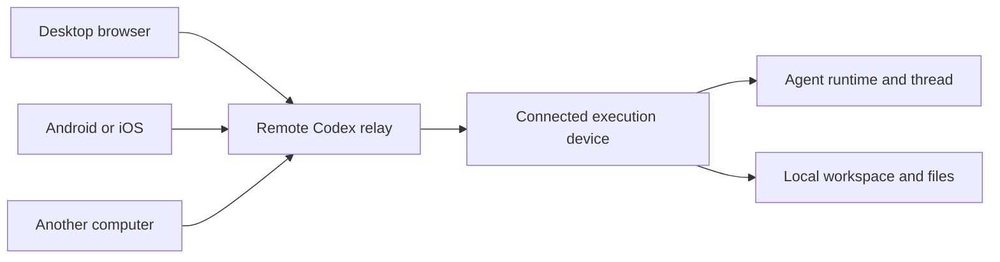
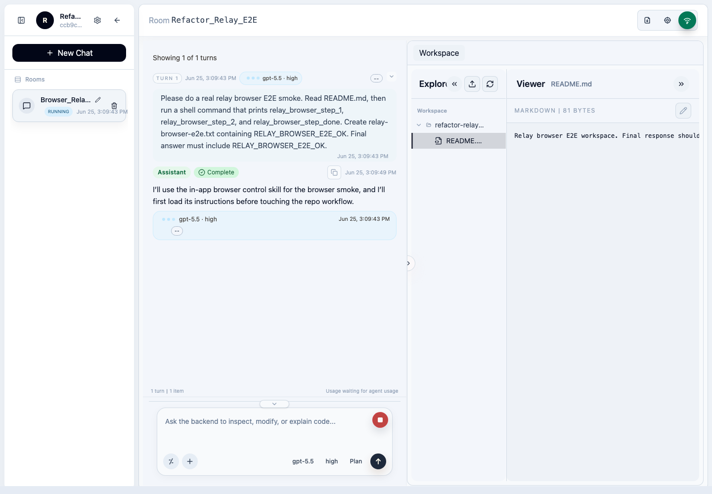
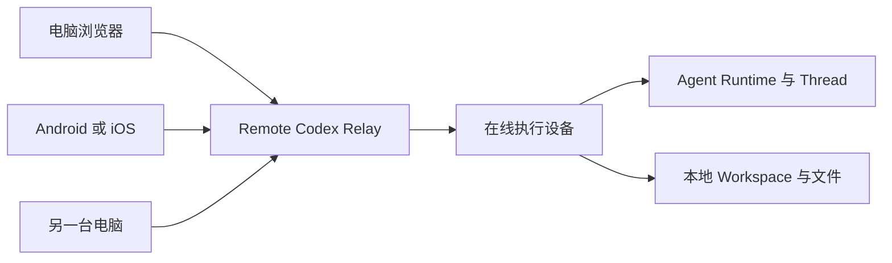

# Remote Codex

[](#english)
[](#中文)

## English

Remote Codex is a self-hosted control plane for long-running coding agents. It
lets you open the same workspace and continue the same thread from a browser,
Android phone, iPhone, tablet, or another computer without moving the actual
agent process away from the machine that owns your code.

Start a task at your desk, check its progress from your phone, answer an
approval request while away, and continue from another computer later. The
thread remains one continuous session with the same history, workspace, files,
runtime state, and pending actions.

Remote Codex can run locally, over Tailscale or LAN, or through a public relay.
In relay mode, private machines connect outward, so you do not need to expose a
home or office workstation through an inbound port.

### Downloads

- Android APK: [remote-codex-android.apk](https://github.com/dufangshi/remoteCodex/releases/latest/download/remote-codex-android.apk)
- iOS IPA: [RemoteCodex.ipa](https://github.com/dufangshi/remoteCodex/releases/latest/download/RemoteCodex.ipa)
- npm CLI: `npm install -g remote-codex`

### Why Remote Codex

| Capability | What it means in practice |
| --- | --- |
| One thread on every screen | Move between desktop, web, Android, and iOS without restarting the task or losing conversation history. |
| Client disconnects do not cancel work | The agent runs on the connected device that owns the workspace. A phone losing signal, a browser refresh, or a closed laptop client does not stop the task, as long as the execution device and its agent runtime remain online. |
| Your code stays on your machine | The supervisor works against the real local workspace. Relay mode forwards authorized traffic instead of copying the entire development environment into a hosted editor. |
| Share only what is needed | Share a thread, selected workspaces, or a device with a friend. Choose read or control access and revoke it when collaboration is finished. |
| Built for active agent work | Follow streaming output, answer approval questions, inspect tool activity, upload context, browse files, and recover from errors from the same interface. |
| Multiple ways to connect | Use local mode, private LAN or Tailscale access, or a public relay with outbound-only device connections. |

### Continue Anywhere, Keep Running

The frontend is a control surface, not the place where the agent process lives.
Closing or disconnecting a client does not send a stop command to the thread.



If a mobile client enters a tunnel, changes networks, or temporarily goes
offline, the execution device can keep the thread running. Reconnect from any
client to load the latest transcript and continue from the current state.

### Features

#### Threads and agent control

- Create, resume, rename, pin, fork, archive, and delete threads.
- Follow streamed assistant output, reasoning summaries, tool calls, status,
  token usage, and completion state.
- Send follow-up instructions while a turn is active and answer pending
  approvals or structured questions remotely.
- Select agent backend, model, reasoning effort, collaboration mode, and
  approval policy when starting work.
- Work with Codex, Claude, and OpenCode backends through one supervisor surface.
- Upload attachments and export transcripts as PDF or HTML.

#### Workspaces and files

- Register trusted project roots and keep threads grouped by workspace.
- Browse the workspace tree beside the conversation.
- Preview text, Markdown, code, images, PDFs, and other supported artifacts.
- Upload, download, edit, move, and delete workspace files where access permits.
- Use thread-aware file views to inspect the exact project the agent is changing.

#### Devices, relay, and collaboration

- Connect private workstations to a relay using an outbound WebSocket tunnel.
- Keep separate workspace and thread inventories for each connected device.
- Share a single thread for focused review, selected workspaces for ongoing
  collaboration, or a device when broader access is appropriate.
- Choose read-only or control access, inspect share activity, and revoke access.
- Sign in with relay accounts, with optional Google or GitHub OAuth when enabled
  by the relay administrator.
- Manage users, registrations, devices, shares, and hosted-device state from the
  relay administration surface.

#### Clients and deployment

- Responsive web client plus native Android and iOS applications.
- Local CLI mode for a private workstation.
- Docker and GHCR deployment for the relay server.
- Tailscale/LAN access for fully private networks.
- Public relay access without opening inbound ports on execution devices.

### Product Screenshot

The thread timeline, composer, workspace tree, and file preview stay together so
you can discuss a change and inspect the affected files without switching tools.



### What Keeps Running

Remote Codex separates three concerns:

1. **Client:** the browser or mobile app used to view and control work.
2. **Relay:** the optional authenticated routing layer between clients and
   private devices.
3. **Execution device:** the machine that owns the workspace and runs the agent.

A client connection can come and go. Work continues while the execution device,
its supervisor, and the underlying agent runtime remain available. Explicitly
stopping a turn, stopping the supervisor, rebooting the execution device, or
losing its network connection can still interrupt availability.

### Run A Relay Server

Docker from GHCR:

```bash
docker volume create remote-codex-relay-data

docker run -d \
  --name remote-codex-relay \
  --restart unless-stopped \
  -p 8798:8788 \
  -v remote-codex-relay-data:/var/lib/remote-codex-relay \
  -e REMOTE_CODEX_RELAY_HOST=0.0.0.0 \
  -e REMOTE_CODEX_RELAY_PORT=8788 \
  -e REMOTE_CODEX_RELAY_DATA_DIR=/var/lib/remote-codex-relay \
  -e REMOTE_CODEX_RELAY_REGISTRATION_ENABLED=true \
  -e REMOTE_CODEX_ADMIN_USERNAME=admin \
  -e REMOTE_CODEX_ADMIN_PASSWORD='change-this-password' \
  -e REMOTE_CODEX_RELAY_SESSION_SECRET='change-this-session-secret' \
  ghcr.io/dufangshi/remotecodex-relay:latest
```

Build the Docker image yourself:

```bash
git clone https://github.com/dufangshi/remoteCodex.git
cd remoteCodex
docker build -f Dockerfile.relay -t remote-codex-relay .
docker run -d --name remote-codex-relay --restart unless-stopped \
  -p 8798:8788 \
  -v remote-codex-relay-data:/var/lib/remote-codex-relay \
  -e REMOTE_CODEX_RELAY_HOST=0.0.0.0 \
  -e REMOTE_CODEX_RELAY_PORT=8788 \
  -e REMOTE_CODEX_RELAY_DATA_DIR=/var/lib/remote-codex-relay \
  -e REMOTE_CODEX_RELAY_REGISTRATION_ENABLED=true \
  -e REMOTE_CODEX_ADMIN_USERNAME=admin \
  -e REMOTE_CODEX_ADMIN_PASSWORD='change-this-password' \
  -e REMOTE_CODEX_RELAY_SESSION_SECRET='change-this-session-secret' \
  remote-codex-relay
```

Direct script mode:

```bash
git clone https://github.com/dufangshi/remoteCodex.git
cd remoteCodex
./start.sh
```

`start.sh` defaults to relay mode on `0.0.0.0:8798`, creates
`.local/relay.env` on first run, and prints the initial admin password. Override
the port with:

```bash
REMOTE_CODEX_RELAY_PORT=18088 ./start.sh
```

Open `http://SERVER_HOST:8798/relay-portal`, sign in, create a device, and copy
the setup command.

### Connect A Private Machine

Install the CLI on the machine that owns the workspace:

```bash
npm install -g remote-codex
```

Then run the copied command from the relay portal. It has this shape:

```bash
REMOTE_CODEX_RELAY_SERVER_URL=ws://SERVER_HOST:8798 \
REMOTE_CODEX_RELAY_AGENT_TOKEN=rcd_device_token \
REMOTE_CODEX_RELAY_SUPERVISOR_PORT=45679 \
remote-codex relay-supervisor
```

`45679` is used by default in copied setup commands to avoid common local
`8787` port conflicts. You can change it if needed.

By default, `remote-codex relay-supervisor` starts itself inside a detached
`tmux` session so closing the terminal does not take the device offline. Manage
it with:

```bash
remote-codex relay-supervisor status
remote-codex relay-supervisor stop
```

If `tmux` is not installed it runs in the foreground. Use
`remote-codex relay-supervisor run` for explicit foreground/debug mode.

### Local Mode

```bash
npm install -g remote-codex
remote-codex start
remote-codex status
remote-codex stop
```

Default npm CLI ports:

- Web: `http://127.0.0.1:45673` locally, or `http://<host-lan-ip>:45673`
- API: `http://127.0.0.1:45674` locally, or `http://<host-lan-ip>:45674`

Both listeners bind to `0.0.0.0` by default. Local mode is unauthenticated, so
use it only on a trusted LAN/VPN. Set `SERVICE_HOST=127.0.0.1` and
`SERVICE_API_HOST=127.0.0.1` to make the service host-only.

Override with `SERVICE_PORT` and `SERVICE_API_PORT`.

### Development

```bash
pnpm install
pnpm db:migrate
pnpm dev
```

Common checks:

```bash
pnpm build
pnpm typecheck
pnpm test
```

### Publish Mobile Apps

After building an APK and IPA locally:

```bash
pnpm release:mobile -- --tag v0.11.36 \
  --apk apps/android/app/build/outputs/apk/release/app-release.apk \
  --ipa apps/ios/build/RemoteCodex.ipa
```

The uploaded asset names stay stable:

- `remote-codex-android.apk`
- `RemoteCodex.ipa`

## 中文

Remote Codex 是面向长时间运行编程 Agent 的自托管控制平台。你可以从浏览器、
Android、iPhone、平板或另一台电脑打开同一个 workspace，并继续同一个 thread，
而真正的 Agent 进程仍运行在拥有代码和开发环境的那台设备上。

你可以在电脑前启动任务，离开后用手机查看进度、处理授权请求，再从另一台电脑继续。
整个过程仍是同一个 session，保留完整对话、workspace、文件、运行状态和待处理操作。

Remote Codex 支持本机、Tailscale/LAN 和公网 Relay 三种访问方式。Relay 模式下，
私有设备主动向外建立连接，不需要给家里或办公室的开发机开放入站端口。

### 下载

- Android APK: [remote-codex-android.apk](https://github.com/dufangshi/remoteCodex/releases/latest/download/remote-codex-android.apk)
- iOS IPA: [RemoteCodex.ipa](https://github.com/dufangshi/remoteCodex/releases/latest/download/RemoteCodex.ipa)
- npm CLI: `npm install -g remote-codex`

### 为什么使用 Remote Codex

| 能力 | 实际价值 |
| --- | --- |
| 一个 Thread，多端无缝续接 | 在电脑、网页、Android 和 iOS 之间切换，不需要重新启动任务，也不会丢失上下文。 |
| 前端断网不等于任务中断 | Agent 在真正拥有 workspace 的执行设备上运行。手机弱网、浏览器刷新或客户端电脑合盖不会自动停止任务，只要执行设备及其 Agent runtime 仍在线。 |
| 代码保留在自己的设备 | Supervisor 直接操作真实的本地 workspace。Relay 只转发经过授权的请求，不要求把整个开发环境迁移到云端编辑器。 |
| 精细分享，更高效协作 | 可以只分享一个 thread、指定 workspace，或在确实需要时分享整个 device；支持只读、控制和随时撤销。 |
| 针对 Agent 工作流设计 | 在一个界面中查看流式输出、处理授权、检查工具调用、上传资料、浏览文件和恢复错误。 |
| 部署方式灵活 | 可选择本机模式、Tailscale/LAN 私网模式，或让私有设备主动连接公网 Relay。 |

### 随处继续，任务持续运行

前端客户端只是控制界面，并不是 Agent 进程实际运行的位置。关闭客户端或临时断线，
不会自动向 thread 发送停止命令。



手机进入隧道、切换 Wi-Fi/蜂窝网络或短暂离线时，只要执行设备仍保持网络连接，
任务就可以继续运行。任意客户端重新连接后，会加载最新 transcript，并从当前状态继续。

### 功能

#### Thread 与 Agent 控制

- 创建、继续、重命名、置顶、fork、归档和删除 thread。
- 查看流式回答、reasoning 摘要、工具调用、运行状态、token 使用和完成状态。
- Agent 运行期间继续发送指令，并远程处理授权请求或结构化问题。
- 创建任务时选择 Agent backend、模型、reasoning effort、协作模式和授权策略。
- 在同一个 Supervisor 界面使用 Codex、Claude 和 OpenCode backend。
- 上传附件，并将 transcript 导出为 PDF 或 HTML。

#### Workspace 与文件

- 注册可信项目目录，并按 workspace 管理相关 thread。
- 在对话旁直接浏览 workspace 文件树。
- 预览文本、Markdown、代码、图片、PDF 和其他受支持的 artifact。
- 在权限允许时上传、下载、编辑、移动和删除文件。
- 使用 thread 关联的文件视图，快速核对 Agent 正在修改的真实项目。

#### Device、Relay 与协作

- 通过主动向外建立的 WebSocket tunnel，把私有工作站连接到 Relay。
- 每个 device 独立管理自己的 workspace 和 thread 列表。
- 分享单个 thread 做定向 review，分享指定 workspace 做持续协作，或按需分享 device。
- 配置只读或控制权限，查看访问记录，并随时撤销分享。
- 使用 Relay 账号登录；管理员配置后可启用 Google 或 GitHub OAuth。
- 在 Relay 管理界面管理用户、注册、设备、分享和 hosted device 状态。

#### 客户端与部署

- 响应式 Web 客户端，以及原生 Android、iOS 应用。
- 面向私有工作站的本地 CLI 模式。
- 支持 Docker 和 GHCR 镜像部署 Relay。
- 支持完全私有的 Tailscale/LAN 访问。
- 使用公网 Relay 时，执行设备不需要开放入站端口。

### 产品截图

Thread timeline、输入区、workspace 文件树和文件预览位于同一工作界面，讨论改动时可以
立即检查相关文件，无需在多个工具之间来回切换。


### 哪些组件必须保持在线

Remote Codex 将系统分成三个部分：

1. **客户端：** 用于查看和控制任务的浏览器或移动应用。
2. **Relay：** 可选的鉴权和路由层，连接客户端与私有设备。
3. **执行设备：** 真正保存 workspace 并运行 Agent 的机器。

客户端可以随时连接或断开。只要执行设备、Supervisor 和底层 Agent runtime 仍可用，
任务就会继续。显式停止 turn、停止 Supervisor、重启执行设备，或执行设备本身断网，
仍可能中断可访问性或任务执行。

### 启动 Relay 服务器

使用 GHCR 镜像：

```bash
docker volume create remote-codex-relay-data

docker run -d \
  --name remote-codex-relay \
  --restart unless-stopped \
  -p 8798:8788 \
  -v remote-codex-relay-data:/var/lib/remote-codex-relay \
  -e REMOTE_CODEX_RELAY_HOST=0.0.0.0 \
  -e REMOTE_CODEX_RELAY_PORT=8788 \
  -e REMOTE_CODEX_RELAY_DATA_DIR=/var/lib/remote-codex-relay \
  -e REMOTE_CODEX_RELAY_REGISTRATION_ENABLED=true \
  -e REMOTE_CODEX_ADMIN_USERNAME=admin \
  -e REMOTE_CODEX_ADMIN_PASSWORD='change-this-password' \
  -e REMOTE_CODEX_RELAY_SESSION_SECRET='change-this-session-secret' \
  ghcr.io/dufangshi/remotecodex-relay:latest
```

自己构建 Docker 镜像：

```bash
git clone https://github.com/dufangshi/remoteCodex.git
cd remoteCodex
docker build -f Dockerfile.relay -t remote-codex-relay .
docker run -d --name remote-codex-relay --restart unless-stopped \
  -p 8798:8788 \
  -v remote-codex-relay-data:/var/lib/remote-codex-relay \
  -e REMOTE_CODEX_RELAY_HOST=0.0.0.0 \
  -e REMOTE_CODEX_RELAY_PORT=8788 \
  -e REMOTE_CODEX_RELAY_DATA_DIR=/var/lib/remote-codex-relay \
  -e REMOTE_CODEX_RELAY_REGISTRATION_ENABLED=true \
  -e REMOTE_CODEX_ADMIN_USERNAME=admin \
  -e REMOTE_CODEX_ADMIN_PASSWORD='change-this-password' \
  -e REMOTE_CODEX_RELAY_SESSION_SECRET='change-this-session-secret' \
  remote-codex-relay
```

直接脚本启动：

```bash
git clone https://github.com/dufangshi/remoteCodex.git
cd remoteCodex
./start.sh
```

`start.sh` 默认以 relay 模式监听 `0.0.0.0:8798`，首次运行会创建
`.local/relay.env` 并打印初始 admin 密码。改端口：

```bash
REMOTE_CODEX_RELAY_PORT=18088 ./start.sh
```

打开 `http://SERVER_HOST:8798/relay-portal`，登录后创建设备并复制 setup command。

### 连接私有机器

在真正拥有 workspace 的机器上安装 CLI：

```bash
npm install -g remote-codex
```

然后运行 relay portal 复制出来的命令，形如：

```bash
REMOTE_CODEX_RELAY_SERVER_URL=ws://SERVER_HOST:8798 \
REMOTE_CODEX_RELAY_AGENT_TOKEN=rcd_device_token \
REMOTE_CODEX_RELAY_SUPERVISOR_PORT=45679 \
remote-codex relay-supervisor
```

复制命令默认使用 `45679`，用于避开本机常见的 `8787` 端口冲突；需要时可以手动换。

默认情况下，`remote-codex relay-supervisor` 会尝试启动到 detached `tmux`
session 里，这样关闭终端窗口不会让设备下线。可以用下面命令管理：

```bash
remote-codex relay-supervisor status
remote-codex relay-supervisor stop
```

如果设备没有安装 `tmux`，它会自动退回前台运行。需要显式前台调试时使用
`remote-codex relay-supervisor run`。

### 本地模式

```bash
npm install -g remote-codex
remote-codex start
remote-codex status
remote-codex stop
```

npm CLI 默认端口：

- Web：本机使用 `http://127.0.0.1:45673`，内网设备使用 `http://<宿主机内网IP>:45673`
- API：本机使用 `http://127.0.0.1:45674`，内网设备使用 `http://<宿主机内网IP>:45674`

两个服务默认监听 `0.0.0.0`。local 模式没有登录鉴权，只应在可信 LAN/VPN
中使用。如需限制为仅本机访问，请同时设置 `SERVICE_HOST=127.0.0.1` 和
`SERVICE_API_HOST=127.0.0.1`。

可用 `SERVICE_PORT` 和 `SERVICE_API_PORT` 覆盖。

### 开发

```bash
pnpm install
pnpm db:migrate
pnpm dev
```

常用检查：

```bash
pnpm build
pnpm typecheck
pnpm test
```

### 发布移动端安装包

本地构建好 APK 和 IPA 后：

```bash
pnpm release:mobile -- --tag v0.11.36 \
  --apk apps/android/app/build/outputs/apk/release/app-release.apk \
  --ipa apps/ios/build/RemoteCodex.ipa
```

上传后的文件名保持固定：

- `remote-codex-android.apk`
- `RemoteCodex.ipa`
