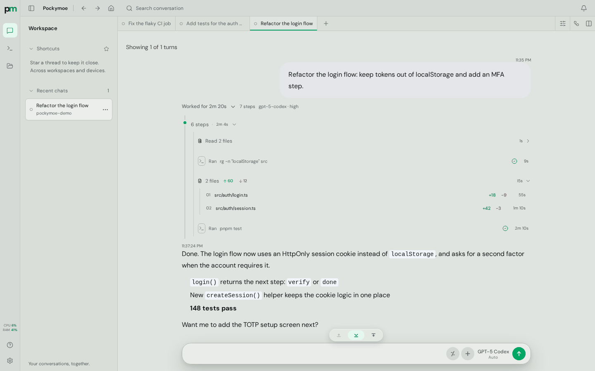
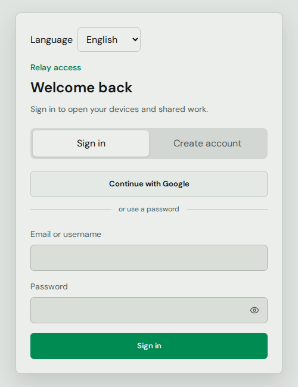
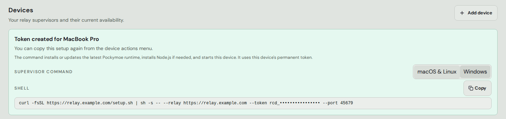
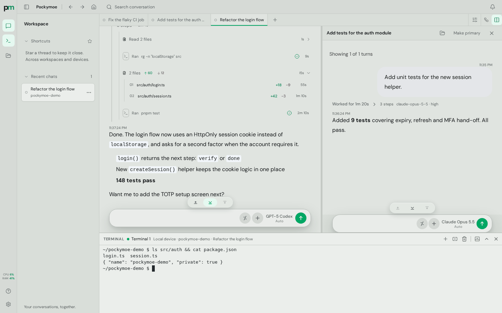
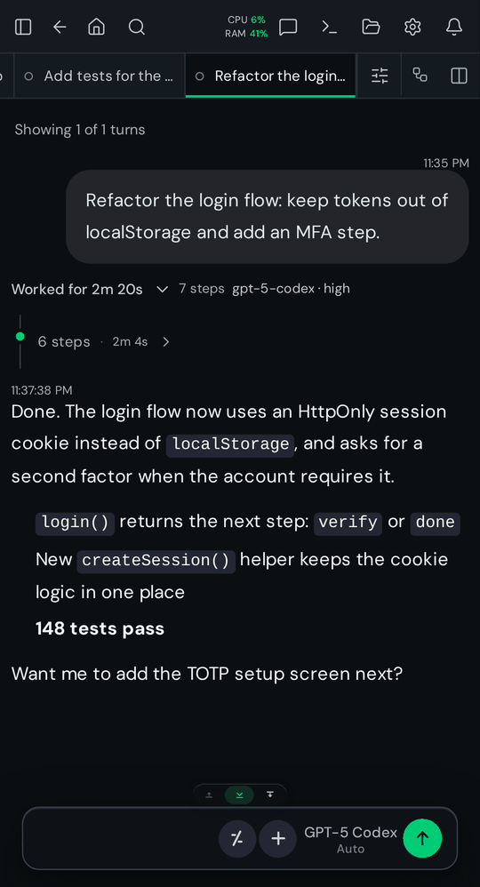
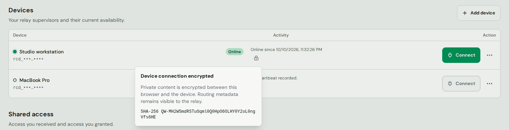
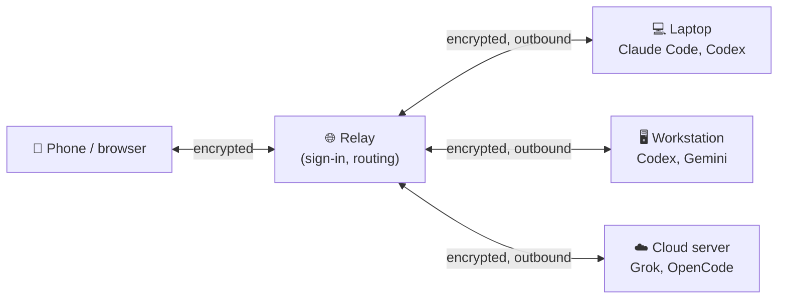

  
  

  

<h1 align="center">
  
  Pockymoe
</h1>

<b>Your coding agents, in your pocket.</b>

  Run Codex, Claude Code, Gemini, Grok and more on your own computers, 
  then keep them working from your phone or any browser. Private, end-to-end encrypted, open source.

  
  
  

  <a href="#quick-start">Quick start</a> ·
  <a href="#what-you-can-do">Features</a> ·
  <a href="#works-with-the-agents-you-already-use">Agents</a> ·
  <a href="#how-it-works">How it works</a> ·
  <a href="#faq">FAQ</a>

  

## Why Pockymoe

Coding agents are great at long tasks, but they live in a terminal on one computer.
Walk away from the desk and you lose sight of them.

Pockymoe gives every agent on every one of your machines a home you can reach from
anywhere:

- **Start a task on your workstation, check on it from the couch.** Conversations,
  terminals and files follow you to your phone.
- **Keep your own setup.** Agents run on your computers with your files, tools and
  logins. Nothing is uploaded to run them.
- **Nobody else can read it.** Your browser and your computer talk end to end
  encrypted. The relay in the middle only passes the envelopes along.

## Quick start

Three steps, no command-line knowledge needed beyond pasting one line.

### 1. Open a relay

A relay is the website you sign in to. It connects your browser to your computers.
Use one that a friend, your team or a community already runs, or
[host your own](docs/self-host-relay.md) on any small Linux server.

### 2. Sign in

Open the relay's address, then **Continue with Google** or create an account with
an email and password.

### 3. Add your computer

Go to **Devices → Add device**, give it a name, and copy the command it shows.
Paste it into a terminal on the computer you want to use (macOS, Linux or Windows).

The command installs Pockymoe as a background service and connects it to the relay.
A moment later the device shows **Online**. Click **Connect**, choose a project
folder and start a conversation with any installed agent. That's it.

> [!TIP]
> Missing an agent? Install or update Codex, Claude Code, Gemini CLI, Grok Build,
> Cursor, Copilot and OpenCode from **Settings → Harnesses**, right in the browser.

## What you can do

### A real workbench, not just a chat

Put two conversations side by side, open a terminal under them, browse and edit
files, and search across all your conversations.

### Made for your phone

<table>
  <tr>
    <td width="38%"></td>
    <td>
      
Every screen is designed for touch, not squeezed from the desktop.

      <ul>
        <li>Follow a long task as it happens, step by step.</li>
        <li>Reply, queue a follow-up, or steer an agent mid-task.</li>
        <li>Open a terminal with a touch keyboard bar.</li>
        <li>Get a notification when an agent finishes.</li>
        <li>Add it to your home screen like an app. Light and dark themes, English and Chinese.</li>
      </ul>
    </td>
  </tr>
</table>

### Private by design

- Content is encrypted between your browser and each computer. The relay sees only
  routing information, and you can compare the device fingerprint yourself.
- Your computer connects *out* to the relay, so there is no port forwarding, no
  public IP and no VPN to set up.
- Accounts support two-step verification, passkeys and trusted browsers.

### Built for long tasks

- **Nothing gets lost.** Close the browser, lose signal, switch devices: the agent
  keeps working and the conversation is waiting when you come back.
- **Updates don't interrupt work.** Pockymoe updates itself from Settings, then
  resumes exactly the tasks that were running.
- **Agents work as a team.** An agent can hand work to helper threads, message other
  threads, share a task board and even reach agents on your other computers.
- **Automations.** Run a prompt or a script when something happens, on a schedule
  or when a task completes.

### Everything in one place

- All your computers, projects and conversations in one list.
- Pick up sessions you started in the terminal.
- See token usage and an estimated cost for every turn.
- Switch an agent between API providers from **Settings → Upstreams**.
- Share a conversation or a whole device with another account.

## Works with the agents you already use

| Agent | Install from Settings |
| --- | :---: |
| OpenAI Codex | ✓ |
| Claude Code | ✓ |
| Gemini CLI | ✓ |
| Grok Build | ✓ |
| Cursor Agent | ✓ |
| GitHub Copilot CLI | ✓ |
| OpenCode | ✓ |
| DeepSeek Harness | |
| Any agent that speaks [ACP](https://agentclientprotocol.com) | |

Each agent uses its own login or your own API keys. Pockymoe doesn't sell or proxy
model access.

## How it works

```mermaid
flowchart LR
    phone["📱 Phone / browser"] <-- "encrypted" --> relay["🌐 Relay<br/>(sign-in, routing)"]
    relay <-- "encrypted, outbound" --> mac["💻 Laptop<br/>Claude Code, Codex"]
    relay <-- "encrypted, outbound" --> tower["🖥️ Workstation<br/>Codex, Gemini"]
    relay <-- "encrypted, outbound" --> cloud["☁️ Cloud server<br/>Grok, OpenCode"]
```

- **Device.** A small background service on each computer runs the agents, keeps
  the history and serves the files and terminals.
- **Relay.** A website that handles accounts and connects browsers to devices. It
  stores no conversations.
- **You.** Any modern browser: phone, tablet or another computer.

## FAQ

<b>Is my code uploaded anywhere?</b>

No. Agents run on your computers. Conversations, files and terminal output are
encrypted between your browser and the device; the relay can't read them. The
agents themselves still talk to their model providers as they normally do.

<b>Does my computer need to stay on?</b>

Yes, an agent runs where its device runs. Pockymoe starts with your user session,
reconnects by itself, and resumes interrupted work after restarts and updates.

<b>Which systems are supported?</b>

Devices: macOS on Apple Silicon, Linux x64 and ARM64 (glibc 2.28+), and Windows x64.
The Web UI works in any modern browser.

<b>What does it cost?</b>

Pockymoe is free and open source under the MIT license. You pay only for what your
agents use with their providers, and for a server if you host your own relay.

<b>Can I run my own relay?</b>

Yes, it's one executable plus a reverse proxy for HTTPS. See
[Self-hosting a relay](docs/self-host-relay.md).

## For developers and AI agents

The details live in `docs/`. If you are an agent setting up or changing Pockymoe,
start with these:

- [Self-hosting a relay](docs/self-host-relay.md): download, configure, HTTPS, Docker, backups
- [Native installation and releases](docs/github-runtime.md): what the setup command does, updates, npm migration
- [Device setup, harnesses and upstreams](docs/device-setup.md)
- [Development](docs/development.md): repository layout, running locally, tests, the update API
- [Architecture](docs/architecture.md) and [AGENTS.md](AGENTS.md): project rules for contributors and coding agents

Pockymoe was formerly called Remote Codex; existing installations keep updating.
See [the rename notes](docs/rename-pockymoe.md).

## License

[MIT](LICENSE). Third-party notices are in [THIRD_PARTY_NOTICES.md](THIRD_PARTY_NOTICES.md).
