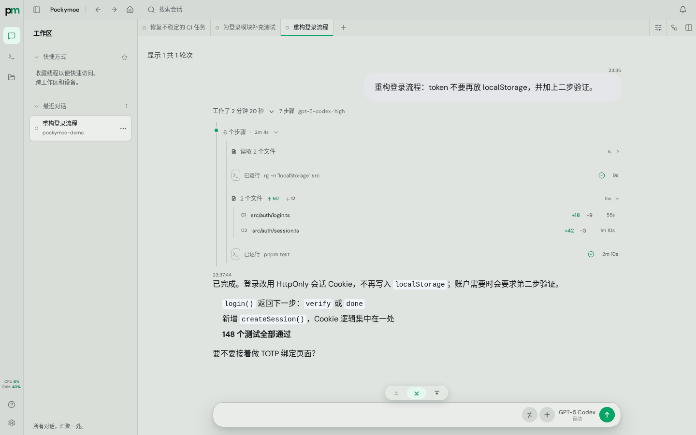
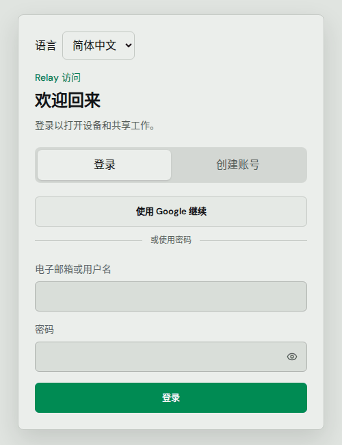
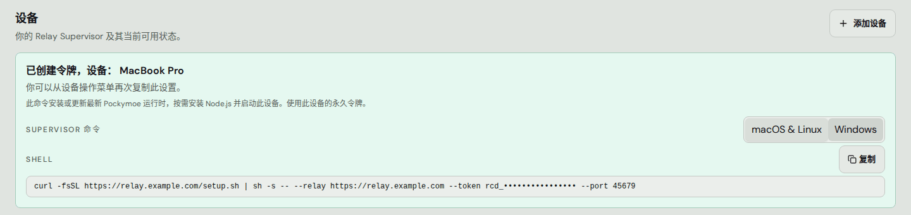
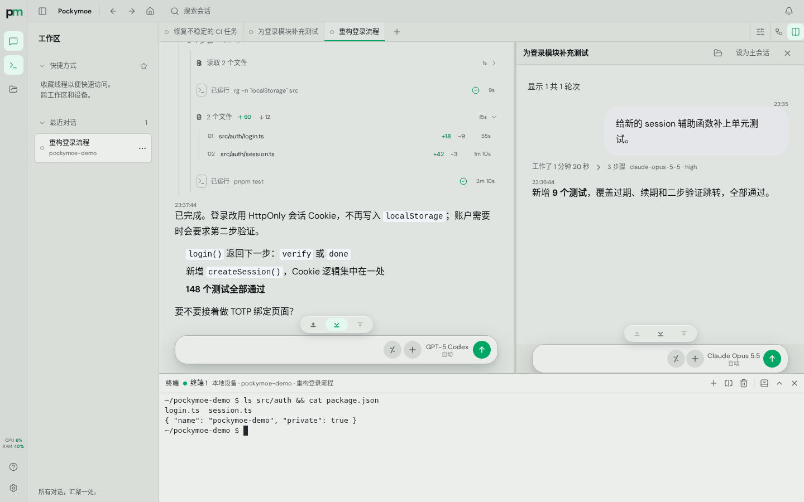
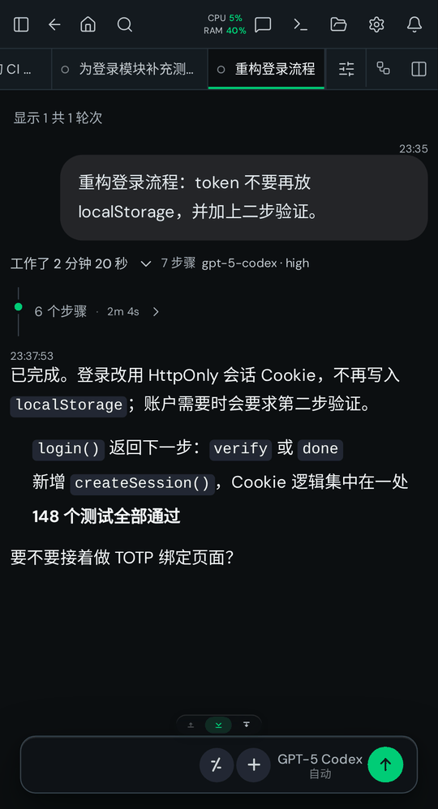
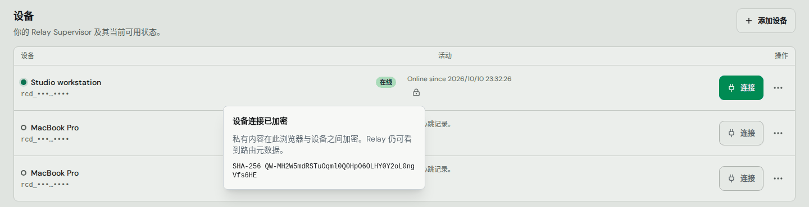
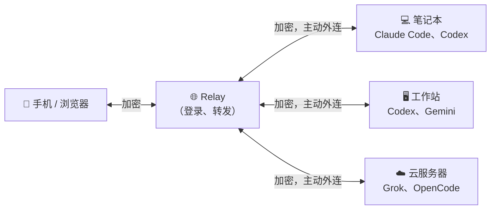

  
  

  

<h1 align="center">
  
  Pockymoe
</h1>

<b>把你的编码 agent 装进口袋。</b>

  在自己的电脑上运行 Codex、Claude Code、Gemini、Grok 等编码 agent， 
  再用手机或任何浏览器随时接着用。私有部署、端到端加密、开源免费。

  
  
  

  <a href="#快速上手">快速上手</a> ·
  <a href="#能做什么">功能</a> ·
  <a href="#支持的-agent">支持的 Agent</a> ·
  <a href="#工作原理">工作原理</a> ·
  <a href="#常见问题">常见问题</a>

  

## 为什么选择 Pockymoe

编码 agent 很擅长长时间的任务，可它们都待在某台电脑的终端里。人一离开桌子，就看不到它们在做什么了。

Pockymoe 给你每台电脑上的每个 agent 安了一个家，在哪儿都能访问：

- **在工作站上布置任务，躺在沙发上看进度。** 对话、终端和文件都能在手机上继续。
- **保留你自己的环境。** Agent 在你的电脑上运行，用的是你的文件、工具和登录状态，不需要把任何东西上传。
- **别人看不到。** 浏览器和你的电脑之间端到端加密，中间的 Relay 只负责传递“信封”。

## 快速上手

三步就好，唯一需要的命令行操作是粘贴一行命令。

### 1. 找一个 Relay

Relay 就是你登录的那个网站，它把浏览器和你的电脑连接起来。可以用朋友、团队或社区已经部署好的 Relay，也可以在任意一台小 Linux 服务器上[自己部署一个](docs/self-host-relay.zh-CN.md)。

### 2. 登录

打开 Relay 的网址，选择 **使用 Google 继续**，或者用邮箱和密码注册账号。

### 3. 添加你的电脑

进入 **设备 → 添加设备**，起个名字，然后复制页面上显示的命令，粘贴到你想使用的那台电脑（macOS、Linux 或 Windows）的终端里运行。

这条命令会把 Pockymoe 安装成后台服务并连接到 Relay。稍等片刻，设备会显示 **在线**。点击 **连接**，选择一个项目文件夹，就可以和任意已安装的 agent 开始对话了。

> [!TIP]
> 还没装某个 agent？在 **设置 → Harness** 里可以直接在浏览器中安装或更新 Codex、Claude Code、Gemini CLI、Grok Build、Cursor、Copilot 和 OpenCode。

## 能做什么

### 真正的工作台，而不只是聊天框

两个对话并排打开，下方再开一个终端，还能浏览、编辑文件，并搜索所有对话。

### 为手机而设计

<table>
  <tr>
    <td width="38%"></td>
    <td>
      
每个页面都按触屏重新设计，而不是把桌面版硬塞进小屏幕。

      <ul>
        <li>实时跟进长任务的每一步。</li>
        <li>回复、排队下一条消息，或在任务中途纠正方向。</li>
        <li>打开带触屏快捷键栏的终端。</li>
        <li>agent 完成任务时收到通知。</li>
        <li>可以像 App 一样添加到主屏幕。支持浅色和深色主题、中英文界面。</li>
      </ul>
    </td>
  </tr>
</table>

### 隐私是默认设计

- 内容在浏览器与每台电脑之间加密。Relay 只能看到路由信息，你也可以自己核对设备指纹。
- 由你的电脑主动连接 Relay，所以不需要端口转发、公网 IP 或 VPN。
- 账号支持二步验证、Passkey 和受信任浏览器。

### 为长任务而生

- **不会丢。** 关掉浏览器、网络断了、换了设备，agent 都会继续工作，回来时对话还在原处。
- **更新不打断工作。** Pockymoe 在设置里一键自更新，完成后只恢复被这次更新打断的任务。
- **agent 能组队干活。** 一个 agent 可以把工作交给子线程、给其他线程发消息、共享任务板，甚至调用你其他电脑上的 agent。
- **自动化。** 按计划、在任务完成时或在特定事件发生时，自动运行一段提示词或脚本。

### 所有东西集中在一处

- 所有电脑、项目和对话都在同一个列表里。
- 可以导入你在终端里开过的会话，接着继续。
- 每一轮对话都能看到 token 用量和预估费用。
- 在 **设置 → 上游** 里为 agent 切换 API 服务商。
- 把一个对话或整台设备共享给其他账号。

## 支持的 Agent

| Agent | 可在设置中安装 |
| --- | :---: |
| OpenAI Codex | ✓ |
| Claude Code | ✓ |
| Gemini CLI | ✓ |
| Grok Build | ✓ |
| Cursor Agent | ✓ |
| GitHub Copilot CLI | ✓ |
| OpenCode | ✓ |
| DeepSeek Harness | |
| 任何支持 [ACP](https://agentclientprotocol.com) 的 agent | |

每个 agent 使用它自己的登录方式或你自己的 API Key。Pockymoe 不转售也不代理模型服务。

## 工作原理

- **设备**：每台电脑上的一个小后台服务，负责运行 agent、保存历史，并提供文件和终端。
- **Relay**：负责账号和连接浏览器与设备的网站，不保存对话内容。
- **你**：任何现代浏览器，手机、平板或另一台电脑都行。

## 常见问题

<b>我的代码会被上传吗？</b>

不会。Agent 在你的电脑上运行。对话、文件和终端输出在浏览器与设备之间加密，Relay 无法读取。当然，agent 本身仍会像平时一样访问它们的模型服务商。

<b>电脑需要一直开着吗？</b>

需要，agent 跑在设备所在的电脑上。Pockymoe 会随用户登录自动启动、自动重连，并在重启和更新后恢复被打断的工作。

<b>支持哪些系统？</b>

设备端：Apple Silicon 的 macOS、x64 和 ARM64 的 Linux（glibc 2.28 及以上）、x64 的 Windows。网页端支持任何现代浏览器。

<b>要花钱吗？</b>

Pockymoe 采用 MIT 许可证，免费开源。你只需要为 agent 使用的模型服务付费；如果自己部署 Relay，还需要一台服务器。

<b>可以自己部署 Relay 吗？</b>

可以，只需要一个可执行文件，再加一个提供 HTTPS 的反向代理。见[自己部署 Relay](docs/self-host-relay.zh-CN.md)。

## 给开发者和 AI Agent

详细文档都在 `docs/` 里。如果你是负责安装或修改 Pockymoe 的 agent，请从这些开始：

- [自己部署 Relay](docs/self-host-relay.zh-CN.md)：下载、配置、HTTPS、Docker、备份
- [原生安装与发布](docs/github-runtime.md)：安装命令做了什么、更新、npm 迁移
- [设备安装、Harness 与上游](docs/device-setup.md)
- [开发](docs/development.md)：仓库结构、本地运行、测试、更新 API
- [架构](docs/architecture.md)与 [AGENTS.md](AGENTS.md)：贡献者和编码 agent 需要遵守的项目规则

Pockymoe 原名 Remote Codex，已有安装会继续正常更新。见[改名说明](docs/rename-pockymoe.md)。

## 许可证

[MIT](LICENSE)。第三方声明见 [THIRD_PARTY_NOTICES.md](THIRD_PARTY_NOTICES.md)。
