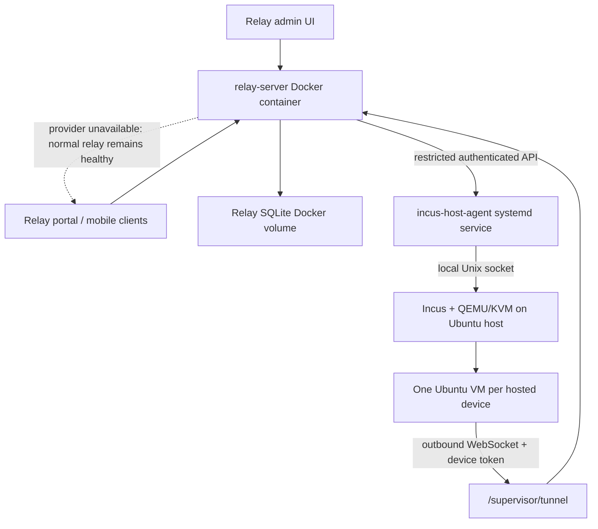

# Incus 托管 Supervisor VM 分阶段实施计划

> 状态：规划草案，尚未安装 Incus、尚未修改生产 relay、尚未部署任何 host agent。
>
> 推进方式：建议在 Goal 模式下严格按 Phase 0 → Phase 10 顺序推进；每个 Phase 独立验收并保存证据后再进入下一阶段。

## 1. 目标

在现有 relay 产品中增加一种可选的 `Hosted supervisor VM`：relay admin 可以为指定 relay 用户创建一台运行在自有 x86 Ubuntu 服务器上的 Incus VM。VM 内自动安装并运行 Codex CLI 与 `remote-codex relay-supervisor run`，使用现有 device token 主动连接 `/supervisor/tunnel`，并继续复用当前 device、grant/share、workspace/thread 权限模型。

目标体验：

1. Admin 在 `/relay-admin` 选择用户、规格、镜像和凭证，创建托管 VM。
2. Relay 先创建普通 `relay_devices` 记录，再异步创建/初始化 Incus VM。
3. VM 开机后自动启动 supervisor，device 在 relay 中变为 online。
4. Turn 未完成时 VM 不进入计划停机。
5. Turn 完成且连续 10 分钟没有用户有效访问后，relay 编排安全关机。
6. 下次用户访问时自动开机；VM 根磁盘中的 `.codex`、supervisor SQLite 和 workspace 保持不变。
7. Incus/host-agent 不可用时，relay 仍然正常启动和提供全部原有功能；只有 Hosted VM 创建/启停能力不可用。

## 2. 已验证的当前基线

### 2.1 代码边界

- `POST /relay/devices` 当前只创建 `relay_devices` 行和 `rcd_...` token；真正 online 来自 supervisor 使用 token 连接 `/supervisor/tunnel`。
- relay 已有 `scope='device'`、`can_create_threads`、workspace/thread 权限，不需要为 Hosted VM 另造转发或分享协议。
- `/relay-admin` 当前已有用户、device、连接状态、workspace/thread inventory、分享关系和注册设置，但没有 Hosted VM 创建/生命周期操作。
- relay 生产部署来自 `.github/workflows/relay-deploy.yml`，在目标机上运行 `remote-codex-relay` Docker 容器，并使用 Docker volume 保存 relay SQLite。
- supervisor 生产默认 SQLite 是 `~/.remote-codex/supervisor.sqlite`，且使用 WAL；Codex home 默认是 `~/.codex`。

### 2.2 目标服务器只读体检（2026-07-10）

- Ubuntu 24.04.3 LTS，`x86_64`，kernel `6.8.0-134-generic`。
- `/dev/kvm` 存在，CPU virtualization flag 可用。
- 约 11 GiB RAM、54 GiB 根盘可用空间；PoC 只允许创建一台小规格 VM。
- Docker 和生产 `remote-codex-relay` 容器正在运行且健康。
- Incus/QEMU 尚未安装；Ubuntu 仓库可提供 Incus 6.0 LTS 与 QEMU 8.2。

这些信息在真正实施 Phase 3 前必须重新验证，不能把此快照视为永久事实。

## 3. 强制架构约束

### 3.1 Incus 必须是可选 capability

Relay 不得在启动时等待或强依赖 Incus：

- 未设置 `REMOTE_CODEX_HOSTED_SANDBOX_PROVIDER` 时，默认 `disabled`。
- 配置为 `incus` 但 host-agent 离线时，relay 启动成功、`/healthz` 正常、普通 relay device 和 tunnel 正常。
- `/relay/admin` 返回 Hosted Sandbox capability 的 `configured/reachable/available/reason`，而不是把 provider 错误升级成 relay 全局错误。
- Hosted VM 创建/启停接口在 capability 不可用时返回明确的 `503 hosted_sandbox_unavailable`。
- 已有普通 device 的创建、删除、share/grant、API/WebSocket 转发路径不得调用 Hosted Sandbox provider。
- relay 部署 workflow 与 host-agent 部署 workflow 相互独立；任一失败不得自动停止另一方。

### 3.2 Incus 管理面不得直接暴露给 relay 或公网

- Incus daemon 原生运行在宿主 Ubuntu，不放进 Docker。
- 新 package `packages/incus-host-agent` 作为受限适配器运行在宿主 systemd。
- host-agent 是唯一允许访问 Incus Unix socket 的进程；该 socket 权限等价于宿主 root。
- host-agent 不提供任意 shell、任意 Incus API passthrough、宿主路径挂载或自定义 QEMU 参数。
- relay 只能调用固定动作：capability、create、status、start、graceful-stop、snapshot、delete、provision-status。
- API 采用短超时、Bearer token、请求 ID、幂等键和审计日志；日志不得记录 device token、API key、access token 或 `auth.json`。

### 3.3 一台 Hosted VM 对应一个 relay device

- 一用户一 VM、一 VM 一 device、同一 VM 同时最多一个 active supervisor。
- VM 内不运行多个不互信用户。
- Incus instance name 由服务端生成，例如 `rcd-<hostedSandboxId>`，不直接使用用户输入。
- 用户输入只作为展示名，不得进入 shell command。

## 4. 目标拓扑



## 5. 数据模型

新增表建议：

### 5.1 `relay_hosted_sandboxes`

| 字段                                          | 用途                                                                               |
| --------------------------------------------- | ---------------------------------------------------------------------------------- |
| `id`                                          | Hosted Sandbox UUID                                                                |
| `relay_device_id`                             | 唯一关联现有 `relay_devices.id`                                                    |
| `assigned_user_id`                            | 默认直接拥有该 device 的目标用户                                                   |
| `created_by_admin_user_id`                    | 审计来源                                                                           |
| `provider`                                    | 第一版固定 `incus`                                                                 |
| `provider_instance_id`                        | Incus instance name                                                                |
| `state`                                       | `requested/provisioning/stopped/starting/online/busy/idle/stopping/error/deleting` |
| `desired_state`                               | `running/stopped/deleted`                                                          |
| `generation`                                  | 防止旧定时器误停新实例                                                             |
| `image_version`                               | Guest image/模板版本                                                               |
| `cpu_count` / `memory_mib` / `disk_gib`       | 固化的资源规格                                                                     |
| `idle_timeout_seconds`                        | 默认 600                                                                           |
| `active_turn_count`                           | 计划停机保护条件                                                                   |
| `last_user_activity_at`                       | 用户有效访问时间，不含心跳/轮询                                                    |
| `credential_ref`                              | 指向 host-agent secret store 的 opaque ID，不存明文                                |
| `last_error_code/message/at`                  | 可诊断但已脱敏的错误                                                               |
| `created_at/updated_at/started_at/stopped_at` | 生命周期时间                                                                       |

约束：`relay_device_id`、`provider + provider_instance_id` 唯一；删除 device 前必须先执行 Hosted VM 删除或明确选择保留孤立 VM。

### 5.2 `relay_hosted_sandbox_operations`

记录 create/start/stop/snapshot/delete/provision 的 durable operation：

- `id`、`hosted_sandbox_id`、`kind`、`idempotency_key`。
- `status=queued/running/succeeded/failed/cancelled`。
- `requested_by_user_id`、`attempt`、`started_at`、`finished_at`、脱敏错误。

所有跨 relay/host-agent/Incus 的操作必须可重试；API timeout 不等于 VM 创建失败。

## 6. Guest VM 标准布局

```text
/home/remote-codex/
├── .codex/
│   ├── config.toml
│   ├── auth.json              # 仅 file credential 模式；0600
│   ├── sessions/
│   └── state_*.sqlite*
├── .remote-codex/
│   └── supervisor.sqlite*
└── workspaces/

/etc/remote-codex/
├── supervisor.env             # root:root 0600
└── provision.json             # 不含模型密钥明文

/etc/systemd/system/
└── remote-codex-relay-supervisor.service
```

固定运行环境：

```text
HOME=/home/remote-codex
CODEX_HOME=/home/remote-codex/.codex
WORKSPACE_ROOT=/home/remote-codex/workspaces
DATABASE_URL=/home/remote-codex/.remote-codex/supervisor.sqlite
REMOTE_CODEX_MODE=relay
REMOTE_CODEX_RELAY_SERVER_URL=wss://<relay-origin>
REMOTE_CODEX_RELAY_AGENT_TOKEN=<injected at provision/rotation time>
```

VM 普通 stop/start 会保留根磁盘，因此 `.codex`、SQLite 和 workspace 不依赖每次 snapshot 恢复。Snapshot 用于升级回滚、备份和灾难恢复。

## 7. Codex 安装与登录设计

### 7.1 安装

- 在版本化的 golden image/template 中安装固定版本的 Codex CLI、Node.js、git、`remote-codex` 和基本编译工具。
- 首次 provision 只做版本校验和必要升级，不在每次 VM start 时重新下载安装。
- 生产镜像记录 Codex version、remote-codex commit/package version、image build timestamp 和 checksum。
- 官方当前提供 macOS/Linux standalone installer；实施时仍应固定经验证版本，避免“新建 VM 自动漂移到未验证 latest”。

### 7.2 配置文件

Codex 的配置文件是 `$CODEX_HOME/config.toml`。登录缓存是 `$CODEX_HOME/auth.json` 或 OS credential store；不存在 `auth.toml`。

Headless VM 第一版建议明确设置：

```toml
cli_auth_credentials_store = "file"
```

原因：VM 没有稳定桌面 keyring，且根磁盘本身已经是每用户隔离、可持久化的存储。`auth.json` 必须为 `0600`，不得返回给浏览器或写入 relay SQLite。

### 7.3 凭证模式

按优先级支持：

1. **Platform API key（PoC 默认）**
   - Admin/用户通过一次性 secret form 提交。
   - relay 不保存明文；直接转交 host-agent secret store，relay 只保存 `credential_ref`。
   - Guest provision 通过 stdin 执行 `codex login --with-api-key`，不把 key 放进 command line 或日志。
2. **Codex access token（企业自动化候选）**
   - 通过 stdin 执行 `codex login --with-access-token`。
   - 需要在产品启用前确认 workspace 权限、轮换和撤销流程。
3. **ChatGPT device-code login（用户交互候选）**
   - Admin 创建 VM 后，UI 显示一次性 device-code 登录流程。
   - 登录成功后 `auth.json` 留在该用户 VM 磁盘。
4. **受控复制 `auth.json`（兼容/迁移路径）**
   - 官方支持将浏览器机器上的 auth cache 复制到 headless 主机。
   - 只能通过加密 secret upload，禁止进入 Git、relay DB、普通 API response 或日志。

禁止默认把一个管理员个人 ChatGPT `auth.json` 复制到多个用户 VM。多用户授权、费用归属和撤销边界必须在 Phase 0 作出明确产品决定。

### 7.4 凭证轮换与删除

- host-agent 使用宿主 master key 加密 secret blob，或接入自托管 secret backend；relay 只持有 opaque ref。
- Rotate 操作先写新 secret，再在 VM 内非交互 login，验证 `codex login status`，成功后删除旧 secret。
- Hosted VM 删除必须清除 secret ref；snapshot/backup 的保留策略必须明确，因为旧 snapshot 可能包含旧 `auth.json`。

官方依据：Codex CLI 支持 ChatGPT、API key 和 access token 登录；API key/access token 可通过 stdin 注入。文件凭证位于 `$CODEX_HOME/auth.json`，官方要求按密码处理。

## 8. Hosted VM 生命周期与 10 分钟空闲策略

不能把 relay 心跳、页面 polling 或 WebSocket 存活当作用户活动。

### 8.1 有效活动

- 创建/导入 workspace。
- 创建 thread。
- 提交 prompt、steer、approval、shell 输入、workspace 写操作。
- 用户主动打开一个 stopped Hosted device 并触发 wake。

纯 GET polling、relay heartbeat、host-agent health check 不刷新 `last_user_activity_at`。

### 8.2 Turn 活跃状态

建议增加向后兼容的 supervisor → relay activity envelope，包含：

```json
{
  "type": "relay.runtime.activity",
  "activeTurnCount": 1,
  "lastUserActivityAt": "...",
  "generation": 4
}
```

- 新 relay 识别该 envelope；旧 relay 忽略，不影响普通 tunnel。
- `activeTurnCount > 0` 时禁止计划 stop。
- completed/failed/cancelled 都必须将计数归零；relay 重启后可通过 supervisor inventory/poll 对账，不能只依赖内存事件。

### 8.3 Stop 状态机

```text
idle timer 到期
→ 事务内确认 generation 未变化
→ activeTurnCount == 0
→ now - lastUserActivityAt >= 600s
→ state=stopping，阻止新 stop 并允许新用户活动取消
→ supervisor drain：拒绝新 turn，等待当前写入完成
→ systemd stop supervisor，SQLite 正常 close/checkpoint
→ Incus graceful stop
→ state=stopped
```

如果 stop 过程中出现新访问：在仍可取消的阶段回到 running；已经发出关机后则完成关机，再立即 start。不得直接 `force stop`，除非 admin 明确执行故障恢复动作。

### 8.4 Wake 状态机

```text
用户访问 Hosted device
→ 原子设置 desired_state=running，generation++
→ Incus start（幂等）
→ 等待 guest agent/systemd ready
→ 等待 device 连接 /supervisor/tunnel
→ replay 原始请求或向 UI 返回 waking 状态并自动重试
```

第一版 UI 建议显式显示 `Waking…`，不让一个 HTTP 请求无限等待。目标 cold-start SLO 在 Phase 2 实测后确定。

## 9. Relay 改造边界

### 9.1 Provider 接口

在 relay-server 内新增抽象而不是直接散落 host-agent HTTP 调用：

```ts
interface HostedSandboxProvider {
  capability(): Promise<HostedSandboxCapability>;
  create(input: CreateHostedSandboxInput): Promise<ProviderOperation>;
  status(providerInstanceId: string): Promise<HostedSandboxProviderStatus>;
  start(...): Promise<ProviderOperation>;
  stop(...): Promise<ProviderOperation>;
  snapshot(...): Promise<ProviderOperation>;
  delete(...): Promise<ProviderOperation>;
}
```

实现：

- `DisabledHostedSandboxProvider`：默认实现，永不抛启动错误。
- `IncusHostedSandboxProvider`：短超时、重试、circuit breaker、脱敏错误。
- 测试用 `FakeHostedSandboxProvider`：Mac 本地与 CI 不需要 Incus/KVM。

### 9.2 Admin API

建议新增：

- `GET /relay/admin/hosted-sandboxes/capability`
- `GET /relay/admin/hosted-sandboxes`
- `POST /relay/admin/hosted-sandboxes`
- `GET /relay/admin/hosted-sandboxes/:id`
- `POST /relay/admin/hosted-sandboxes/:id/start`
- `POST /relay/admin/hosted-sandboxes/:id/stop`
- `POST /relay/admin/hosted-sandboxes/:id/snapshot`
- `POST /relay/admin/hosted-sandboxes/:id/credentials/rotate`
- `DELETE /relay/admin/hosted-sandboxes/:id`

全部要求 relay admin auth、CSRF/现有 token 保护、审计记录和幂等键。

### 9.3 Device ownership

第一版建议 admin 创建后，让 `assigned_user_id` 直接成为 `relay_devices.owner_user_id`：

- 用户在现有 portal 里自然看到自己的 device。
- 当前 owner 权限和 create-thread 逻辑无需特殊 grant。
- `created_by_admin_user_id` 单独审计。

后续如需“平台持有、租给用户”，再增加 service owner + device grant 模式；PoC 不同时实现两套所有权模型。

### 9.4 删除与补偿

创建是跨 SQLite 与 Incus 的 saga：

1. 事务内创建 relay device + hosted sandbox requested 记录。
2. 异步让 host-agent 创建 VM。
3. 失败保留 error 记录和 Retry/Delete 操作，不静默删除审计证据。
4. 用户删除普通 device 时，如果它是 hosted device，必须走 hosted delete 流程；普通 device 删除行为保持原样。

## 10. Host-agent package 设计

路径：`packages/incus-host-agent`。

建议模块：

```text
src/config.ts
src/server.ts
src/auth.ts
src/incus-client.ts
src/instance-policy.ts
src/operations.ts
src/secret-store.ts
src/provisioning.ts
src/audit-log.ts
src/index.ts
```

强制策略：

- 只管理固定 Incus project 和 `rcd-` 前缀 instance。
- 资源规格从 allowlist 选择，PoC 最大 2 vCPU / 2 GiB / 12 GiB。
- 禁止 arbitrary image URL、host disk、GPU、USB、PCI、raw QEMU、privileged host mount。
- 不使用 shell 字符串拼接；通过 argv 调用 `incus` 或严格类型化 REST client。
- 所有 create/start/stop/delete 幂等。
- `/healthz` 只报告 process healthy；受认证的 `/readyz` 与 `/v1/capability` 区分 Incus reachable、project/image ready，避免把 provider 故障升级成进程故障。
- 默认只监听宿主私网/loopback；若 relay Docker 通过 bridge 访问，则 nftables 只允许指定 Docker bridge 源地址与端口。

## 11. Guest image 与 provision

Golden image 构建内容：

- Ubuntu LTS guest、`incus-agent`、cloud-init。
- 非 root 用户 `remote-codex`。
- Node.js、git、curl/CA、基础构建工具。
- 固定版本 Codex CLI、remote-codex。
- systemd unit，默认 disabled/waiting for provision。
- provision helper：从 vsock/Incus agent 接收一次性配置，写入 env、`config.toml`、登录凭证并启用 supervisor。

Provision 完成条件：

- `codex --version` 与 image manifest 匹配。
- `codex login status` 成功，但输出被脱敏。
- `config.toml` owner/mode 正确。
- `auth.json`（如使用）owner/mode 为 `remote-codex:remote-codex 0600`。
- `remote-codex relay-supervisor run` 由 systemd 运行并能自动重连。
- `/workspace` 可写，supervisor SQLite 能创建/迁移。
- device 在 relay 变为 online。

## 12. Relay Admin UI 改造

### 12.1 Capability 卡片

在 `/relay-admin` 增加 `Hosted supervisor VMs` 面板：

- `Available`：显示宿主、image version、可用规格、capacity。
- `Unavailable`：显示简短原因和 `Retry health check`；Create 按钮 disabled。
- `Disabled`：说明服务端未配置 Hosted Sandbox provider。

Provider 不可用不得让整个 admin summary 加载失败；Hosted panel 自己显示 degraded state。

### 12.2 创建向导

字段：

- Assigned relay user。
- Device display name。
- 资源规格 preset。
- Guest image version。
- Codex credential mode。
- API key/access token/加密 auth upload（按模式显示，一次性输入，不回显）。
- Idle timeout，第一版锁定 10 分钟或由 allowlist 选择。
- 最终确认：费用/资源、凭证归属、删除行为。

提交后进入 operation detail，不把 create 当同步秒级操作。

### 12.3 Hosted VM 列表

显示：

- Assigned user、device、Incus instance、desired/actual state。
- Online/busy/idle/stopped/error。
- vCPU/RAM/disk/image version。
- 最近活动、active turns、预计自动停止时间。
- Start、Stop、Retry provision、Rotate credentials、Snapshot、Delete。

已有 Devices 表增加 `Hosted` badge 和 VM state，但普通 device 行保持原样。

### 12.4 用户端体验

- stopped Hosted device 仍在 portal 中可见，状态显示 `Stopped` 而不仅是 generic offline。
- 用户首次进入时显示 `Starting hosted device…`，ready 后继续加载 workspace/thread。
- start 失败显示可重试错误，不影响访问其他 devices。
- 移动端第一阶段不新增管理功能，只消费兼容的 device status；若 DTO 有新增字段必须为 optional，避免强制 Android/iOS 同步发布。

## 13. 部署与更新

### 13.1 宿主 bootstrap（一次性人工审核）

- 重新验证 `/dev/kvm`、磁盘、内存、Ubuntu/QEMU/Incus 版本。
- 安装 Incus/QEMU，创建专用 project、network、storage pool 和 profile。
- 存储优先 LVM-thin 或 ZFS；如果服务器磁盘条件不适合，PoC 可先使用 `dir`，但需记录快照效率限制。
- 设置 nftables egress 与 host-agent ingress。
- 只创建一台 PoC VM，确认不会挤压现有生产容器。

### 13.2 GitHub Actions

新增独立 workflow `incus-host-agent-deploy.yml`：

- 仅在 host-agent、guest image manifest、systemd/deploy 脚本变化时触发。
- build/test → 上传 artifact → SSH 安装 → systemd restart → health check。
- 不依赖也不重启 relay container。
- 失败时保留旧版本并自动 rollback 或保持旧 service running。

现有 `relay-deploy.yml`：

- 增加 optional provider env，但未配置 secret 时仍以 disabled 启动。
- relay image 发布/启动不等待 host-agent health。
- 部署后除 relay `/healthz` 外，额外记录 Hosted capability，但 capability unavailable 不判 relay deploy 失败。

### 13.3 回滚

- Relay schema 必须向后兼容；回滚旧 relay 时 hosted 表可以保留不用。
- Host-agent 保留前一版本 artifact。
- Guest image 使用不可变 version，不原地覆盖。
- 已创建 VM 不因 provider/relay 回滚被自动删除。

## 14. 分阶段 Checklist

## Phase 0：冻结产品与安全决策

- [x] 确认第一版 device 直接归 assigned user 所有。
- [x] 确认 PoC credential 默认：Platform API key、Codex access token 或 ChatGPT auth cache。
- [x] 确认是否允许 admin 代用户录入凭证，还是用户本人完成一次性 credential setup。
- [x] 确认资源规格、最大 VM 数、idle timeout、stop grace period。
- [x] 确认删除 VM 时 snapshot/backup/auth 的保留策略。
- [x] 确认模型 API、GitHub、npm 等 egress allowlist。
- [x] 写 ADR，锁定 provider optional/fail-open 原则。

验收：所有决策有明确 owner 和默认值，不留会改变数据模型的开放问题。

## Phase 1：Provider 抽象和降级测试

- [x] 增加 shared DTO、provider interface、disabled/fake provider。
- [x] 增加 capability API，但不连接真实 Incus。
- [x] relay 无 provider 配置时全量测试保持通过。
- [x] fake provider failure/timeout/circuit-breaker 测试。
- [x] 增加“hosted provider down，普通 relay 仍可用”集成测试。

验收：在 Mac/CI 无 KVM 环境完成；不改变生产行为。

## Phase 2：Incus host-agent

- [x] 创建 `packages/incus-host-agent`。
- [x] 实现受限 API、auth、幂等 operations、审计和脱敏。
- [x] 实现 Incus project/prefix/resource policy。
- [x] 单元测试 command injection、越权 instance、重复请求和 timeout。
- [x] systemd service、env 示例、安装/卸载/回滚脚本。

验收：package 构建/测试通过；尚不接生产 relay。

## Phase 3：服务器 Incus bootstrap 与基础 VM E2E

- [x] 重新做宿主只读体检和容量确认。
- [x] 安装 Incus 6.0 LTS/QEMU，初始化专用 project/network/storage/profile。
- [x] 部署 host-agent，仅允许本机/relay bridge 访问。
- [x] 创建最小 Ubuntu VM。
- [x] 写入 marker → graceful stop → start → marker 仍存在。
- [x] 创建 snapshot → 修改文件 → restore → 验证回滚。
- [x] 验证宿主其他 Docker services 未受网络/资源影响。

验收证据：命令、实例状态、持久化 marker、资源/网络前后对比。

### Phase 3 验收记录（2026-07-10）

- 宿主为 Ubuntu 24.04 x86_64，`/dev/kvm` 存在；安装 Incus 6.0.0 与 QEMU 8.2.2，未改动已有 Docker runtime。
- 创建 `remote-codex-hosted` project、`remote-codex` dir storage pool、`rcdbr0` managed NAT bridge（`10.221.0.1/24`）及 project default profile。PoC 使用 dir driver；其快照空间与性能限制保留为后续生产化风险。
- host-agent 以原生 systemd service 运行，仅监听 `127.0.0.1:8801`；认证后的 `/readyz` 返回 Incus available。agent 失败或未安装时 relay 不依赖它启动。
- 通过受限 API 创建并启动一台 `1 vCPU / 1536 MiB / 10 GiB` Ubuntu VM；实例 ID 为 `17f49979-72ed-436f-9cfb-7cd82962c59b`。
- 在 guest 写入精确 marker `phase3-persistence-v1`。经 host-agent graceful stop/start 后读取仍为 `phase3-persistence-v1`。
- 创建 `phase3-checkpoint` snapshot 后把 marker 改为 `phase3-mutated-v2`；停止 VM，通过新增的受限 snapshot restore API 恢复并启动，marker 回到 `phase3-persistence-v1`。
- 验收时宿主尚有 `7.8 GiB` available RAM、根盘 `51 GiB` available；23 个既有 Docker containers 仍在运行，生产 relay 为 `running healthy`，Incus 与 host-agent 均为 `active`。
- host-agent package 在本机通过 TypeScript typecheck、11 个 Vitest tests 与 CJS bundle build；真实服务器验证暴露并修复了 Incus 6.0 status CLI 兼容与 Node 24 ESM bundle 问题。

## Phase 4：Guest image、Codex 与凭证 provision

- [x] 构建版本化 golden image。
- [x] 自动创建 `remote-codex` 用户和目录权限。
- [x] 安装固定版本 Codex CLI 与 remote-codex。
- [x] 写入 `config.toml`；按选定模式生成 `auth.json` 或完成 access-token login。
- [x] 安装/启用 supervisor systemd unit。
- [x] 验证 Codex login、CLI smoke、SQLite、workspace、重启持久化。
- [x] 验证 host-agent audit/operation response 不含 secret。

验收：单独通过 host-agent 创建的 VM 可作为手工 relay device 上线并完成一次真实 Codex turn。

### Phase 4 实施记录（2026-07-10）

- 发布 `remote-codex-ubuntu-24.04-v1`，base image 固定到完整 fingerprint；manifest 固定 Node 22.17.0（含 SHA-256）、Codex CLI 0.144.1、remote-codex 0.11.31 和 x86_64 架构。
- image 内创建非 root `remote-codex` 用户、持久化 home/workspace 目录、默认 disabled 的 hardened systemd unit 和 root-only provision helper；image 不含任何用户 token/key/auth。
- 发现 Docker `FORWARD DROP` 会覆盖 Incus bridge forward accept；增加独立幂等 oneshot，只允许 `rcdbr0` guest 主动出站及 established return，不开放 guest 入站端口。生产 relay 始终保持 healthy。
- 首版 12 GiB image 无法按默认 10 GiB 规格向下克隆；在投入用户前重建为 10 GiB，并通过 host-agent 以 `1 vCPU / 1536 MiB / 10 GiB` 创建真实 VM。
- host-agent 增加本机 AES-256-GCM credential store。HTTP create credential 只返回 `rcc_...` 引用，磁盘密文不含 fixture key；provision 读取 ref 后仅经 guest stdin 传递，key 不进入 Incus argv、operation response 或 host-agent audit。
- 用明确的非生产 fixture key 完成自动 provision smoke：`config.toml`/`auth.json` 均为 `remote-codex:remote-codex 0600`，supervisor service enabled/active，SQLite/WAL 创建，workspace 可写；VM stop/start 后 auth、SQLite、workspace 均保留。
- fixture 通过远程 shell 发起时，`sudo` 将测试命令行记录进了宿主 user journal；这不是 host-agent/relay HTTP 生产路径，且未使用真实 secret。真实 E2E 必须从 relay 进程直接 POST body，并再次执行全链路 secret scan。
- 尚未关闭本 Phase 的最终验收句：需要一份专用测试用户 OpenAI Platform API key 和真实 relay device token，完成 device online 与真实 Codex turn；不得用管理员个人 `auth.json` 代替。

## Phase 5：Relay 数据模型与 create saga

- [x] 添加 hosted sandbox/operation 表和迁移测试。
- [x] 实现 admin create/list/detail/start/stop/snapshot/delete/rotate API。
- [x] 事务创建 relay device + requested record。
- [x] 实现异步 operation reconciliation 和补偿逻辑。
- [x] provider timeout/retry/restart 后恢复测试。
- [x] Hosted delete 与普通 device delete 分流。

验收：API fake-provider E2E 覆盖成功、失败、重试、删除和 relay restart。

## Phase 6：Wake、turn-aware idle 和安全 stop

- [x] 定义并实现向后兼容 activity envelope。
- [x] 记录有效用户活动，排除 polling/heartbeat。
- [x] active turn 期间禁止 auto-stop。
- [x] turn terminal 后 10 分钟 timer，带 generation 防误杀。
- [x] supervisor drain/shutdown/SQLite close/checkpoint。
- [x] stopped device 首次访问触发 wake，UI 可观察进度。
- [x] relay/host-agent 重启后的 reconciliation。

验收：长 turn 超过 10 分钟仍持续运行；turn 完成后 10 分钟才关机；wake 后数据不丢。

## Phase 7：Relay Admin 和用户 UI

- [x] Capability/degraded card。
- [x] Create Hosted VM wizard。
- [x] Operation progress/detail。
- [x] Hosted VM 列表和管理动作。
- [x] 普通 device 行保持兼容。
- [x] 用户端 Stopped/Starting/Online/Error 状态。
- [x] responsive/accessibility/error/secret-field 测试。
- [x] 确认 Android/iOS DTO optional compatibility；需要时单独排移动端 phase。

验收：host-agent down 时 UI 只有 Hosted 操作 disabled，admin 其他面板和 portal 正常。

## Phase 8：独立部署 workflow

- [x] host-agent GitHub Actions build/test/deploy/rollback。
- [x] relay optional env 和 capability deploy evidence。
- [x] 两个 workflow 无硬依赖。
- [x] secrets 只存在 GitHub Secrets/宿主 secret store。
- [ ] 部署日志 secret scan。

验收：故意让 host-agent deploy 失败，relay deploy/health 和普通 device 不受影响。

### Phase 5-8 实施记录（2026-07-10）

- Relay SQLite 增加 hosted sandbox、operation 与 active-turn 表；device 与 requested sandbox 在同一事务创建，API 不返回 device token、credential ref 或模型 key。
- create saga 持久化 `requested → creating → starting → provisioning`，provider 使用稳定 idempotency key；provider 失败仅把该 sandbox/operation 标成 error，普通 device API 回归继续通过。relay restart 会 reconcile 未完成记录。
- admin API 已覆盖 list/detail/create/retry/start/stop/snapshot/delete/rotate；普通用户删除 hosted device 返回 conflict，避免遗留 VM/secret，Hosted delete 会清理 VM、snapshot、credential 与 device record。
- supervisor 新增向后兼容 `relay.activity`。断线期间同一 turn 的最新状态会留在内存并在 tunnel 重连后补发；relay 用 `(sandbox, thread, turn)` 持久化集合去重。
- idle 状态机只把有效非 GET API mutation 记为用户活动；GET/polling 与 heartbeat 不续期。active turn 清除 deadline，terminal 后生成 10 分钟 deadline；generation 条件更新负责原子 claim，fake-timer 测试验证 active turn 超过 20 分钟不停止、terminal 后 10 分钟才停止、用户活动重置 deadline。
- supervisor 处理 SIGTERM/SIGINT 时调用 Fastify close hook，依次停止 shell/tunnel/runtime 并关闭 SQLite；Incus stop 使用 120 秒 graceful timeout。
- Relay Admin 增加 Hosted VMs tab，包含 capability degraded state、内联创建、状态/active turn/idle deadline、管理动作和 secret 字段；用户 device 行显示 Hosted 状态，Stopped 可 Start & connect，且不显示 setup token/普通删除。新增 22 个相关前端测试断言通过。
- 新增完全独立 `incus-host-agent-deploy.yml`（build/test/artifact/SSH install/health/rollback），relay workflow 只在 host-agent ready 且公开 relay URL secret 已配置时注入 provider env；否则明确以 disabled 部署并继续检查 relay health。
- Phase 8 仍需在真实 GitHub Actions 上做一次故意失败注入与部署日志 secret scan，不能仅以 YAML 解析/本地测试替代。

## Phase 9：完整真实 E2E

- [ ] Admin UI 创建 Hosted VM 并分配给测试用户。
- [ ] VM provision、Codex login、supervisor 自动上线。
- [ ] 测试用户从 relay portal 创建 workspace/thread。
- [ ] 提交带顺序 marker 和文件写入的真实 Codex turn。
- [ ] turn 活跃时等待超过 10 分钟，VM 不停止。
- [ ] turn 完成后 10 分钟无用户操作，VM graceful stop。
- [ ] 用户再次打开 device，自动 wake。
- [ ] workspace 文件、supervisor thread、`.codex` session/state 保持。
- [ ] restart relay、restart host-agent、restart宿主后分别复验。
- [ ] host-agent/Incus 故障注入，普通 relay device 完整回归。

验收 sentinel 建议：`INCUS_HOSTED_RELAY_E2E_OK`，并保存 VM state、relay online/offline、marker 文件和 UI 截图证据。

## Phase 10：限量上线与运维

- [ ] 仅 admin allowlist 用户可创建，初始最大 1 台 running VM。
- [ ] capacity dashboard、CPU/RAM/disk 告警。
- [ ] VM/snapshot/secret orphan reconciliation。
- [ ] backup/restore drill。
- [ ] incident runbook：host-agent down、Incus down、VM boot failed、credential expired、disk full。
- [ ] 成本/容量数据达到阈值后再扩大配额。

验收：可以从空宿主或备份恢复一台 Hosted device，并有明确的删除/撤销/轮换流程。

## 15. 必测降级矩阵

| 场景                  | Relay 启动/健康 | 普通 device | Hosted device                          |
| --------------------- | --------------- | ----------- | -------------------------------------- |
| Provider 未配置       | 正常            | 正常        | UI 显示 Disabled，不能创建             |
| host-agent timeout    | 正常            | 正常        | 当前操作失败/可重试                    |
| Incus daemon down     | 正常            | 正常        | capability Unavailable                 |
| Hosted VM boot failed | 正常            | 正常        | 仅该 VM Error                          |
| Hosted VM token失效   | 正常            | 正常        | 仅该 VM Offline，可 rotate/reprovision |
| relay 重启            | 正常            | 重连        | reconciliation 后恢复状态              |
| host-agent 部署失败   | 正常            | 正常        | 旧 agent 继续或 capability degraded    |
| 普通 relay deploy     | 正常            | 正常        | 不删除/停止已有 VM                     |

## 16. Goal 模式推进规则

每次 Goal 只推进一个 Phase，objective 中明确：

```text
严格按 docs/incus-hosted-supervisor-vm-plan.zh.md 推进 Phase N。
不要提前实现后续 Phase；完成本 Phase 的代码、测试和验收证据，更新 checklist，最后报告未解决风险。
```

Phase 3、4、8、9 涉及服务器写操作或生产部署；开始前重新展示将执行的安装、端口、服务、secret 和回滚边界。不得因为 Goal 模式而跳过这些安全检查。

## 17. 参考资料

- [Incus overview and REST API](https://linuxcontainers.org/incus/)
- [Incus instance lifecycle](https://linuxcontainers.org/incus/docs/main/howto/instances_manage/)
- [Incus VM snapshots and backup](https://linuxcontainers.org/incus/docs/main/howto/instances_backup/)
- [Incus Ubuntu installation](https://linuxcontainers.org/incus/docs/main/installing/)
- [Codex CLI](https://developers.openai.com/codex/cli)
- [Codex authentication and headless login](https://developers.openai.com/codex/auth)
- [Codex configuration reference](https://developers.openai.com/codex/config-reference)
