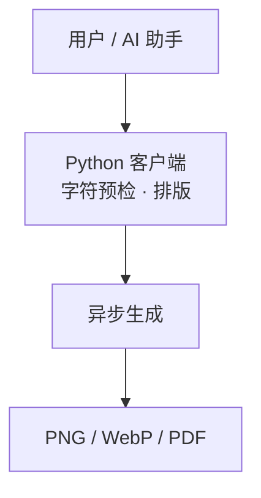

# Chat diagrams

Chat Markdown renders fenced `mermaid` blocks as diagrams. Flowcharts beginning
with `flowchart TD` (or another valid direction) or `graph LR` are also recognized
in unlabelled, `text`, `plaintext`, `flowchart` and `graph` code blocks. Explicit
programming languages and inline code keep their normal rendering.

For reliable Agent output, use a Mermaid fence:

````markdown

````

The renderer supports Mermaid's diagram types, including sequence diagrams.
The toolbar provides source/diagram switching, source copying and a zoomable
preview. Inline diagrams fit the available width and have a height limit;
the preview supports zooming and dragging. Diagrams follow light/dark mode
and work in read-only chat too.

While a reply streams, an unfinished fenced block remains source code. Once
the fence closes, it renders immediately. Invalid or unsupported syntax and
rendering failures preserve the source with a short fallback label. Async jobs
from replaced text or themes cannot overwrite the current diagram.

## Implementation

The shared UI owns `GraphChatMermaidDiagram`, `graphChatMermaid` and
`mermaid-diagrams.css`. Mermaid 11.16.1 loads on demand; its global configuration
and rendering operations run through a shared serial queue across chat panes.
Each render gets a unique SVG ID. SVG labels avoid foreign HTML, the renderer
uses strict security, and the result passes through DOMPurify. Diagram directives
cannot override the site's security settings, theme or rendering limits.

ReactMarkdown's code renderer retains a stable component identity so incoming
text and syntax-highlighter updates preserve diagram controls. The streamed
message wrapper forwards its streaming state to the Markdown renderer.

## Validation

- Shared UI: targeted `GraphChatMermaidDiagram`, `GraphChatMessageContent` and
  `GraphChatMessageBody` regressions, 17 tests passed.
- Shared UI build/declarations and typecheck; Web typecheck and production build.
- `e2e/mermaid-diagrams.spec.ts`: desktop Chromium and mobile Chromium passed.
- The same focused browser regression passed against the production Web preview,
  confirming lazy diagram imports work in the built assets.

The browser regression covers Chinese labels and line breaks, source switching,
zoom and focus return, ordinary code, invalid syntax, active-content sanitization,
theme regeneration and horizontal overflow. Its fixture uses an isolated fake
Supervisor and a database under `.temp/workbench/`.
