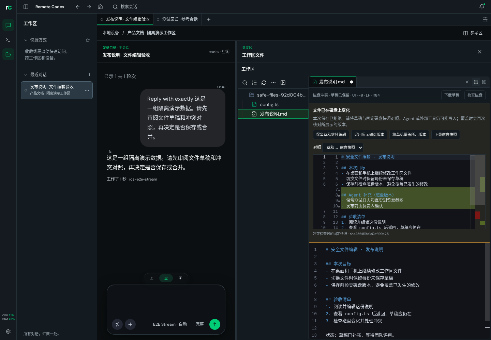

# 文件编辑与工作台：合并前视觉评审

2026-10-08。用户要求在独立分支实现并先看效果，再决定是否合并。本轮仅完成
feature 分支和组合 preview 分支；没有合入 main、推送 main、部署或发布版本。

## 效果图

截图来自隔离 fake Supervisor 的实际产品页面。会话内容和子代理终态是标注的
验收 fixture；文件读取、保存、磁盘冲突和操作回执经过真实 Rust API/设备文件。
桌面 1440×1000，手机 390×844。没有使用静态产品 mock 或 AI 图片。

| 场景 | 图片 | 可以评审的变化 |
| --- | --- | --- |
| 桌面编辑 | [原图](assets/narrafork-preview/files/desktop-editor.png) | 每文件草稿、脏标签、Undo/切换后恢复、明确保存操作；文件区有更宽初始比例 |
| 磁盘冲突 | [原图](assets/narrafork-preview/files/desktop-conflict.png) | 真实 409 后保留草稿，固定磁盘版本 diff，继续编辑/采用/按所示版本覆盖/下载 |
| 双会话 | [原图](assets/narrafork-preview/layout/desktop-compare.png) | 主会话与只读参考并排，唯一发送目标、显式设为主会话、独立历史与滚动 |
| 协作摘要 | [原图](assets/narrafork-preview/layout/desktop-collaboration.png) | 托管线程与 harness 原生子代理分开，真实状态字段和结果入口 |
| 手机编辑 | [原图](assets/narrafork-preview/files/mobile-editor.png) | 单视图文件编辑、下载草稿、保存、关闭，未保存状态可见 |
| 手机主会话 | [原图](assets/narrafork-preview/layout/mobile-main.png) | 只有主会话提供输入，未发送会话草稿保持来源隔离 |
| 手机参考 | [原图](assets/narrafork-preview/layout/mobile-reference.png) | 无第二个输入框，设为主会话/关闭按钮可达，Back 返回主视图 |




## 实现与取舍

文件侧实现 P0 核心：每文件有界内存 store、来源与 revision 隔离；独立 document/
conditional save/operation API；raw hash、固定冲突快照、受管写入串行、原子替换、
最小持久回执与不确定结果核验。保存中新输入不会因旧响应被清除。关闭/离页前
明确保护草稿。沿用 Monaco、标签、树和多格式预览。

工作台实现有限模板：主会话 + 文件/只读参考/协作摘要，本地保存成员与排列；
手机一个活动主视图。参考控制器共用主连接，不增加第二个 Supervisor socket；
关闭参考只隐藏视图。线程输入草稿按 device/thread 保留在页面内存。

父线程整合时补充：

- 保留两个分支的公共导出，组合构建 shared dist，核对消费方文件一致。
- “设为主会话”先完成文件离页决策，再改变参考成员。取消时原 URL、参考对象和
  隐藏草稿仍在；用浏览器回归验证。
- 文件区打开时采用 35/65 初始比例，保留拖动与键盘调整；移除参考区内文件树
  工具栏的重复标题，避免窄列中文字竖排。后续可进一步将各模板比例分别记忆。

## 明确限制

- 安全写入目前只支持 Linux 上符合 metadata/filesystem 约束的普通小型 UTF-8
  文件（50 KiB、1000 行）。BOM 和统一 LF/CRLF 可保留。不支持平台/旧 runtime
  降为只读预览，不能假装旧无条件端点具有 expectedHash 语义。
- 外部 shell/IDE 仍可写盘；最终检查到 rename 之间的外部 writer 竞态未消除。
  受管串行和固定快照并不构成任意进程强 CAS。
- 文件草稿和线程未发送草稿为内存状态，没有刷新后正文恢复；文件刷新前有
  beforeunload 保护。没有 watcher、自动 merge、多编码或大文件编辑。
- 仅同设备对照；未增加跨设备并排、云端布局、自由 Dockview、Git 后端和共享
  PTY。切换主/参考会话会重建时间线，暂不恢复旧像素滚动锚点。
- 协作摘要来自线程族及最近三轮原生工具记录；没有 task/inbox Web 摘要，查看
  不 ack inbox。真实 Relay/OAuth/真实模型全链路未在浏览器启动。

## 分支和提交

| 对象 | 主仓库 | 独立共享 UI |
| --- | --- | --- |
| 文件 feature | `feature/narrafork-file-editor` · `e6d845b14ead18238471f875dab88c94848e0aed` | `feature/narrafork-file-editor-ui` · `c0b34ab34676391c8cb6fa2d697057cf9f7d6303` |
| 布局 feature | `feature/narrafork-workbench` · `86c2ebea2d186f697e4b0f0548803988c604181d` | `feature/narrafork-workbench-ui` · `090fca674a7ab120a4719f7186ca499025d0af0a` |
| 组合预览 | `preview/narrafork-editor-workbench` | `preview/narrafork-editor-workbench-ui` · `ef9d702ba199937a96de513a272fb17eeeda6423` |

组合主仓库目录：`/home/ubuntu/dev/remoteCodex.worktrees/nf-combined-preview`。
从主基线 `6c104ceb3cde832f22d2dcb4188ca520a8bcaac5` 和 UI 基线
`970408b3772efccdae2b20153dec027aac9c4fef` 仅取两项实现提交；没有带入 feature
分支创建时继承的其他 ingress 文档提交。两仓均保留供用户评审，尚未 push。

## 验证证据

核对文件线程日志：runtime file_documents 5 综合回归、migration 5、HTTP 1、
可信 actor 1、relay ACL 7，以及相关 check/build/fmt 均通过。组合 crates 与该
已测文件提交没有差异，复用其 debug executable 的独立副本，SHA256 相同：
`871c6974e2ee061a954c3bc8d7a82461baa162837df81f030cd0f4cf8ead3fd8`。
无需再对相同 Rust 代码重复构建/全测。

父线程组合验证：shared build、双方 typecheck、Web production build 通过。
UI 定向 14 测试 + Web 定向 5 测试通过。共 **5 个桌面 + 2 个手机浏览器机制**
通过：文件 3+1、布局 2+1；调整后只重跑受影响文件用例，不把批次相加统计唯一
数量。另保留实现线程对已有 Explorer actions / thread groups 的通过记录。

准确命令（在组合 worktree，使用 corepack pnpm）：

```sh
corepack pnpm --dir remote-codex-thread-ui --filter @remote-codex/thread-ui build
corepack pnpm install --offline --frozen-lockfile
corepack pnpm --dir remote-codex-thread-ui --filter @remote-codex/thread-ui typecheck
corepack pnpm --filter @remote-codex/supervisor-web typecheck
corepack pnpm --filter @remote-codex/supervisor-web build
corepack pnpm --dir remote-codex-thread-ui --filter @remote-codex/thread-ui exec vitest run src/components/graph-workspace/explorer/workspaceDocuments.test.ts src/components/workbench/presentation.test.ts src/i18n/i18n.test.tsx
corepack pnpm --filter @remote-codex/supervisor-web exec vitest run src/pages/useThreadWorkspaceAdapter.test.tsx src/pages/useThreadDrafts.test.tsx src/pages/workbenchNativeModel.test.ts
```

浏览器命令共有隔离环境：

```sh
export PATH="$PWD/.temp/bin:$PATH"
export E2E_API_PORT=18186 E2E_WEB_PORT=15186
export E2E_DATABASE_URL="$PWD/.temp/workbench/combined.sqlite"
export E2E_WORKSPACE_ROOT="$PWD/.temp/workbench/workspaces"
export FILE_EDITOR_SCREENSHOTS="$PWD/.temp/combined/screenshots/files"
export WORKBENCH_SCREENSHOT_DIR="$PWD/.temp/combined/screenshots/layout"
corepack pnpm exec playwright test e2e/workspace-edit-safety.spec.ts e2e/workbench-panels.spec.ts --project=desktop-chromium --grep-invert 'mobile editor'
corepack pnpm exec playwright test e2e/workspace-edit-safety.spec.ts e2e/workbench-panels.spec.ts --project=mobile-chromium --grep 'mobile editor|comparison keeps'
```

首轮桌面文件用例在旧“关闭文件浏览器”定位失败，改为新外壳“关闭参考视图”；
新增回归随后因多个 fixture 同名 option 匹配失败，改为选择创建 API 返回的准确
线程 ID。修正后目标用例通过；没有增加 timeout 或 retry。文件宽度调整后再次
仅跑三个桌面文件用例：3/3 通过，10.5 秒。桌面持续执行/迟到响应隔离沿用首次
通过结果；手机两个相关用例 2/2 通过，5.8 秒。

日志保存在组合 worktree 的 `.temp/combined/`；截图副本已随此预览文档提交，
逐张查看，尺寸与 SHA256 记录在 `assets/narrafork-preview/manifest.json`。
未运行 workspace 全测、完整 E2E、平台矩阵；没有修改正式 Supervisor/数据库。
