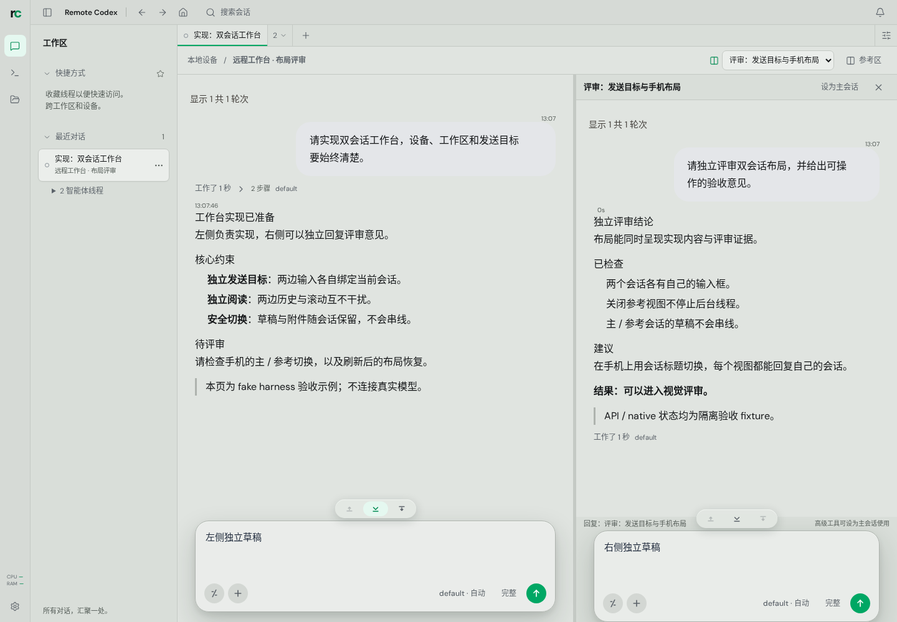
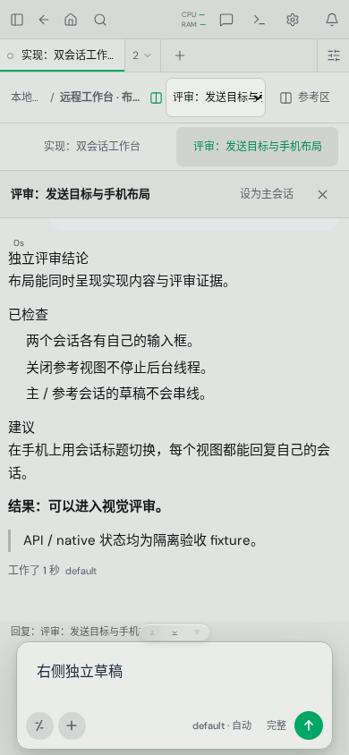

# 文件编辑与双向分屏：合并前视觉评审

2026-10-08。独立预览分支已按本次反馈改为两个可独立对话的会话，并移除主会话
重复标题状态栏。没有合入 main、push、部署或发布版本。

## 效果图

布局截图已更新，来自隔离 fake Supervisor 的实际产品页面；不是静态 mock 或
AI 图片。会话文字与原生子代理终态是明确标注的验收 fixture。桌面 1440×1000，
手机 390×844。文件编辑三张原图原样保留，代表上一轮已验收的文件功能；当前
布局以本轮 layout 图片为准。尺寸、SHA256、各图对应 UI SHA 记录在
[截图清单](assets/narrafork-preview/manifest.json)。

| 场景 | 图片 | 实际行为 |
| --- | --- | --- |
| 桌面双会话 | [原图](assets/narrafork-preview/layout/desktop-compare.png) | 两个标准输入框，草稿分别属于左右会话；顶部直接选择分屏会话，主会话重复标题状态区已删除 |
| 手机左会话 | [原图](assets/narrafork-preview/layout/mobile-main.png) | 以会话标题切换，左会话自己的输入与草稿可见 |
| 手机右会话 | [原图](assets/narrafork-preview/layout/mobile-reference.png) | 右会话同样有标准输入、附件和发送按钮，不必先设为主会话 |
| 协作摘要 | [原图](assets/narrafork-preview/layout/desktop-collaboration.png) | 保留托管线程、原生子代理状态和结果入口 |
| 桌面编辑（保留） | [原图](assets/narrafork-preview/files/desktop-editor.png) | 每文件草稿、脏标签、Undo、明确保存操作 |
| 磁盘冲突（保留） | [原图](assets/narrafork-preview/files/desktop-conflict.png) | 409 后保留草稿；固定磁盘快照 diff、继续编辑/采用/按所示版本覆盖/下载 |
| 手机编辑（保留） | [原图](assets/narrafork-preview/files/mobile-editor.png) | 单视图文件编辑、下载草稿、保存、关闭保护 |





## 双向分屏的实现

设备/工作区行直接暴露分屏会话选择器，无需先打开参考区菜单。左侧目标由当前
会话 tab 识别；右侧使用紧凑标题控制行与输入前短标签。手机切换按钮直接使用
两个会话标题。删除了“发送目标 · 主会话 / 会话标题 / harness · 状态”整条重复
区块，右侧也不再叠加 workspace/harness/status 摘要。

两边复用 `ThreadComposer`，各自绑定 device/thread 草稿、File 附件、发送锁、
错误、运行状态、Stop、请求回应和排队/Steer。浏览器回归将两路发送同时挂起，
确认它们分别到达真实 threadId 的端点；右侧附件随后经过真实 multipart API
保存到右侧线程目录，并核对文件内容。不是把两个输入合成一个发送请求。

右侧扩展既有轻量 controller，共用主页面的一个 Supervisor socket，以事件
节流刷新和定时恢复更新详情；没有嵌套 `ThreadDetailPage`，没有第二套设备管理、
自动恢复或 read/ack 副作用。所有异步操作先捕获目标，切换对象后旧结果不会写入
新对象。交换主会话时，主页面的错误、忙碌与乐观状态也按来源隔离。

Relay 权限按右侧目标 threadId 单独查询。权限未确认、失败或 read-only 时禁止
发送、停止、设置、请求回答和队列修改。主页面也收紧权限未确认的发送、请求
回应与只读队列删除入口。右侧不会继承左侧会话的 owner/control 权限。

文件编辑的 document store、revision/来源隔离、条件保存、原子替换、冲突快照
和未保存离页保护沿用既有实现。“设为主会话”仍先完成文件离页决策，再交换
成员；取消后 URL、原参考对象和隐藏文件草稿均保留。

## 功能边界

- 右侧直接支持普通对话、标准附件、模型/推理/沙箱等现有会话设置、Stop、待处理
  请求回应、排队、删除队列与后端支持的 Steer。Shell、目标/分叉、skills、MCP、
  hooks、harness 管理等高级工具需“设为主会话”后使用，输入前已有短提示。
- 仅同设备分屏。会话输入草稿和 File 对象保留在当前工作台内存，关闭/重开、切换
  目标和左右交换会保留；刷新后正文不会恢复。布局成员和排列会恢复。交换会话
  会重建时间线，不保存旧像素滚动位置。
- 文件安全写入仍仅支持 Linux 普通小型 UTF-8 文件（50 KiB、1000 行）；保留 BOM
  和统一 LF/CRLF。旧 runtime/不支持平台降为只读。外部 shell/IDE 写盘的最终
  检查到 rename 之间竞态未消除；没有 watcher、自动 merge、多编码或大文件编辑。
- 协作摘要仍来自线程族与最近三轮原生工具记录，没有 task/inbox Web 摘要。
  本轮只读权限以定向 controller 回归验证，未启动完整 Relay/OAuth/真实模型链路。

## 预览分支

| 对象 | 分支 / 提交 |
| --- | --- |
| 主仓库 | `preview/narrafork-editor-workbench`，本轮从 `88128d2edd8ac91cb839075c875513c7e0210ae4` 追加实现与证据提交 |
| 独立共享 UI | `preview/narrafork-editor-workbench-ui` · `692202ac34f5d0a6a7ecc41280962cf790e5b615` |

目录：`/home/ubuntu/dev/remoteCodex.worktrees/nf-combined-preview`，其嵌套
`pockymoe-thread-ui` 是独立仓库。最终主仓 SHA 与源码/日志索引见本轮交付
`/home/ubuntu/dev/remoteCodex/.temp/research/narrafork-implementation/revision/ui-result.md`。

## 本轮验证

共享 UI build、UI typecheck、Web typecheck 与 Web production build 通过。
定向 Web Vitest **5/5**：双槽草稿与附件交换、迟到回调、目标 ACL 的只读/未确认/
失败、各操作 ID、接受后 summary 失败不诱发重复提交。UI 定向 Vitest **11/11**：
布局持久化与 i18n。浏览器 **5 个桌面机制 + 2 个手机机制**通过：

- 桌面：真实双路并发发送与附件、切换/恢复/独立草稿、排队/Steer/Stop/错误隔离；
  运行中关闭与迟到参考响应；发送过程中交换主会话；文件脏草稿/Undo/取消离页/
  保存关闭。这里按测试计数为 5 个，前两项内容集中在两个分屏用例。
- 手机：两个可输入视图、并发在途请求、草稿交换、Back 和布局恢复；原有文件
  编辑、保存与关闭保护。

```sh
corepack pnpm --dir pockymoe-thread-ui --filter @pockymoe/thread-ui build
corepack pnpm install --offline --frozen-lockfile
corepack pnpm --dir pockymoe-thread-ui --filter @pockymoe/thread-ui typecheck
corepack pnpm --filter @pockymoe/supervisor-web typecheck
corepack pnpm --filter @pockymoe/supervisor-web build
corepack pnpm --dir pockymoe-thread-ui --filter @pockymoe/thread-ui exec vitest run src/components/workbench/presentation.test.ts src/i18n/i18n.test.tsx
corepack pnpm --filter @pockymoe/supervisor-web exec vitest run src/pages/useThreadDrafts.test.tsx src/pages/useWorkbenchReference.test.tsx
```

浏览器环境与准确范围：

```sh
export PATH="$PWD/.temp/bin:$PATH"
export E2E_API_PORT=18196 E2E_WEB_PORT=15196
export E2E_DATABASE_URL="$PWD/.temp/workbench/dual-chat.sqlite"
export E2E_WORKSPACE_ROOT="$PWD/.temp/workbench/dual-chat-workspaces"
export WORKBENCH_SCREENSHOT_DIR="$PWD/.temp/dual-chat/screenshots/layout"
corepack pnpm exec playwright test e2e/workbench-panels.spec.ts e2e/workspace-edit-safety.spec.ts --project=desktop-chromium --grep 'dual conversations|secondary queue|opening and closing references|dirty file survives'
corepack pnpm exec playwright test e2e/workbench-panels.spec.ts --project=desktop-chromium --grep 'swapping primary'
corepack pnpm exec playwright test e2e/workbench-panels.spec.ts e2e/workspace-edit-safety.spec.ts --project=mobile-chromium --grep 'dual conversations|mobile editor'
```

专项迭代只重跑失败或受改动影响的用例。测试自身的初始定位/断言已按实际标准
组件契约修正：历史取 userMessage 文本；附件文件名包含去重后缀；英文发送按钮
是 `Send Prompt`；发送忙碌状态显示 `Sending...`，标准组件仍通过提交锁阻止重复
发送。没有扩大 timeout 或 retry 来掩盖失败。

日志位于组合 worktree `.temp/dual-chat/`。Playwright 配置清除继承的正式
Supervisor/Relay 参数，明确覆盖数据库和 workspace 的优先环境变量；本轮使用
隔离 fake runtime、独立端口、已有匹配 Rust executable。没有改动 crates，不重复
构建 Rust；没有接触正式 Supervisor/数据库、运行 workspace 全测、完整 E2E 或
发布矩阵。文件原图三张 SHA256 均与上轮相同。
