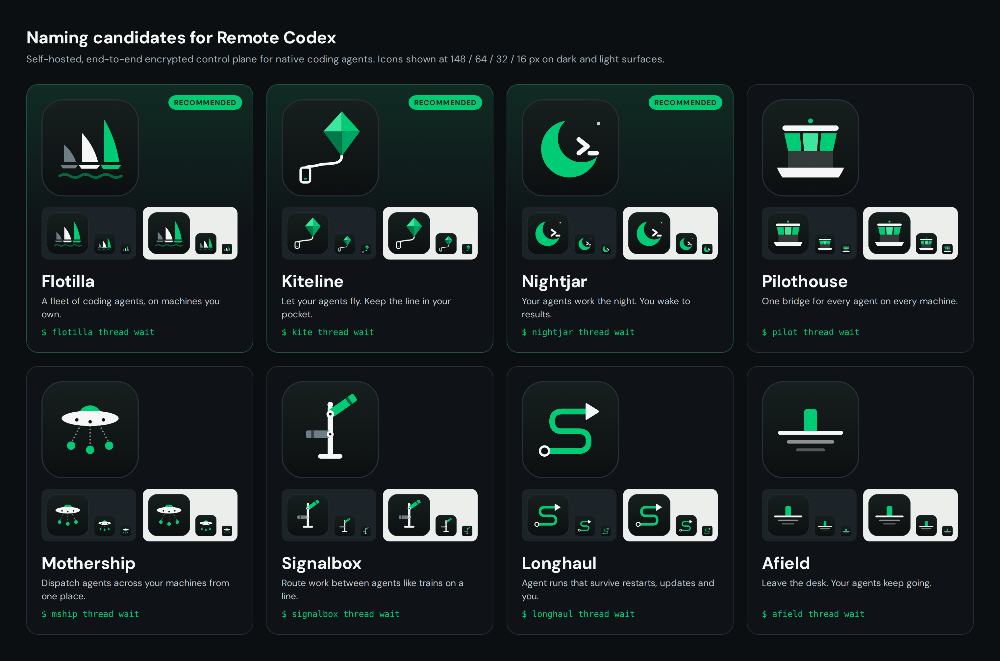

# 项目命名提案

> 最终定名：**Pockymoe**（2026-10-10）。图标见 [`pockymoe/`](pockymoe/README.zh.md)，改名方式和兼容规则见 [`docs/rename-pockymoe.md`](../../rename-pockymoe.md)。下面是第一轮候选，保留作为历史记录。

日期：2026-10-08。状态：已定名为 Pockymoe。

图标源文件在 [`icons/`](icons/)（512×512 SVG，可直接用作 favicon / PWA / 托盘图标源）。
预览页是 [`preview.html`](preview.html)。

## 为什么要换名

- **"Codex" 是 OpenAI 的产品名。** 拿去做宣传有商标风险，也会让人误以为这是 OpenAI 官方产品或只支持 Codex。
- **名字已经装不下现在的产品。** ACP 目录里有 9 个 harness：Codex、Claude、Gemini CLI、Grok Build、Cursor Agent、Copilot CLI、OpenCode、DeepSeek Harness，以及自定义 ACP 命令。
- **"Remote" 这个赛道已经很挤。** 2026 年"手机遥控编码 agent"类产品已经很多，如 Claude Code Remote Control、Happy、Paseo、Rein、AgentDeck、AgentPort、Leash、Tailscode、Cmd+Ctrl。只强调"远程"很难被记住。

## 新名字要讲的故事

一句话定位：

> A self-hosted, end-to-end encrypted control plane where your native coding agents, Codex, Claude Code, Gemini, Grok, Cursor and more, run on your own machines, work as a team, and stay in your pocket.
>
> 在你自己的机器上运行原生编码 agent，让它们跨设备协作，并把控制权放进口袋。全程端到端加密。

和同类相比，真正的差异点有四个，名字和图标至少要撑起其中一个：

1. **多 agent、多设备成队协作。** inbox / queue / steer 投递、子线程、任务板、wait/wake、跨设备线程。
2. **原生 agent。** 不替换 CLI，导入并续接已有 session，9 个 harness 并排运行。
3. **Relay 看不到内容。** HPKE 端到端加密，可穿透 NAT，没有中心化的对话副本。
4. **长任务不中断。** 更新、重启后自动续跑被打断的线程。

命名标准：

- 短，好读，能当 CLI 命令。
- 不含第三方商标。
- 在 AI 编码 agent 领域没有同名产品。
- 有可延展的隐喻，图标在 16px 下仍能辨认。

## 候选名

可用性是 2026-10-08 的快照：域名用 RDAP 查询，404 表示当时未注册；npm 查的是无 scope 包名。这不是商标检索。

| 名字 | 寓意 | Slogan | CLI | npm | 未注册域名 |
| --- | --- | --- | --- | --- | --- |
| **Flotilla** ⭐ | 小型舰队：多台机器上的一队 agent 编队前进 | A fleet of coding agents, on machines you own. | `flotilla` / `flo` | 被 2013 年的废弃包占用，可用 `@flotilla/cli` | flotilla.sh |
| **Kiteline** ⭐ | 风筝线：agent 飞得再远，线仍握在你手里（手机） | Let your agents fly. Keep the line in your pocket. | `kite` | **可用** | kiteline.dev、kiteline.sh |
| **Nightjar** ⭐ | 夜鹰，夜行鸟：你睡觉时 agent 在干活 | Your agents work the night. You wake to results. | `nightjar` | 被旧数学库占用 | nightjar.sh |
| Pilothouse | 驾驶舱：一个舱室掌控整船 | One bridge for every agent on every machine. | `pilot` | 被旧 Docker 工具占用 | pilothouse.dev、pilothouse.sh |
| Mothership | 母舰：从一处派出 agent 到各台机器 | Dispatch agents across your machines from one place. | `mship` | 被小工具包占用 | mothership.sh |
| Signalbox | 铁路信号楼：像调度列车一样在 agent 之间路由工作 | Route work between agents like trains on a line. | `signalbox` | 被旧 Redux 中间件占用 | (.dev 已注册) |
| Longhaul | 长途运输：跑几小时的任务也能扛过重启和更新 | Agent runs that survive restarts, updates and you. | `longhaul` | **可用** | 未查 |
| Afield | 远离书桌、身在野外：人走了，agent 继续跑 | Leave the desk. Your agents keep going. | `afield` | **可用** | afield.sh |

### 推荐 1：Flotilla

最能体现产品与众不同的一点：多 agent、多设备，成队协作，而不是"手机遥控一个 agent"。

- 隐喻可以延展到整套产品：设备是船，线程是船员，Relay 是航道，Supervisor 是旗舰。
- 图标是三面大小递进的帆，颜色从灰、白到品牌绿，下面是水波。
  - 一眼能看出"一队"，也有前进感。
  - 16px 下仍能辨认出三角帆。
- 风险：npm 无 scope 名被占用；flotilla.dev / .app 已注册。

### 推荐 2：Kiteline

最好传播、可用性最干净：npm、.dev、.sh 都还空着，也没查到同名开发工具。

- 打的是"远程 / 移动"的情绪点，画面感强：agent 在天上飞，线在你手里的手机上。
- 图标是四个切面的绿色风筝，线连到左下角的一部手机。
- CLI 可以简写成 `kite`。
- 风险：Kite 是 2022 年停运的 AI 补全产品，老用户可能联想到它。但 Kiteline 拼写不同，问题不大。

### 推荐 3：Nightjar

情绪钩子最强，图标也最醒目：绿色新月里放着一个终端提示符 `>_`。

- 直接对应"睡前布置任务、醒来收结果"的使用场景，适合在社交媒体上传播。
- 避开了已被占用的 Nightshift（有两个同名 AI 编码工具）。
- 风险：night shift 这个叙事在同类产品中很常见，比如 AgentsRoom；Framer 上也有一个叫 NightJar Agent 的落地页模板。

## 已排除（同领域撞名）

| 名字 | 撞名对象 |
| --- | --- |
| Rein / Reins | Rein 也是手机控制 Claude / Codex / Gemini 的应用 |
| Bosun | 同名的开源 AI agent 编排器 |
| Nightshift | 两个同名的 AI 编码 CLI |
| AgentDeck | npm 上已有手机控制 agent 的包 |
| Roost | macOS 上的 AI agent 终端 |
| Switchyard | NVIDIA NeMo Switchyard，另有一个 MCP harness 同名 |
| Weft | 多个 AI agent 项目 |
| Orrery | agent 编排 MCP |
| Muster | Giant Swarm 的 agent 工具 |
| Conductor | 多 Claude Code 并行的 Mac 应用 |
| Leash、AgentPort、Control | 都是 iOS 上的 agent 遥控应用 |
| Steer | 适合作为产品里的动词保留；作为品牌名太泛，难做 SEO |
| Helm 系 / 船舵图标 | Kubernetes Helm 的 logo 就是船舵 |

## 图标说明

- 配色沿用当前 Matter 主题：
  - 底色 `#0c0f11` → `#17201e`
  - 品牌绿 `#00cc76`，亮绿 `#3ee59c`，深绿 `#007a49`
  - 前景 `#f4f7f6`，次要灰 `#6f7d86`
- 遵守 `PRODUCT.md` 里不用紫色渐变和发光效果的要求。
- 每个图标都是圆角方形 app icon。预览图里同时给出 148 / 64 / 32 / 16 px，以及深色、浅色两种底色下的效果。
- 这些是方向稿。选定名字后还需要：
  - 为 16px favicon 单独做一版简化图形。
  - 配一个字标（DM Sans Bold，或定制字形）。
  - 导出 PNG / ICO / apple-touch-icon。

## 选定之后（不在本次范围）

1. **商标检索**：USPTO、EUIPO、中国商标网，第 9 类和第 42 类。
2. **抢注资源**：域名、npm scope、GitHub org、X/Twitter 账号。
3. **迁移计划**：
   - npm 包名和 CLI 名：`remote-codex` 保留为别名。
   - 环境变量 `REMOTE_CODEX_*`：新旧前缀并存一段时间。
   - Relay 域名、Windows Device Manager 显示名、PWA manifest、`.remote-codex/` 目录。
   - 按 `AGENTS.md`，Device Manager 品牌更新需要单独发版。
