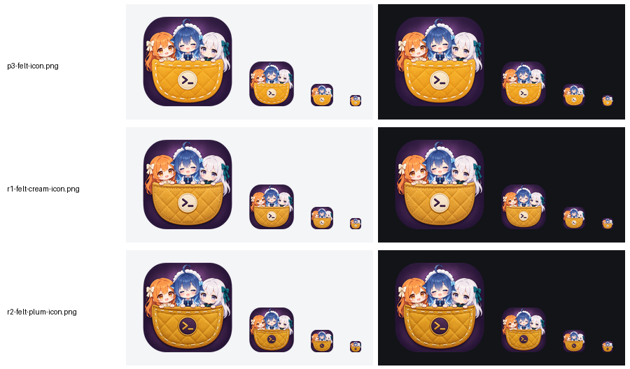
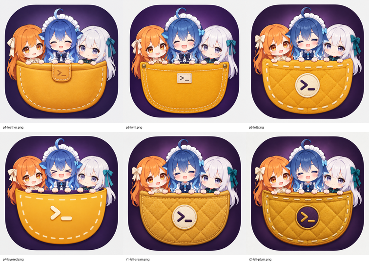

# Pockymoe 图标

日期：2026-10-10。状态：已选定 felt-cream，作为 `rename/pockymoe` 分支的正式图标。


用户在上一轮选定了 H 方案（深梅紫底、芥末黄口袋、三个 AI 风格的 Q 版角色），这一轮按要求再优化：

- **去掉全部商标。** Claude 星芒、OpenAI 六瓣结、DeepSeek 鲸鱼徽标都已移除，角色只保留发色和服装风格：
  - 左边：橘发，奶油色缎带。
  - 右边：银发，青绿色缎带。
- **中间的 DS 娘按用户提供的参考图重画。** 深蓝渐变长发，呆毛，白色女仆头饰，下垂的鲸鳍耳，侧边小蓝蝴蝶结，黑领结配蓝宝石。参考图只作为生成时的输入，没有存进仓库。
- **口袋做得更精致。**
  - 细绒羊毛毡材质，菱格绗缝，深芥末色包边，金线缝制。
  - 正中间是奶油底、金边的刺绣圆章，上面绣着梅紫色的终端提示符 `>_`。

## 候选

| 文件 | 说明 |
| --- | --- |
| ⭐ [`icon-felt-cream.png`](icon-felt-cream.png)（1024px） | 奶油色徽章。32px 下徽章仍然清楚。 |
| [`icon-felt-plum.png`](icon-felt-plum.png)（512px） | 梅紫色徽章配金色 `>_`，和背景更呼应，但小尺寸下辨识度略低。 |





四个口袋方向的取舍：

- **皮革和斜纹布**：`>_` 标签太小、对比弱，小尺寸下看不清。
- **分层扁平**：清楚，但不够精致。
- **绗缝毛毡**：圆章对比强，质感最好，进入细化。

## 使用注意

- 图标里已经没有任何公司商标。
- **DS 娘形象来自社区二创。** 她的商业使用仍需取得原设计者授权，见上一版的说明 [`../pocketteam/README.zh.md`](../pocketteam/README.zh.md)。
- **名字 "Pockymoe" 含有 "Pocky"。** "Pocky" 是江崎格力高的注册商标，正式推广前建议做商标检索。

## 生成方式

- 使用本机全局 skill `nikoapi-imagegen`，路径为 `~/.claude/skills/nikoapi-imagegen`。上游地址和密钥只保存在 skill 的配置里，不进仓库。
- 第一轮传两张参考图：
  - 图 1：上一版 H 方案的整图，用作构图和配色参考。
  - 图 2：用户提供的 DS 娘，去掉底部文字后作为中间角色的参考。
- 细化轮把毛毡版作为编辑底图，同样带上 DS 娘参考图。
- 后处理用 skill 的 `icon_tools.py`：
  - `cutout`：抠成透明的圆角方形。
  - `sizes`：做 128/64/32/16px 的小尺寸测试。

## Prompts

### p1-leather（参考图：上一版图标、DS 娘）

```text
Use case: logo-brand
Asset type: app icon for "Pockymoe", a developer tool that keeps a cute team of AI coding agents in your pocket; used as the iOS/macOS/PWA icon, so it must still read at 64px
Input images: Image 1 is the previous icon, a composition and palette reference only: deep plum squircle, a mustard-gold pocket at the bottom, three chibi girls peeking out of it holding the rim. Image 2 is the character reference for the CENTER girl only.
Composition/framing: one single centered rounded-square (squircle) app icon, whole icon visible, on a plain very light gray backdrop with generous padding; the three heads are large and fill the upper half, the pocket fills the lower half
Subject: three super-deformed chibi anime girls (about 2 heads tall, only heads, shoulders and small hands gripping the pocket rim visible):
- center, slightly higher, drawn after Image 2: long deep-blue hair fading to lighter blue at the tips, a curled ahoge, a white frilly maid headband, drooping navy whale-fin ears with pale blue inner edges, a small light-blue bow on one side, navy maid dress with a white ruffled collar, a black bow tie with a small round blue gem; happy closed eyes, rosy blush, small open mouth
- left: long warm ginger-orange hair, amber eyes, a plain cream ribbon in her hair, cream blouse collar; gentle smile
- right: long silver-white hair, gray-violet eyes, a plain teal satin ribbon bow in her hair, black collar with teal trim; calm smile
Color palette: deep plum squircle with a soft lighter radial glow behind the heads; warm mustard-gold pocket
Pocket design: a refined mustard-tan leather pocket with a softly curved opening, a folded welt edge along the rim, even cream saddle stitching around the edges, gentle leather grain and soft highlights; a small rounded leather tab at the front center debossed with a neat terminal prompt mark ">_"
Style/medium: polished premium app icon illustration, clean anime chibi line art with soft cel shading, crisp edges, refined lighting, sticker-quality finish
Constraints: no company logos, emblems or trademark shapes anywhere (no starburst or sun-spark clip, no knot or rosette ornament, no whale logo or whale emblem on clothes); no words or letters except the small ">_" mark; no watermark; faces large and readable; fully clothed and wholesome
```

### p2-twill（参考图：上一版图标、DS 娘）

```text
Use case: logo-brand
Asset type: app icon for "Pockymoe", a developer tool that keeps a cute team of AI coding agents in your pocket; used as the iOS/macOS/PWA icon, so it must still read at 64px
Input images: Image 1 is the previous icon, a composition and palette reference only: deep plum squircle, a mustard-gold pocket at the bottom, three chibi girls peeking out of it holding the rim. Image 2 is the character reference for the CENTER girl only.
Composition/framing: one single centered rounded-square (squircle) app icon, whole icon visible, on a plain very light gray backdrop with generous padding; the three heads are large and fill the upper half, the pocket fills the lower half
Subject: three super-deformed chibi anime girls (about 2 heads tall, only heads, shoulders and small hands gripping the pocket rim visible):
- center, slightly higher, drawn after Image 2: long deep-blue hair fading to lighter blue at the tips, a curled ahoge, a white frilly maid headband, drooping navy whale-fin ears with pale blue inner edges, a small light-blue bow on one side, navy maid dress with a white ruffled collar, a black bow tie with a small round blue gem; happy closed eyes, rosy blush, small open mouth
- left: long warm ginger-orange hair, amber eyes, a plain cream ribbon in her hair, cream blouse collar; gentle smile
- right: long silver-white hair, gray-violet eyes, a plain teal satin ribbon bow in her hair, black collar with teal trim; calm smile
Color palette: deep plum squircle with a soft lighter radial glow behind the heads; warm mustard-gold pocket
Pocket design: a structured mustard cotton-twill pocket with crisp double contrast stitching in cream, small brushed brass rivets at the two top corners, and a little woven label tab sewn at the front center showing a neat terminal prompt mark ">_"
Style/medium: polished premium app icon illustration, clean anime chibi line art with soft cel shading, crisp edges, refined lighting, sticker-quality finish
Constraints: no company logos, emblems or trademark shapes anywhere (no starburst or sun-spark clip, no knot or rosette ornament, no whale logo or whale emblem on clothes); no words or letters except the small ">_" mark; no watermark; faces large and readable; fully clothed and wholesome
```

### p3-felt（参考图：上一版图标、DS 娘）

```text
Use case: logo-brand
Asset type: app icon for "Pockymoe", a developer tool that keeps a cute team of AI coding agents in your pocket; used as the iOS/macOS/PWA icon, so it must still read at 64px
Input images: Image 1 is the previous icon, a composition and palette reference only: deep plum squircle, a mustard-gold pocket at the bottom, three chibi girls peeking out of it holding the rim. Image 2 is the character reference for the CENTER girl only.
Composition/framing: one single centered rounded-square (squircle) app icon, whole icon visible, on a plain very light gray backdrop with generous padding; the three heads are large and fill the upper half, the pocket fills the lower half
Subject: three super-deformed chibi anime girls (about 2 heads tall, only heads, shoulders and small hands gripping the pocket rim visible):
- center, slightly higher, drawn after Image 2: long deep-blue hair fading to lighter blue at the tips, a curled ahoge, a white frilly maid headband, drooping navy whale-fin ears with pale blue inner edges, a small light-blue bow on one side, navy maid dress with a white ruffled collar, a black bow tie with a small round blue gem; happy closed eyes, rosy blush, small open mouth
- left: long warm ginger-orange hair, amber eyes, a plain cream ribbon in her hair, cream blouse collar; gentle smile
- right: long silver-white hair, gray-violet eyes, a plain teal satin ribbon bow in her hair, black collar with teal trim; calm smile
Color palette: deep plum squircle with a soft lighter radial glow behind the heads; warm mustard-gold pocket
Pocket design: a plush mustard felt pocket with a soft quilted diamond pattern and rounded puffy edges, cream running stitches, and a round embroidered satin-stitch patch at the front center showing a neat terminal prompt mark ">_"
Style/medium: polished premium app icon illustration, clean anime chibi line art with soft cel shading, crisp edges, refined lighting, sticker-quality finish
Constraints: no company logos, emblems or trademark shapes anywhere (no starburst or sun-spark clip, no knot or rosette ornament, no whale logo or whale emblem on clothes); no words or letters except the small ">_" mark; no watermark; faces large and readable; fully clothed and wholesome
```

### p4-layered（参考图：上一版图标、DS 娘）

```text
Use case: logo-brand
Asset type: app icon for "Pockymoe", a developer tool that keeps a cute team of AI coding agents in your pocket; used as the iOS/macOS/PWA icon, so it must still read at 64px
Input images: Image 1 is the previous icon, a composition and palette reference only: deep plum squircle, a mustard-gold pocket at the bottom, three chibi girls peeking out of it holding the rim. Image 2 is the character reference for the CENTER girl only.
Composition/framing: one single centered rounded-square (squircle) app icon, whole icon visible, on a plain very light gray backdrop with generous padding; the three heads are large and fill the upper half, the pocket fills the lower half
Subject: three super-deformed chibi anime girls (about 2 heads tall, only heads, shoulders and small hands gripping the pocket rim visible):
- center, slightly higher, drawn after Image 2: long deep-blue hair fading to lighter blue at the tips, a curled ahoge, a white frilly maid headband, drooping navy whale-fin ears with pale blue inner edges, a small light-blue bow on one side, navy maid dress with a white ruffled collar, a black bow tie with a small round blue gem; happy closed eyes, rosy blush, small open mouth
- left: long warm ginger-orange hair, amber eyes, a plain cream ribbon in her hair, cream blouse collar; gentle smile
- right: long silver-white hair, gray-violet eyes, a plain teal satin ribbon bow in her hair, black collar with teal trim; calm smile
Color palette: deep plum squircle with a soft lighter radial glow behind the heads; warm mustard-gold pocket
Pocket design: a clean modern layered pocket built from crisp flat shapes: mustard front panel with a subtle top-to-bottom gradient, a darker plum inner lining visible at the opening, a thin cream stitched border, a soft drop shadow under the rim, and a small glossy enamel pin at the front center shaped as a terminal prompt mark ">_"
Style/medium: polished premium app icon illustration, clean anime chibi line art with soft cel shading, crisp edges, refined lighting, sticker-quality finish
Constraints: no company logos, emblems or trademark shapes anywhere (no starburst or sun-spark clip, no knot or rosette ornament, no whale logo or whale emblem on clothes); no words or letters except the small ">_" mark; no watermark; faces large and readable; fully clothed and wholesome
```

### r1-felt-cream（编辑底图：p3-felt；参考图：DS 娘）

```text
Use case: precise-object-edit
Asset type: app icon for "Pockymoe"
Input images: Image 1 is the edit target. Image 2 is the character reference for the center girl.
Primary request: refine only the pocket so it looks premium, crafted and designed: fine wool felt with a delicate diamond quilting pattern and subtle fabric texture, a thin darker-mustard piped edge along the rim, neat stitching in warm golden thread, soft realistic shading and a gentle shadow under the girls' hands on the rim.
Badge: keep the round embroidered patch at the front center, cream with a thin golden border ring, the terminal prompt mark ">_" embroidered in dark plum.
Constraints: keep everything else exactly unchanged: the plum squircle background, the composition, all three girls (faces, hair, ribbons, expressions, poses, hands on the rim); the center girl keeps matching Image 2 (deep-blue hair, ahoge, maid headband, navy whale-fin ears, small blue bow, black bow with blue gem); no logos, emblems or trademark shapes; no words or letters except ">_"; no watermark
```

### r2-felt-plum（编辑底图：p3-felt；参考图：DS 娘）

```text
Use case: precise-object-edit
Asset type: app icon for "Pockymoe"
Input images: Image 1 is the edit target. Image 2 is the character reference for the center girl.
Primary request: refine only the pocket so it looks premium, crafted and designed: fine wool felt with a delicate diamond quilting pattern and subtle fabric texture, a thin darker-mustard piped edge along the rim, neat stitching in warm golden thread, soft realistic shading and a gentle shadow under the girls' hands on the rim.
Badge: make the round embroidered patch at the front center deep plum with a thin golden border ring, the terminal prompt mark ">_" embroidered in warm gold.
Constraints: keep everything else exactly unchanged: the plum squircle background, the composition, all three girls (faces, hair, ribbons, expressions, poses, hands on the rim); the center girl keeps matching Image 2 (deep-blue hair, ahoge, maid headband, navy whale-fin ears, small blue bow, black bow with blue gem); no logos, emblems or trademark shapes; no words or letters except ">_"; no watermark
```

