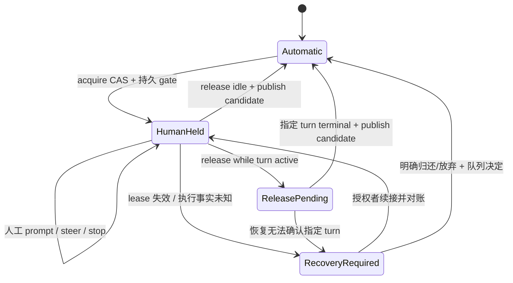
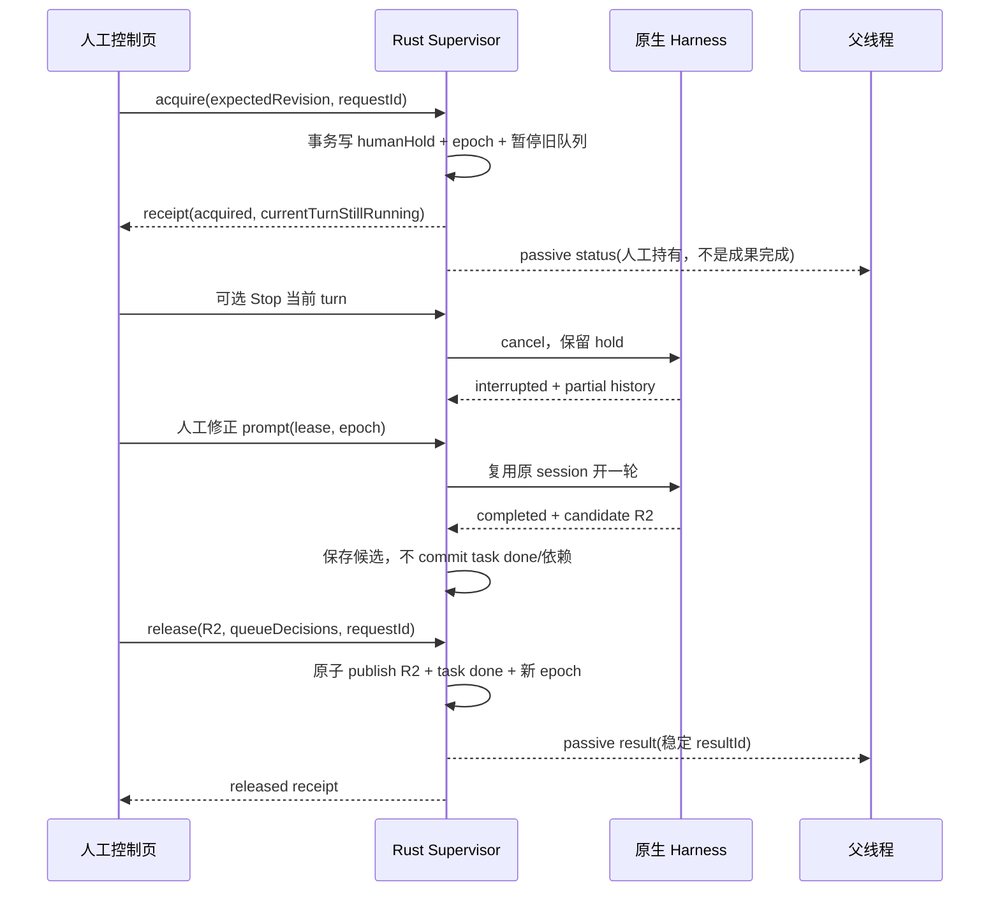

# 人工介入与多 Agent 协作详细方案

日期：2026-10-07（Toronto）；任务板 #2。本文仅研究与设计，不实现产品功能。

建议把人工接管实现为 Rust 控制面的**持久协作闸门**：用户明确持有一个 remoteCodex 子线程的自动驱动权和成果交付权，原生 harness 仍负责执行。接管默认让正在运行的 turn 结束；停止当前 turn、发送纠偏、暂停后续调度、归还成果分别操作。结果始终通过 passive inbox 交付，不能借接管把报告升级为 direct/queue，也不能因打开、聚焦或关闭面板隐式发命令。

## 1. 范围、基线与证据等级

| 对象 | 实际读取版本 | 说明 |
| --- | --- | --- |
| remoteCodex | `ffb07d8b17c08af5aa601a67af6e9f058a5a25ac` | 当前工作目录 HEAD；业务对比基线为 `94edcfadc8a6dda5ebc23271ee582709d32af171` |
| shared UI | `8e4c384d81012c229d1a780ea175fa2dbaa5c82b` | 独立仓库 `remote-codex-thread-ui` |
| NarraFork | `4e04d2f2e490bd57a5d8d712b709a574b905848a` | `.temp/research/NarraFork`，全程只读 |

共同输入为 [代码对比报告](../narrafork-comparison-2026-10-07.zh.md)。下面“已有”以生产源码为依据；测试只帮助核对边界；“建议”“草案”“拟新增”均尚未实现。本轮没有运行 NarraFork Agent、读取其模型凭据、修改产品源码、构建应用或执行浏览器测试。

特别区分三个对象：

1. **remoteCodex 托管子线程**：有自己的 threadId、parentThreadId/rootThreadId、CLI 身份、投递队列、inbox、任务记录，是第一阶段可接管对象。
2. **harness 原生子代理**：例如 `activeSubagents` 中的 native subagent。它可能没有可寻址 remoteCodex threadId，能否单独中止/对话/接回由 harness 决定，不自动获得本方案能力。
3. **其他设备上的 peer thread**：可通过已有 peer 路由通信，但不能凭本机 lineage 名称或接管标记取得远端控制权。第一阶段只读展示，并使用既有 peer 纠偏/结果语义。

## 2. NarraFork 的真实体验及其限制

### 2.1 接管的是结果，而非自动停止当前 turn

`subagent-takeover.ts:4–32` 明确规定 takeover 是对结果的 claim。`POST /:id/takeover` 在 `narrators.ts:4319–4375` 内用 resume lock 检查：对象是有父代理的 subagent、状态为 working/waiting、实际有执行 engine；仅执行 `markTakenOver`、写 `taken_over` 展示标记并广播，没有 abort。数据库显示工作中却没有 engine 时返回 409，避免建立永远无法兑现的接管。

用户看到接管标记时，子代理仍可能正在执行工具。它的含义是“这份结论须经我再交父代理”，不能读成“已停止修改文件”。当前执行自然结束后进入 `idle[taken_over]`。Stop 是独立操作，接管期间的 Stop 保留 hold（`beginSubagentInterruptSuspension`，`subagent-takeover.ts:138–157`；interrupt 路由 `narrators.ts:4173–4228`）。

### 2.2 前台：父代理的工具调用等待人工归还

前台 subagent 的运行结束/局部中断进入 `agent-runtime/control.ts:60–165`：写 idle+taken_over，广播 suspended，调用 `waitForManualOverride`。原前台 runner 没有被替换成另一个 AgentLoop，父工具调用继续等待；人工发送输入可在原 runner 中 resume，下一轮结束后仍回到接管等待。

`subagent-manual-override.ts:23–143,209–253` 用内存 Map 保存 Promise resolve、parentSignal、entryId、claimId 和 waiting/claimed/settled。resume/finish/detach 等操作先 claim，只有当前 entry/claim 可以 settle。父中断在异步准备期间到来则记录 pendingTerminal，终止结果优先，避免老回调清掉新 entry。等待没有自动超时，但仍受父 signal，以及 runtime control 合并的执行 timeout signal 影响；不应描述为永久免于终止。

还存在结束接管的错误边界：`agent-runtime/control.ts:67–80` 对 parent abort、timeout、detach 不再进入人工等待；非 aborted 的 execution error 会清 takeover 后走普通结束路径。后台 `subagent-runner.ts:1028–1042,1075–1086` 则在一般结束和 catch 分支都检查 takeover。因此其不同 engine 的异常路径不能一概描述为“所有失败结果都必定等人工归还”。我们建议的新持久 hold 明确保留失败/中断候选，不照搬这个差异。

### 2.3 后台：停用自动完成回收，让人继续对话

`subagent-runner.ts:773–848` 的 `transitionBackgroundTakenOverToIdle` 在当前执行结束后移除 background trait，清空后台完成字段、写 idle+taken_over，并静默停止后台 task tracking；不会作为 completed/failed 通知父代理。`background-task-service.ts:3156` 附近把被接管任务行标记为 cancelled 以退出旧追踪，这只是其内部实现，不能解释成人工取消了业务成果。

归还时 `finalizeTakenOverBackgroundSubagent`（`subagent-runner.ts:644–706`）恢复后台 terminal 状态及存储结果，通过 runtime publication 和后台 completion 通路交付。它还修正先前 cancelled 的后台 task row，避免 Await 回收陈旧取消状态。由此可见“前台/后台”会改变结果归还路径，直接搬两个独立完成分支会扩大恢复复杂度。

### 2.4 Agent / Send / Await 与接管如何交织

| 操作 | 实际代码行为 | 产品含义 |
| --- | --- | --- |
| Agent 创建时 `takeover_by_user:true` | `tools/task.ts:9–14,107,499`，`subagent-runner.ts:1940,2256–2260` 强制走独立后台启动并立即返回；初始 prompt 仍执行 | 可创建“交给用户继续讨论”的代理；不等于创建后不运行 |
| 普通 Agent 前台执行后被接管 | 原 tool call 留在 manual override wait | 父代理等人工归还；不能从 idle 推断完成 |
| Await 接管对象 | `agent-communication.ts:760–790,1134–1138` 将 taken_over 排除 terminal；一部分路径立即报告 taken_over，已进入 wait 的路径不把 idle+taken_over 当完成 | 要区分等待开始时机与后台任务状态；不能笼统声称所有 Await 都会立即退出或永远阻塞 |
| Await 回收 | `tools/await.ts:17–42` 排除 timeout/aborted/running/taken_over 的 terminal consumption | 人工接管期间不确认消费最终结果 |
| 父代理 Send | `agent-communication.ts:1376–1391` 仍接收团队 Send，可 buffer/resume；对接管目标忽略 doInterrupt，结束后再回 hold | 它保护用户 turn 不被父代理打断，但并未排他禁止父代理驱动下一轮 |
| 人工操作 | composer 保留输入，接管后显示 Stop takeover；仍可发送/停止/排队/继续 | 用户可以直接操作子代理，而非只在父聊天框转述 |

最后一项 Send 是容易误读的边界：NarraFork 的 takeover 不是严格单写者控制租约。我们若使用“由你接管”的文案，应在控制面真正限制自动驱动，不能允许父代理在用户不知情时另开 turn。

### 2.5 归还：空闲立即交付，运行中延迟交付

`POST /:id/stop-takeover`（`narrators.ts:4381–4577`）按当前实际 owner 分流：

- 已 suspend 的 foreground runner：提取结论、resolve manual override，原 finalizer 完成工具结果。
- 仍运行：记录 pendingStopTakeover 或 pendingBackgroundFinalize，返回 `deferred:true`，等当前循环结束再交付。
- 空闲后台：恢复后台 completion。
- session engine + conclusion watcher：准备引用、更新原工具结论，再移除 watcher。

`subagent-takeover.ts:173–203` 区分“控制流程还 hold”与“用户已经点归还但待执行结束”。归还 pending 时隐藏接管 badge，但内部 hold 尚在；用于防止刷新后重新点亮旧 badge。多入口、多 finalizer 的设计说明需要持久的 releasePending，而非只有一个布尔值。

### 2.6 UI、持久状态与重启限制

`composer/composer-action-slot.ts:1–28` 与 `NarratorComposerRow.tsx:342–360` 将空输入接管按钮、正常发送按钮、已接管归还按钮分开，运行中纠偏输入不会因为尚未接管而消失。父卡片与子页面分别订阅状态，`subagent-takeover-broadcast.ts`、`RenderSubagent.tsx:598` 以及 `narrator-messages.ts:2383` 的加载补齐确保重连时显示一致。

但控制真相在 `Set`/`Map`/Promise，数据库 `taken_over` 只作镜像。`hydrateTakeoverState()`（`subagent-takeover.ts:225–231`）是明确 no-op，进程重启后不会重建接管控制；startup reconciliation 将 working/waiting 收敛为 interrupted。重连可恢复 UI，不等于进程重启可恢复接管。另有 runtime publication、mailbox、run/result 的持久化，不能因为 takeover 内存态就把对方整个协作系统说成不持久。

## 3. 我方已有基础与真正缺口

| 领域 | 已有生产实现 | 本方案复用/补充 |
| --- | --- | --- |
| lineage、名字、层级、关闭 | `interaction/agents.rs:296–363,507–617`；名称按 root 解析，关闭要求无运行/排队工作 | 不重造代理注册表；接管绑定 UUID 与 root；人工持有对象禁止被自动 close/delete |
| passive inbox | `interaction/inbox.rs`；持久读取/ack、问题关联、status 合并 | 保留原消息 id、sender、kind；阅读不等于 ack，更不等于接受成果 |
| 发送与 receipt | `interaction/mod.rs:157–450`、`protocol/interaction.rs:7`；四种 delivery、指纹幂等、事务固定 direct 路由 | 扩展结构化 gate/held 原因；不把接管阻挡静默改成 queue |
| steer、排队、取消 | `service.rs:2546–2785`；continuation 排队，cli-steer 锁定具体 turn；取消队列已有 API | 增加暂停检查、队列版本/来源、显式 supersede；保留取消接口与回执 |
| wait | `agents.rs:366–502`；运行/排队未 settled；审批或未答被动 question 提前返回 blocked | 加入人工 hold 的结构化 waitingOn；不得因子线程 idle 而回收未归还结果 |
| wake | `agents.rs:618–730`；消费者显式登记、持久 one-shot，满足后 queue 一轮 | 增加闸门检查与 hold-notice/terminal 区分；接管本身不替人登记 wake |
| 任务板 | `tasks.rs:256–344,377–464`；atomic claim，done 在同事务发结果并解锁依赖 | done 请求在 hold 时先保存候选完成，归还后再 commit business done/解锁 |
| 完成通知 | `mod.rs:590–669`；存 passive result，不自动唤醒 | 终端执行记录照存；成果 publication 受 hold；不能遗漏 task done、显式 result、wake 三条旁路 |
| 审批/补输入 | `service.rs:3436–3453`；shared `TimelineRequestCards.tsx:15` 有 permission/plan/user-input 卡片 | 继续沿用原 requestId 响应；加 owner/turn/revision 校验与竞争回执，不用普通 prompt 冒充审批 |
| 更新恢复 | `service/update.rs:8–38,85–114`；先持久 update-resume 再取消；用户 Stop 删除恢复意图 | hold/暂停在恢复前载入；自动恢复不能绕过人工控制；用户停止仍优先 |
| Web 线程族 | `useWorkbenchNavigation.ts:309–392`、`e2e/thread-groups.spec.ts` | 在现有族导航加协作视图与状态入口，不另建 Dockview 执行事实 |
| native subagent 展示 | `ThreadSubagentsControl.tsx:20–109` 只读运行列表 | 保留 native 标识；不能给不存在 threadId 的对象套 managed 接管按钮 |

当前没有统一持久的 humanHold、成果候选/归还、单写者租约、人工接管版 wait/task 接口；不能声称加一个前端按钮就能复用后端全部语义。

当前任务完成通知中的 ready 消息以 `kind=task` 存入**被动** inbox（`tasks.rs:445–453`），它不自动执行。新介入进度、ready input、采纳通知使用 passive status/result，不复制这种 wording 当自动任务，更不增加新的自动派单。

## 4. 产品语义：五类操作明确分开

| 操作 | 控制影响 | 对当前 turn | 对未来派单/队列 | 对成果 |
| --- | --- | --- | --- | --- |
| 停止当前轮 | 发已有 interrupt/cancel 请求 | 请求中断；等待实际 terminal ack | 不保证删除普通已排队任务；UI 列出后让人处理 | 保存 interrupted 与部分输出，不自动视为验收 |
| 立即纠偏 | 用 steer，状态不确定用 direct；绑定具体 turn | harness 支持才注入，工具可能不可立即中断 | 不自动删除旧 queue | 不因 receipt=steered 就视为执行正确 |
| 人工接管 | 创建持久 hold 与单写者 lease | 默认继续自然结束；可另点 Stop/steer | 暂停目标的自动启动、自动 steer、任务领取；旧队列保留待审 | 形成候选，归还前不作依赖完成 |
| 暂停自动协作 | thread 或显式 root scope 的调度 gate | 已运行 work 继续；要止住它须独立 Stop | 不再自动启动/claim/create；不等于接管所有成果 | 默认仍保存/交付 passive result；可额外选择成果 hold |
| 关闭/切换 UI 面板 | 本地布局变更 | 无 | 无 | 无；人工 hold 持续 |

“暂停自动协作”采用文案“暂停后续自动调度；已运行工作继续”，不能仅显示“已暂停”让人误以为工具被冻结。ACP cancel 也不是可恢复 CPU 挂起，不实现假 pause/resume。

“直接与子线程对话”不强制接管：读历史、补 passive input、idle 时明确发一轮、running 时纠偏均保留。要排他控制和暂缓回收，再显式点接管。新工作只有能等**整个当前 turn**结束才 queue；正在做错的工作用 steer/direct 或 Stop，不因队列方便而延后纠偏。

## 5. 建议的状态模型与不变量

### 5.1 分离三个正交维度

不要把 `threads.status` 扩成各种交叉组合。保留执行状态 execution（idle/running/recovering/interrupted/failed 等），增加：

- `controlMode: automatic | humanHeld`，`holdPhase: active | releasePending | recoveryRequired`。
- `dispatchMode: enabled | paused`，可有多个原因：humanHold、用户暂停、root 暂停、maintenance；只有全部原因解除才允许自动启动。
- `handoffState: none | candidate | released | superseded`，绑定 delegation/任务、结果版本与来源 turn。执行完成和业务交付是两件事。

展示可组合：“正在执行 · 由张三接管 · 结果待人工归还”；“已结束当前轮 · 待你归还”；“已请求归还 · 等当前轮结束”；“连接中断 · 仍由张三接管”。lease 过期时显示“接管者离线 · 需要继续接管或归还”，不自动把控制交给父代理。

### 5.2 接管生命周期



执行 active 与否始终从现有 turn/journal 判断。lease 失效只撤销该写者的授权；hold 不失效。releasePending 期间禁止继续发送新人工轮；若用户取消归还，必须单独 CAS `resumeHold`，不能靠输入框发消息暗改状态。

### 5.3 必须成立的不变量

1. 每个目标同时最多一个有效 writer lease；人、父代理、后台恢复器都经过同一 admission 判断。
2. 执行器/原生 harness 的 current turn 所有权不被 acquire 突然替换；当前工具继续的事实必须可见。
3. 结果记录不可变；人工归还选择一个候选版本，不就地改写历史 final。人工总结是新记录，并标 `origin=human`。
4. hold 时 `task done` 不解锁依赖；`wait` 不将 idle+candiate 当可采纳成果；自动 completion 不提前交付最终成果。
5. 结果、问题、进度保持 passive inbox；归还不隐式唤醒父线程。仅父方原先登记的 one-shot wake 可在合格条件满足后执行。
6. hold 解除不自动批准旧 queue。必须提交一份精确队列决定；默认保留为 held，不执行，避免旧任务复活。
7. `stop`、`closePanel`、`ack`、审批通过、lease heartbeat 互不替代，也不互相隐式触发。
8. “读取/已投递/已执行结束/用户采纳”分别记录；ack 消息不等于接受 candidate。
9. 对已提交至 harness 的工具、普通 shell 副作用不承诺 exactly-once；unknown 时先对账，不自动重发。

## 6. 控制权、结果收集权与权限

| 主体 | 未接管时 | 接管期间 | 归还后 |
| --- | --- | --- | --- |
| 父线程 | 按既有 grant 派单、steer、wait、读 inbox | 可读状态/经授权的历史、发 passive input；自动 queue/steer/create/close 受 gate，收到结构化 held | 按新 epoch 和队列决定恢复；从 passive inbox 采纳结果 |
| 接管人 | 原 thread control 权限 | 独占主动控制与候选选择；可停止当前轮、明确纠偏、人工对话、归还 | writer lease 无效；仍保留原读/控权限 |
| 其他协作者/页签 | 按 ACL | 观察；竞争写入返回 409；有独立权限的审批 responder 可按 request 规则处理 | 按 ACL |
| Supervisor | 路由与持久化 | 保持 native turn 事实、gate、lease、candidate；不生成新模型循环 | 一次发布合格结果并恢复允许的调度 |

**结果收集权不是保密权。** 父线程如有历史读权仍能主动读 transcript，人工 hold 不能撤回已进入模型上下文的文字，也不能阻止同用户 shell 直接读文件。因此严格承诺限于平台管理的最终交付、依赖解锁与自动回收，不宣称阻止恶意 agent 旁路读取。可见部分输出统一标“草稿，尚未归还”，协议的 completion/wait 不把它装成 terminal result。

acquire/release/supersede 需要目标 thread control；root-wide pause/管理员强制换接管人需要覆盖该 root 全部目标的控制权限。仅分享一个子线程的人不能暂停父/兄弟线程，不能读超出授权的任务标题、用户身份或 inbox 正文。native审批仍依原 request 的权限，接管不扩大命令/文件/设备访问授权，也不自动切换 guarded/yolo。

身份必须来自认证上下文，不能信任 JSON `fromThreadId`/`actorId`/`clientId`。现有 `auth.rs:102–119` 提供受管 CLI token 绑定身份，但 CLI 归属不是同 Unix 账户内的沙箱安全边界；应明确设备 owner/local 管理权限的能力范围，不能把所有持机器 CLI token 的进程冒充真人。对于 encrypted relay，请在端到端可信控制上下文中验证可用的 owner/controller 身份；若当前协议不能可靠携带人身份，第一阶段按 connection/controller handle 租约，文案显示“另一个控制连接”，不要伪造用户级审计。

## 7. 场景流程与时序

### 7.1 运行中纠偏，不必先接管

在子线程 composer 输入新约束，选择“立即纠偏”，请求带 `expectedTurnId`、`clientRequestId`；主动消息包含具体原因，例如“当前正在修改错误分支；延迟到下一轮会继续污染该分支”。receipt=steered 仅显示“已交给当前轮”，仍观察下一段输出/变更；held 则显示原因与目标 turn，不自动 queue。harness 不支持 steer 时提供独立按钮“停止当前轮后发送修正”，明确需等取消 terminal 并由用户确认新的任务输入，不把修正静默延到下一轮。

### 7.2 直接对话/补充输入

从线程族、任务卡或 wait 卡打开子线程，只导航不执行。空闲时明确点击发送启动一轮；运行中普通补充可选择稍后任务或立即纠偏，默认不猜测优先级。父代理收到补输入、ready artifact、进度走被动 inbox；问题回复带 inReplyTo。用户进入子线程不自动 claim board task，不转移任务 owner，不触发接管。

### 7.3 子代理走偏：接管、停止、修正、归还



停止本身不销毁 hold。若用户仅希望看完结果再放行，省略 Stop 与修正步骤，当前 turn 自然形成候选。若归还请求发生在执行中，绑定当前 turn 的 `releasePending`，该 turn terminal 后发布；失败/中断成果也可归还，但 UI 明示其状态，不改写成成功。

### 7.4 父线程正在 wait / wake

`wait_threads` 增加 `waitingOn.type=humanIntervention`、`resultReady=false`。推荐 `blocked=true, done=false` 提前返回，使父代理可以做独立工作；这是明确的控制状态，不是 result 消息启动一轮。不再复用现有 `settled=!running&&!queued` 的简单式作为 business done：增加 `executionSettled` 与 `handoffReady`，人工 hold 可以执行 settled 而成果尚不可用。

父若在原长等待中不愿退出，可请求显式 `until=handoff` 等待同一 resultId；API 连接丢失只丢 waiter，不丢 hold/candidate。`inbox wait --kind result --kind question` 继续工作，不能把所有 status 当 result 强行结束它；Web 可独立展示人工持有状态。lease 过期需要人的决定时可创建一次关联 question，而非重复 question 风暴。

原有 wake 的“blocked 则唤醒”语义必须保留但去重：人工 hold 版本首次造成 blocked，可按父方登记的授权生成一次 hold-notice wake；不得塞候选结论冒充完成。若该 one-shot 已消费，归还只发 passive result；希望再自动继续，父须重新登记自己的 wake。MVP 可限制为 wait 结构化 blocked，UI 提示既有 wake 可能消费，不增加新订阅。

### 7.5 后台子任务介入

不改变子线程 lineage，不把后台业务任务改成 cancelled，不临时移除 owner。前台等待和后台协作共用 candidate/publication 机制，只在 UI 显示父是否正在等。后台 turn 结束后自动队列暂停、子线程供人工继续操作；归还写一条 passive result，父空闲时仍不自动启动。用户可明确选择“归还并取消旧任务”作为不同结论，不能把退出后台追踪自动解释成业务取消。

### 7.6 暂停整个协作链

root 入口显示影响清单：将暂停后续的 automatic queue、子线程 create、task claim、wake continuation、update-resume；列出仍执行中的 turn 数。root gate 只约束平台下一次 admission，无法冻结 agent 当前工具中已发出的 shell 命令，也不能撤回已经被执行器接受的子线程创建。

需要把当前活动也停住时，使用明确的批量 Stop 操作，返回每个 turn 的停止回执与未确认项；不能用 root pause 文案暗示完成。恢复 root 调度只解除这个原因，不能解除某个 child 的 humanHold 或另一个人的暂停。

### 7.7 审批与补输入

pending request 卡继续展示具体命令/计划/问题；用户可从父线程卡跳到准确 child/request。审批响应带 targetThreadId、requestId、expectedTurnId、requestRevision 和 requestIdempotencyKey；若 request 已解决或 turn 换代，返回已有 outcome 或 stale，不把答案作为新 prompt 重放。允许/拒绝不自动结束 humanHold；接管不自动批准危险操作。

非接管者仍有该审批权时可响应，但在卡片显示已由谁处理；控制 lease 不是对所有审批的独占 veto。实际 harness 若请求只有进程内生命周期，重启后的旧卡显示“已失效，等待代理重新请求”，禁止冒充已成功发送。

### 7.8 多人、多页竞争

第一个 acquire 的 CAS 成功；第二页得到当前 holder/revision 的 409，只有观察、请求转交、授权强制转交入口。即使同一个人，两页也按不同 writer session 互斥，避免双击/重发。强制转交增加 fencing epoch，旧页后续 heartbeat/prompt/release 均失败；lease token 仅存在内存安全会话，不放在 URL/localStorage/日志。

已有发往 harness 的输入不能靠 epoch 撤回：强制转交 receipt 返回 inFlightAction/turn，接手页确认事实后操作。WS 事件乱序按 revision 丢弃旧帧；刷新读取 snapshot+后续游标，不从最后一次 optimistic UI 推断控制权。

### 7.9 断网、服务重启与升级

- **浏览器断线**：hold 持久保留；短期可 heartbeat 续租，租约过期变 recoveryRequired，绝不定时自动放行结果/旧队列。重连 acquire/renew 根据 owner 与 epoch 处理。
- **Supervisor 崩溃**：先载入 hold/gates，再启动 interaction worker/恢复器；未确认的原生 turn 保持 recovering。重建 waiter 是读同一 journal，不恢复 JS Promise，不重跑模型 prompt。
- **计划更新**：保留现有先写 update-resume 再 cancel 的机制。hold/paused thread 的 marker 保存但暂停消费；人工选择恢复上一轮才开新 turn。非持有线程仍按已有选择性恢复，不扩大到所有 idle 线程。
- **用户 Stop 后更新**：原规则删除 update-resume 继续优先；保留人工 hold。不能因归还自动恢复已被用户停止的旧任务。
- **归还事务期间重启**：journal/outbox 决定是 releasePending、published 或未提交；同一 requestId 重试返回同一结果；不会双发业务结果/双解锁依赖。
- **回滚旧版本**：版本不理解新 hold schema 时禁止自动消费已保护队列；需要 capability/schema guard 或禁止向不支持版本回滚后自动恢复。此项是新功能发布门槛，当前不可声称已具备。

## 8. 防止旧队列复活与重复回收

### 8.1 队列不是隐式撤销栈

acquire 在目标 admission lock 与数据库事务内增加 `dispatchEpoch`，将现有 continuation 标为 `heldForReview` 并记录来源（human/peer/wake/update）、原 epoch、关联 task。它不删除任务正文，也不伪造“执行过”。新 peer queue 在 hold 时返回 `delivery=held, heldReason=humanControl`，可保存待审提案但不会自动执行；主动 steer 同样 held，不悄悄降级。

只允许当前 holder 的明确 manual prompt 越过 humanHold，且仍受 maintenance/不可确认执行状态 gate 限制。每次真正 `run_turn` 前重新验证 epoch/gate，不能只在请求进入队列时验证。批量取消/替代使用精确 pending id + expectedQueueRevision；人工输入“改用 B”若要替代 A，UI 同时要求选中要 supersede 的 A，不能仅凭语义相似自动删队列。

归还对旧 queue 的默认决定为 `keepHeld`；用户可逐项 cancel 或保留并明确 revalidate 后 resume。新任务 epoch 不能由旧 payload 恢复。队列数据增加审计 tombstone；现有 cancel 直接删行的 API 可维持兼容，对新治理队列另存撤销记录。

尚无成果时允许“退出接管，恢复自动协作”，但它只解除控制 hold，不提交 task done、不发布空成功结果，也不放行旧队列。明确放弃业务任务则使用另一种 disposition，并沿任务板既有失败/取消策略处理依赖；不得把“归还控制”自动等同“完成任务”。API release 应用 `disposition=publishResult|resumeAutomatic|abandonTask` 表达这三种决定，publishResult 必须有候选或绑定 afterTurnId，abandonTask 必须明确影响的 task/delegation。

### 8.2 一个逻辑成果，多种观察入口

以 `(delegationId, resultRevision)` 作为逻辑身份，来源绑定 sourceTurnId；task candidate、显式 result、automatic completion 只关联同一 resultRef，不各自生成三个业务完成。结果正文存原有 history/产物引用，publication 只保存引用与 hash。

hold 时必须覆盖：

1. `finish_notification` 的自动 result；
2. 被接管线程向相关父/依赖方发送的显式 `kind=result`；
3. `task_done` 的状态变更、结果通知和依赖解锁；
4. wait 的 `lastTurn.closingMessage` 自动回收；
5. wake 的 closingMessage 注入；
6. cross-device completion outbox（跨设备完整接管延后，但本地 held 成果不能漏发至远端订阅者）。

不全局扣住所有 `kind=result`：必须只对该 held delegation 的最终交付目标与绑定结果生效，其他独立任务的 ready batch/问题/状态应正常投递。旧 CLI 没有 resultRef 时采用保守规则：该线程对原父方的 final result 归入当前 candidate，其他独立 result 要明确关联外部 task/delegation，不能靠 subject 猜。若多项委托并存且无法归属，返回 `resultBindingRequired`，不要默默丢弃。

所有通知仍写 passive inbox，hold 期间的“尚待人工归还”是去重 status，不是虚假的 result。归还将 resultRef、task transition、dependent notices/outbox 意图在同一数据库事务内提交。outbox 用稳定 publication id 去重；客户端 ack 不删除成果；重复查询返回相同 resultId。parent 多页可读同一结果，只有带 expected result revision 的 accept/adopt 操作登记一次采纳；这与 inbox ack 分离。

**已读结果不可追回。** acquire 若与 publication 竞争，事务顺序决定：先 hold 则阻挡发布；先发布则 receipt 明示 `alreadyPublished` 和 resultId。若父已将成果写进模型上下文，需另外 steer 父线程纠正，接管不能自动消除旧上下文。

## 9. 协议与 API 草案（全部拟新增）

### 9.1 不改变现有 delivery 的含义

现有 SendInput 保留 inbox/direct/queue/steer 及 kind/reason 约束。新增可选 `expectedTurnId`、`expectedDispatchEpoch`、`resultRef`、`delegationId`；UI holder 人工操作的 lease/actor 通过受认证通道携带，不允许 peer 文本自声明“我是人”。旧客户端缺字段仍按已有路由工作，但不能越过新 gate。

新 control receipt 与原 send receipt 并存，`queued` 依旧只是接受，`steered` 依旧只是 backend ack。不得把 acquire 成功包装成 turn completed。

```json
{
  "threadId": "child-uuid",
  "operationId": "op-uuid",
  "requestedAction": "acquire",
  "state": "acquired",
  "controlRevision": 7,
  "dispatchEpoch": 3,
  "holdId": "hold-uuid",
  "currentTurnId": "turn-uuid",
  "currentTurnStillRunning": true,
  "heldPendingIds": ["pending-uuid"],
  "resultDelivery": "inbox",
  "acceptedAt": "2026-10-08T03:30:00Z"
}
```

### 9.2 HTTP 草案

| 方法与路由 | 输入要点 | 返回与限制 |
| --- | --- | --- |
| GET `/api/threads/{id}/intervention` | 无副作用 | 当前 control、lease 摘要、candidateRefs、queueRevision；ACL 裁剪 |
| POST `/api/threads/{id}/intervention/acquire` | clientRequestId、expectedControlRevision、reason | 事务 acquired/conflict；明确 currentTurnStillRunning |
| POST `/api/threads/{id}/intervention/renew` | holdId、leaseToken、fencingEpoch | 续租或 stale；不改变 hold/队列 |
| POST `/api/threads/{id}/intervention/release` | holdId、expectedRevision、disposition、resultRef 或 afterTurnId、queueDecisions、clientRequestId | released/releasePending；候选缺失不能伪造成功结果 |
| POST `/api/threads/{id}/intervention/transfer` | expectedRevision、新 holder 的授权目标、forceReason | 新 fencingEpoch；普通 controller 不默认能强制夺权 |
| POST `/api/threads/{id}/dispatch/pause` | scope=thread/root、expectedRevision、reason、clientRequestId | 影响目标与仍 active 清单；root 权限不足拒绝 |
| POST `/api/threads/{id}/dispatch/resume` | pauseId、expectedRevision、queueDecisions | 只清自己的原因；不解除 humanHold |
| POST `/api/threads/{id}/handoffs/{resultId}/adopt` | expectedResultRevision、clientRequestId、可选 note | 记录业务采纳；不代替 inbox ack，也不直接触发模型轮 |

人工 prompt/interrupt/requests respond 继续走已有 API，新增 gate 校验与 idempotency，不另外实现一个 human AgentLoop。CLI 初期提供 `thread control status/acquire/release` 或等价子命令；命名待实现时与现有 CLI 一致性确认。未实现前不得写成可立即执行的命令示例。

### 9.3 wait/status 的兼容扩展

```json
{
  "threadId": "child-uuid",
  "state": "blocked",
  "executionSettled": true,
  "handoffReady": false,
  "blockedReasons": [
    {"type": "humanIntervention", "holdId": "hold-uuid", "phase": "active"}
  ],
  "control": {"mode": "humanHeld", "revision": 7, "dispatchEpoch": 3},
  "lastTurn": {"turnId": "turn-uuid", "status": "completed"}
}
```

保留旧 `waitingOn` 可读摘要；新字段不把 held closingMessage 填作可交付 terminal result。control snapshot 只向授权对象返回；等待者能知道被人持有，不一定能看到 holder 用户名。加入 capabilities：`managedIntervention`、`dispatchPause`、`handoffHold`、`exclusiveHumanWriter`；与 harness `turns.steer` 分列，不能由 harness steer=true 推断接管=true。

事件草案为 `thread.control.changed`、`thread.handoff.changed`、`thread.dispatch.changed`，均带 threadId、controlRevision、eventId。WS 只是 snapshot 更新通知，不本身推进状态；缺帧后 GET 对账。

## 10. 持久化、幂等、租约与执行竞争

### 10.1 最小数据域

建议在现有 SQLite/DB migration 中增加小表，不为介入引入新数据库服务：

| 表/记录 | 核心字段 | 不变量 |
| --- | --- | --- |
| `thread_controls` | threadId PK、mode、holdId、holdPhase、controlRevision、dispatchEpoch、afterTurnId | 一目标一当前控制事实；JSON 对外 camelCase |
| `thread_control_leases` | holdId、holderPrincipal/connection、writerSessionId、fencingEpoch、expiresAt、tokenHash | token 不明文保存；lease 失效不清 hold |
| `thread_dispatch_pauses` | pauseId、scopeThreadId、scope、createdBy、reason、revision | 多暂停原因叠加，不能互相覆盖 |
| `thread_handoffs` | resultId、delegationId、taskNumber、sourceTurnId、resultRevision、resultRef、status、releasedAt | 唯一 delegation+revision；candidate immutable |
| `thread_control_operations` | principal、clientRequestId、fingerprint、operationId、receipt | 精确重试同 receipt，冲突 payload 返回 409 |
| 现有 pending queue 扩展 | dispatchEpoch、origin、holdReason、supersededBy、delegationId | 旧 epoch 不能隐式执行 |
| 现有通知/outbox 扩展 | publicationId/resultId | 唯一投递意图；重试不双发布 |

可将 lease 和小型 audit 合并为同表以压缩 MVP 迁移数量；领域边界必须保留，不能用一条模糊的 KV bool 掩盖候选/归还状态。复用现有 inbox KV 与 task tables，不复制第二套 inbox/board。

### 10.2 事务与锁顺序

统一线程 admission lock，固定顺序 `maintenance gate → thread admission → DB transaction`，所有 acquire/manual prompt/自动 drain/更新恢复/steer 在 commit 前后按同一序列检查。数据库事务内不能等待远端 harness RPC。

acquire 的线性化点是 control+queue epoch 事务提交；启动 turn 的线性化点是写 thread_turn/消耗 queue 的事务提交。两者竞争只能出现“turn 已启动，接管允许其继续”或“接管先发生，自动启动被阻挡”，不可出现先回 acquired 后旧队列悄悄开轮。跨 await 的 claim 验证 fencingEpoch；若 RPC 已发出则记 action outcome pending，不能假装 epoch 能撤回 RPC。

release 的线性化点是 candidate selection+result publication+task done/依赖更新提交；通知由稳定 outbox 意图执行。若结果还没有，保存 releasePending + afterTurnId；失败/中断 terminal 也触发对账，但候选必须明确状态。来自更晚的 unrelated turn 不能消费旧 afterTurnId。

### 10.3 租约建议

初始可选服务端租期约 90 秒、活跃控制连接约 30 秒 heartbeat；这是可调 UX 参数，不是安全保证。后台浏览器定时器节流、手机锁屏、断网都可能过期，所以过期后转 recoveryRequired，保持队列和结果 hold。重连恢复需要有权限者显式续接，允许同 principal 经重新认证重新取 lease。强制转移单独审计理由，不能用两个页面反复抢占。

controlRevision 用于人机状态 CAS，fencingEpoch 用于拒绝旧 writer，dispatchEpoch 用于作废旧自动工作授权；三者语义不同，不用一个模糊 version 同时代表。若 MVP 合并物理计数器，也必须在接口描述各自期望值及增长规则。

延续现有 SendInput 的幂等约定：同一 clientRequestId 的 held receipt 在归还后重试仍返回原 held，不因目标状态变化重新解释路由。用户重新授权一个待审任务时，通过明确的 queue resume 操作生成新 operation/epoch；不能循环重发原消息直到偶然执行。create 的幂等不足也不能用“超时后再建一条子线程”处理，需先核对创建回执中的 threadId。

## 11. Rust、shared、UI 的文件落点

以下是拟修改/拟新增点，不表示本轮已改这些文件。

| 落点 | 建议职责 |
| --- | --- |
| `crates/runtime/src/interaction/intervention.rs`（新增） | acquire/release/lease/CAS/gate、publication 协调；小模块挂在既有 Supervisor，不新建 AgentLoop/coordinator 栈 |
| `crates/runtime/src/interaction/mod.rs` | send admission、held receipt、completion candidate/publication |
| `crates/runtime/src/interaction/agents.rs` | wait/member_state/tree/wake/close 的 hold 语义与 snapshot |
| `crates/runtime/src/interaction/inbox.rs` | 继续原 passive store/read/ack；关联 resultRef，不把 read 变成 adopt |
| `crates/runtime/src/interaction/tasks.rs` | task candidate、done 延后、依赖原子 release；claim/root pause gate |
| `crates/runtime/src/service.rs` | run_turn、drain_steers、prompt、interrupt、respond_request 的共同 admission/epoch 校验 |
| `crates/runtime/src/service/update.rs`、`reliability.rs` | hold 优先的恢复与未知状态对账；不扩大自动恢复集合 |
| `crates/runtime/src/db.rs` | 持久表/迁移/约束、旧版本 guard |
| `crates/protocol/src/interaction.rs`、`lib.rs` | camelCase DTO、control receipt、wait/status、capability |
| `crates/supervisor/src/http.rs`、CLI 分派入口 | 新 control API、认证 actor 传入；旧 send 路径同 gate |
| `crates/runtime/src/acp/capabilities.rs`、`adapter.rs` | 仅处理真实 cancel/steer/审批差异；不把 humanHold 降成 harness 原生命令 |
| `packages/shared/src/index.ts`、UI 仓库 `packages/shared/src/index.ts` | 对齐两处实际消费的 shared 类型与版本，避免只改主仓库 UI 看不到 |
| shared UI `components/ThreadComposer.tsx`、`composer/ComposerPendingQueue.tsx` | 独立纠偏/停止/接管/归还入口；held 队列逐项复核 |
| shared UI `components/timeline/TimelineRequestCards.tsx` | 原审批卡展示持有人、冲突/过期，不另造审批弹窗协议 |
| shared UI 新 `components/collaboration/ThreadControlBanner.tsx`、`ThreadHandoffCard.tsx` | 可复用展示与明确操作 callback；host 提供 API |
| `apps/supervisor-web/src/pages/ThreadDetailPage.tsx`、`useWorkbenchNavigation.ts`、`lib/api.ts` | device+thread 身份绑定、族导航、API/WS 对账与 route 切换防串线 |
| `apps/supervisor-web/src/components/ThreadSubagentsControl.tsx` | native 与 managed 分清；native 未获能力时只读 |

shared UI 只拥有展示/动作意图，不拥有调度事实；本地打开标签、折叠、切换焦点没有 control API 副作用。公共 Web 在后续实现上线时需按仓库规则发布 shared UI commit，并从 main 派发 `relay-deploy.yml` 携带完整 thread_ui_sha；父线程负责集成/上线。本轮不发布、不 push、不改版本，Windows Device Manager 无需任何变化。

## 12. 操作入口与用户可见文案

| 入口 | 主要显示与按钮 | 文案要点 |
| --- | --- | --- |
| 父线程 Agent/任务卡 | 子线程链接、执行状态、控制状态、待归还标记 | “子线程仍在执行，结果将等你归还后交给父线程” |
| 线程族菜单/协作列表 | managed tree、board owner/依赖、unread/blocked | “人工持有 1 项，正在执行 2 项”，不能合成一个完成比例 |
| 子线程 composer | 发送、立即纠偏、停止当前轮、人工接管 | “接管后暂停后续自动指令；当前轮继续” |
| humanHeld banner | 持有者、连接/租约状态、current turn、归还按钮 | “由你接管 · 当前轮仍在运行”；lease 过期“控制连接已失效，结果仍保留” |
| 归还卡 | candidate 版本、产物/diff/commit、测试证据、错误/中断状态、旧队列清单 | “归还结果”，运行中“当前轮结束后归还” |
| queued panel | 原来源、关联任务、held 原因、取消/保留/重新授权 | “旧指令暂缓；归还不会自动执行” |
| root menu | 暂停后续自动协作、恢复、独立批量停止入口 | “仍有 N 个 turn 正在执行” |
| 冲突提示 | 当前 holder（可见范围内）、观察/请求转交 | “另一个控制连接正在操作；你的输入尚未发送” |
| 已发布后接管 | resultId 与当时发布事实 | “此前结果已经交付；接管会影响后续结果” |
| 关闭面板 | 普通关闭，无 API | 如有持有状态，仅提示“接管继续，可在协作列表返回” |

运行中不隐藏纠偏输入，也不要求用户为了补一句话先接管。归还卡只做成果选择与精确队列处理，不把内部 Rust module/租约算法堆进用户正常流程。

## 13. Harness 能力与兼容降级

| 情况 | 行为 |
| --- | --- |
| managed thread + 支持 steer/cancel | 完整控制 hold，按 negotiated caps 提供实际纠偏/Stop |
| managed thread + 不支持 steer | 接管/结果 hold 仍可用；纠偏按钮解释限制，提供明确 Stop 后修正或下一轮独立任务；不静默 queue |
| cancel 没有即时确认 | 显示停止请求中；保留 running/unknown，禁止启动第二个 owner；可继续查看日志 |
| session 不能 load/resume | 保留 transcript/candidate；明确需要新线程，不能伪装原会话继续；新建须用户明确确认该上下文降级 |
| harness 内部 native subagent | 仅展示；如未来暴露独立操作，增加 adapter 能力与绑定映射后再开启，不能凭 native id 调用 managed API |
| 旧客户端 | 可读可见 hold 文本；主动调用受 server gate；未知 held 回执不得自动重试 queue |
| 旧 Supervisor | control capability 缺失，UI 隐藏接管；保留既有对话/steer/Stop；不能用前端布尔值模拟 hold |
| 跨设备 | 第一阶段只现有 peer message/result；真正远端 acquire 必须目标端实现 capability、认证 lease 与持久 gate；本地 gate 无法替代 |
| agent 直接运行 shell/原生定时器 | gate 只控制 Supervisor admission；原生会话内部自主 timer 不等同持久调度，需要单独停止/适配；不能承诺暂停所有外部工作 |

## 14. 分阶段路线与验收

### 阶段 0：只读协作入口与词义统一

在现有线程族/任务卡连接到子线程，展示 pending request、inbox 摘要、真实 receipt，明确 native/managed。按钮仍只调用已有 steer/interrupt/prompt。验收：切换/关闭面板没有 prompt/interrupt 请求；running 纠偏不自动排队；旧 queue 可取消；父 wait 卡能导航准确 child。

这阶段改善人工介入入口，但**不能命名为“人工接管已完成”**，因为尚无排他控制/结果扣留。

### 阶段 1：推荐最小完整接管

仅本设备 managed 子线程；支持 acquire、当前 turn 自然结束、可选 Stop/纠偏、人工后续对话、candidate hold、idle/active 归还、lease/CAS、旧队列默认 held、持久恢复。前后台统一 publication。task done/自动 completion/显式 result/wait/wake 必须同时覆盖；遗漏任何一条会使接管看似有效却提前交付。

验收：

1. acquire 不取消当前 turn，UI 与历史证明 turn 延续；自然完成后结果不提前交付/解锁依赖。
2. Stop 只终止当前轮，hold 保留；人工修正后可选择新 candidate 归还。
3. active release 仅归还绑定 turn，重复 release 不双通知、不双 task done。
4. 两页竞争只有一个 writer；旧 lease/epoch 的 prompt/steer/release 全被拒绝。
5. 刷新、断线、服务重启后 hold/候选/旧队列仍在，lease 过期不会自动回父线程。
6. 父 wait 不误报成果完成；原 wake 按其既有一次性授权解释，普通结果保持 passive。
7. 发布竞争 receipt 准确表示 alreadyPublished；不承诺撤回父已读结果。
8. 只读/仅子线程控制用户不能取得 root 管理权；接管不升级工具权限。

### 阶段 2：root 暂停、团队转交、成果采纳 UI

多原因 gate/root pause、明确批量 Stop、任务板候选/采纳/恢复卡、授权转交、审计与事件游标。验收：解除 root pause 不释放 child hold；跨角色 ACL 无侧信道泄漏；后台 completion 与 ready batch 互不吞没；归还仍不自动起父 turn。

### 阶段 3：按真实需求扩展跨设备和 native 子代理

在目标 Supervisor 与 native harness 实际暴露能力后分别做薄适配，协议明确远端 outbox/retry/lease owner、设备身份变化和断网处理。不是阶段 1 的阻塞前提，不提前建设第二套 AgentLoop。

## 15. 建议的定向验证

本轮只有方案文件，按 focused-e2e skill 只做文件/引用/范围检查，不运行 E2E/编译。以下为后续实现时的建议测试，不表示已经执行或已有同名用例。

### Rust 单元与集成（优先验证并发/恢复）

- acquire 与 run_turn 同时竞争：线性化顺序可解释，acquired 后旧 epoch 不再启动新 turn。
- hold 自然完成、Stop、人工新轮、idle release、active release、releasePending 取消/恢复的状态转换。
- `task_done` 候选期间依赖不 ready；release 原子解锁且仅一条 business result。
- 自动通知、显式 result、wait closingMessage、wake、peer outbox 旁路全部受约束；普通 status/question/无关 ready batch 正常投递。
- 重试指纹、clientRequestId 冲突、重复 acquire/release/adopt、lease fencing、两 writer、管理员转交。
- DB reopen 的 hold/candidate/paused queue，release commit 前后崩溃，outbox 重试去重。
- user Stop 与 prepare_update_restart/自动恢复竞争；hold 载入早于 worker；recovering 不重放未知副作用。
- native id/远端 id/跨 root 无效调用；read/control ACL；request 属于错误 thread/旧 turn/已解决。

按最终新增 test 名选 `cargo test -p <受影响实际 crate> <intervention 或具体回归名>`，先核对 Cargo.toml 的真实 crate 名；格式与 compilation 选受影响 crate，不跑 workspace 全套、平台矩阵或 release dry-run。

### React/Vitest

首选 shared UI control banner/handoff card/ComposerPendingQueue 状态组合：运行中持有、待归还、lease expired、held receipt、stale revision；关闭面板不触发任何控制 callback。复用/扩展现有 `TimelineRequestCards.test.tsx` 的审批请求竞争、`ComposerPendingQueue.test.tsx` 的取消/held 禁用与 `ThreadSubagentsControl.test.tsx` 的 native 只读行为。

### 浏览器只保留关键串联

建议新增 `e2e/human-intervention.spec.ts`（拟新增），使用隔离 fake harness 和真实持久 API：

1. `running takeover holds result until release across reload`：已有运行输出 → acquire → reload → 新 delta → turn completed → 父无可交付成果 → release → passive result 一条、旧 queue 不运行。
2. `two pages reject stale writer and keep hold after disconnect`：两页 acquire 竞争 → epoch 转交 → 旧页发送失败 → 重连一致。
3. `closing child panel does not change control or execution`：关闭/重新打开，无 prompt/interrupt/release 网络调用。

命令范式：`pnpm exec playwright test e2e/human-intervention.spec.ts --project=desktop-chromium --grep 'running takeover holds result until release across reload'`；先加 `--list` 核验匹配与 skip，但只列出不算验证通过。只有新入口改变手机专属交互时再选 `mobile-chromium` 的相应用例。

已有 `e2e/thread-groups.spec.ts` 只证明分组导航，没有接管覆盖；`session-state-recovery.spec.ts` 只证明 ACP stale state/queue reload，也不证明接管持久化。仅在这两类实际代码被改动时跑相关 spec，不能用已有标题替代新增行为断言。

不启动正式数据库/服务做测试；按 skill 选择独立 `REMOTE_CODEX_DATABASE_PATH`、`REMOTE_CODEX_WORKSPACE_ROOT`，清除测试进程继承的 relay 参数。涉及 shared UI TSX 后只构建它的包及受影响 Rust binary 一次，后续按新改动重跑相关项，不追加全浏览器套件。

## 16. 推荐最小方案与不建议照搬的设计

**推荐最小实现：本设备 managed 子线程的持久 humanHold + 一个成果 publication 域 + 旧队列复核 + 明确归还 UI。** 保留现有原生 harness、inbox、receipt、lineage、任务板、wait/wake 和更新恢复。第一阶段不做完整 Dockview、不接管 native 子代理、不扩展跨设备 lease、不新建调度 AgentLoop；同时不能为了缩范围省略 task done/wait/wake 的结果闸门。

值得借鉴 NarraFork 的是“我先拿走这个结果审查权”“当前轮继续”“人可以直接与子代理工作”“完成后明确归还”，以及父卡片/子页面同步显示人正在介入。

不建议照搬：

- 内存 Set/Promise 作为接管真相、数据库只镜像，重启默认结束 hold。
- 后台 takeover 先改 cancelled、归还再恢复 completed 的业务状态折返。
- parent Send 在接管期间仍自动启动用户子线程，却用排他接管的文案。
- 前台/后台/新 session watcher 各自写结果，靠多个临时 marker 防重复。
- 将停止 turn、接管结果、暂停调度合成一个“大暂停”按钮。
- 通过面板焦点、标签开关、UI mount/unmount 决定执行权或成果是否回收。
- 用 queued 代替 active correction，或把成果/采纳通知改成任务去唤醒父代理。
- 认为人工 lease 是同 Unix 用户共享 workspace 内的安全沙箱，或保证能撤销已运行 shell/已读取模型上下文。

## 17. 实际代码引用索引

所有 NarraFork 链接固定为上述提交；我方链接固定为当前主线基线，shared UI 固定为独立 UI 基线。链接给复核入口，关键条件在正文同时标出具体本地行号。

- NarraFork：[takeover 状态与重启说明](https://github.com/NarraFork/NarraFork/blob/4e04d2f2e490bd57a5d8d712b709a574b905848a/server/services/subagent-takeover.ts#L4)、[takeover/归还路由](https://github.com/NarraFork/NarraFork/blob/4e04d2f2e490bd57a5d8d712b709a574b905848a/server/routes/narrators.ts#L4319)、[manual override claim](https://github.com/NarraFork/NarraFork/blob/4e04d2f2e490bd57a5d8d712b709a574b905848a/server/services/subagent-manual-override.ts#L95)、[前台 runtime control](https://github.com/NarraFork/NarraFork/blob/4e04d2f2e490bd57a5d8d712b709a574b905848a/server/services/agent-runtime/control.ts#L60)。
- NarraFork：[后台转人工](https://github.com/NarraFork/NarraFork/blob/4e04d2f2e490bd57a5d8d712b709a574b905848a/server/services/subagent-runner.ts#L773)、[后台归还 publication](https://github.com/NarraFork/NarraFork/blob/4e04d2f2e490bd57a5d8d712b709a574b905848a/server/services/subagent-runner.ts#L644)、[Agent 创建 takeover](https://github.com/NarraFork/NarraFork/blob/4e04d2f2e490bd57a5d8d712b709a574b905848a/server/lib/agent/tools/task.ts#L9)、[Await/Send 接管语义](https://github.com/NarraFork/NarraFork/blob/4e04d2f2e490bd57a5d8d712b709a574b905848a/server/services/agent-communication.ts#L760)、[Await 不消费接管结果](https://github.com/NarraFork/NarraFork/blob/4e04d2f2e490bd57a5d8d712b709a574b905848a/server/lib/agent/tools/await.ts#L17)。
- NarraFork：[composer 行为选择](https://github.com/NarraFork/NarraFork/blob/4e04d2f2e490bd57a5d8d712b709a574b905848a/frontend/components/narrator/composer/composer-action-slot.ts#L1)、[归还按钮](https://github.com/NarraFork/NarraFork/blob/4e04d2f2e490bd57a5d8d712b709a574b905848a/frontend/components/narrator/composer/NarratorComposerRow.tsx#L342)、[父卡片加载补齐](https://github.com/NarraFork/NarraFork/blob/4e04d2f2e490bd57a5d8d712b709a574b905848a/server/services/narrator-messages.ts#L2383)。
- remoteCodex：[发送/回执/幂等](https://github.com/dufangshi/remoteCodex/blob/ffb07d8b17c08af5aa601a67af6e9f058a5a25ac/crates/runtime/src/interaction/mod.rs#L157)、[被动完成通知](https://github.com/dufangshi/remoteCodex/blob/ffb07d8b17c08af5aa601a67af6e9f058a5a25ac/crates/runtime/src/interaction/mod.rs#L590)、[wait/member state](https://github.com/dufangshi/remoteCodex/blob/ffb07d8b17c08af5aa601a67af6e9f058a5a25ac/crates/runtime/src/interaction/agents.rs#L366)、[wake](https://github.com/dufangshi/remoteCodex/blob/ffb07d8b17c08af5aa601a67af6e9f058a5a25ac/crates/runtime/src/interaction/agents.rs#L618)。
- remoteCodex：[task done/依赖解锁](https://github.com/dufangshi/remoteCodex/blob/ffb07d8b17c08af5aa601a67af6e9f058a5a25ac/crates/runtime/src/interaction/tasks.rs#L377)、[drain/steer](https://github.com/dufangshi/remoteCodex/blob/ffb07d8b17c08af5aa601a67af6e9f058a5a25ac/crates/runtime/src/service.rs#L2546)、[审批响应](https://github.com/dufangshi/remoteCodex/blob/ffb07d8b17c08af5aa601a67af6e9f058a5a25ac/crates/runtime/src/service.rs#L3436)、[选择性更新恢复](https://github.com/dufangshi/remoteCodex/blob/ffb07d8b17c08af5aa601a67af6e9f058a5a25ac/crates/runtime/src/service/update.rs#L8)、[native 列表](https://github.com/dufangshi/remoteCodex/blob/ffb07d8b17c08af5aa601a67af6e9f058a5a25ac/apps/supervisor-web/src/components/ThreadSubagentsControl.tsx#L20)。
- shared UI：[pending queue](https://github.com/dufangshi/remote-codex-thread-ui-rust/blob/8e4c384d81012c229d1a780ea175fa2dbaa5c82b/packages/thread-ui/src/components/composer/ComposerPendingQueue.tsx#L10)、[审批/补输入卡](https://github.com/dufangshi/remote-codex-thread-ui-rust/blob/8e4c384d81012c229d1a780ea175fa2dbaa5c82b/packages/thread-ui/src/components/timeline/TimelineRequestCards.tsx#L15)。
