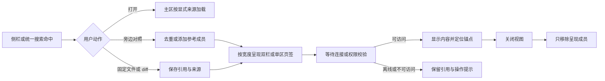

# Pockymoe 工作台布局与 UI 优化方案

日期：2026-10-07（多伦多）。任务板：#3。状态：方案交付，未实现产品改动。

## 1. 结论与证据边界

建议保留现有 MatterWorkbench、Monaco、文件标签和可调整分栏，先建设“清楚的导航 + 可恢复的文件工作区 + 双会话对照 + 集中的协作进度”，暂不引入完整 Dockview。最值得学的是 NarraFork 把会话、目录、文件、Git 和终端组织成连续工作流，以及把面板成员与布局位置分开管理；任意拖拽、浮窗和复杂缩略面板是后续可选项。

我们不是缺一个浏览器 IDE 外壳：现有生产代码已经有文件浏览、Monaco、Markdown/图片/PDF/Drawio/分子等预览、预览和固定文件标签、未保存关闭确认、聊天/工作区分栏、可调整 Explorer、人工 PTY、根线程/子线程分组、跨设备最近访问、收藏和通知。应补充这些能力之间的衔接，而不是重做它们。

本方案基于静态源码检查，没有运行 NarraFork、调用其 Agent、访问模型凭据、运行应用构建或浏览器。不能由源码断言它更快、移动端实际更流畅，或多端完全无冲突。所有新增类型、路径和接口均为**建议**，不是现有接口声明。

| 输入 | 核对版本 | 范围 |
| --- | --- | --- |
| 主仓库 | `ffb07d8b17c08af5aa601a67af6e9f058a5a25ac` | Web 适配、Rust relay 工作台导航、协作接口、现有 E2E |
| 底层业务对比基线 | `94edcfa` | 沿用共同对比报告；当前 UI 结论以本轮生产源码为准 |
| 独立共享 UI | `8e4c384d81012c229d1a780ea175fa2dbaa5c82b` | `pockymoe-thread-ui/packages/thread-ui/src` |
| NarraFork，只读 | `4e04d2f2e490bd57a5d8d712b709a574b905848a` | Dockview、面板服务、导航、编辑器、终端、手机和主题 |

共同报告：[Pockymoe 与 NarraFork 对比](../narrafork-comparison-2026-10-07.zh.md)。下面使用 `U/` 表示共享 UI 的 `packages/thread-ui/src/`，`W/` 表示主仓库 `apps/supervisor-web/src/`，`N/` 表示只读参考仓库根目录。

### 1.1 关键源码依据

| 编号 | 真实落点 | 本轮看到的行为 |
| --- | --- | --- |
| U1 | [MatterWorkbench.tsx](https://github.com/dufangshi/remote-codex-thread-ui-rust/blob/8e4c384d81012c229d1a780ea175fa2dbaa5c82b/packages/thread-ui/src/components/MatterWorkbench.tsx) | 实际工作台外壳；侧栏、标签、搜索插槽、通知、Explorer；仅 Explorer 宽度写入 localStorage，初始 360，限制 260–800 |
| U2 | [ThreadWorkspaceLayout.tsx](https://github.com/dufangshi/remote-codex-thread-ui-rust/blob/8e4c384d81012c229d1a780ea175fa2dbaa5c82b/packages/thread-ui/src/components/ThreadWorkspaceLayout.tsx) | 提供 workbench 时走 MatterWorkbench；旧外壳仍有 47/53 默认聊天/文件分栏和 639/1023 断点，不能把旧布局误作全部生产路径 |
| U3 | [GroupedThreadTabs.tsx](https://github.com/dufangshi/remote-codex-thread-ui-rust/blob/8e4c384d81012c229d1a780ea175fa2dbaa5c82b/packages/thread-ui/src/components/GroupedThreadTabs.tsx) | 根线程分组、子线程弹层、运行聚合提示、Escape 与焦点返回；聚合指示不会改变父线程执行状态 |
| U4 | [GraphWorkspaceExplorer.tsx](https://github.com/dufangshi/remote-codex-thread-ui-rust/blob/8e4c384d81012c229d1a780ea175fa2dbaa5c82b/packages/thread-ui/src/components/graph-workspace/GraphWorkspaceExplorer.tsx)、[WorkspaceFileTabs.tsx](https://github.com/dufangshi/remote-codex-thread-ui-rust/blob/8e4c384d81012c229d1a780ea175fa2dbaa5c82b/packages/thread-ui/src/components/graph-workspace/WorkspaceFileTabs.tsx) | 临时预览标签、双击固定、脏文件固定、关闭未保存确认；标签/dirty 为组件 state，线程/工作区改变后清空 |
| U5 | [useWorkspaceExplorerPersistence.ts](https://github.com/dufangshi/remote-codex-thread-ui-rust/blob/8e4c384d81012c229d1a780ea175fa2dbaa5c82b/packages/thread-ui/src/components/graph-workspace/explorer/useWorkspaceExplorerPersistence.ts) | version 2；保存展开路径、选中路径、filterMode；key 含 workspaceId/threadId，未显式含 deviceId |
| U6 | [GraphWorkspaceMonacoEditor.tsx](https://github.com/dufangshi/remote-codex-thread-ui-rust/blob/8e4c384d81012c229d1a780ea175fa2dbaa5c82b/packages/thread-ui/src/components/graph-workspace/GraphWorkspaceMonacoEditor.tsx)、[GraphWorkspacePreviewPane.tsx](https://github.com/dufangshi/remote-codex-thread-ui-rust/blob/8e4c384d81012c229d1a780ea175fa2dbaa5c82b/packages/thread-ui/src/components/graph-workspace/GraphWorkspacePreviewPane.tsx) | 已有 Monaco、Ctrl/Cmd+S、主题、指定行定位；model URI 仅含 path；预览器仅允许完整小文本进入编辑，当前阈值 50 KiB/1000 行；草稿为当前预览器 state |
| U7 | [useWorkspaceFilePreview.ts](https://github.com/dufangshi/remote-codex-thread-ui-rust/blob/8e4c384d81012c229d1a780ea175fa2dbaa5c82b/packages/thread-ui/src/components/graph-workspace/explorer/useWorkspaceFilePreview.ts)、[adapters.ts](https://github.com/dufangshi/remote-codex-thread-ui-rust/blob/8e4c384d81012c229d1a780ea175fa2dbaa5c82b/packages/thread-ui/src/adapters.ts) | 按需读取/分块、下载和写入适配；当前 writeFile 为 path/content，没有 expectedHash |
| U8 | [DiffDetail.tsx](https://github.com/dufangshi/remote-codex-thread-ui-rust/blob/8e4c384d81012c229d1a780ea175fa2dbaa5c82b/packages/thread-ui/src/components/DiffDetail.tsx)、[ShellPane.tsx](https://github.com/dufangshi/remote-codex-thread-ui-rust/blob/8e4c384d81012c229d1a780ea175fa2dbaa5c82b/packages/thread-ui/src/components/shell/ShellPane.tsx) | 已有带行号/语法高亮的统一 diff；Shell 有 attach/reconnect/resize/可见性等生命周期，不能当成空白能力 |
| W1 | [useWorkbenchNavigation.ts](https://github.com/dufangshi/remoteCodex/blob/ffb07d8b17c08af5aa601a67af6e9f058a5a25ac/apps/supervisor-web/src/pages/useWorkbenchNavigation.ts)、[relay workbench.rs](https://github.com/dufangshi/remoteCodex/blob/ffb07d8b17c08af5aa601a67af6e9f058a5a25ac/crates/relay/src/workbench.rs) | relay 账号导航持久化，设备+线程引用、收藏/访问/已读；local 模式 localStorage；跨设备状态/完整 family 获取，离线不会被当成线程删除 |
| W2 | [ThreadDetailPage.tsx](https://github.com/dufangshi/remoteCodex/blob/ffb07d8b17c08af5aa601a67af6e9f058a5a25ac/apps/supervisor-web/src/pages/ThreadDetailPage.tsx)、[ThreadSubagentsControl.tsx](https://github.com/dufangshi/remoteCodex/blob/ffb07d8b17c08af5aa601a67af6e9f058a5a25ac/apps/supervisor-web/src/components/ThreadSubagentsControl.tsx) | 单活跃 detail 页面组装；原生 subagent 弹层已存在，但 running 数为 0 时入口消失；不能将原生 subagent 和控制面子线程混为一类 |
| N1 | [DockviewWorkspace.tsx](https://github.com/NarraFork/NarraFork/blob/4e04d2f2e490bd57a5d8d712b709a574b905848a/frontend/components/narrator/workspace/DockviewWorkspace.tsx)、[dockview-layout.ts](https://github.com/NarraFork/NarraFork/blob/4e04d2f2e490bd57a5d8d712b709a574b905848a/frontend/components/narrator/workspace/dockview-layout.ts) | 多种面板、任意排列、恢复/修剪/补面板、版本 envelope、grid/director；保存成功回写 query cache |
| N2 | [workspace-panel-service.ts](https://github.com/NarraFork/NarraFork/blob/4e04d2f2e490bd57a5d8d712b709a574b905848a/server/services/workspace-panel-service.ts)、[workspace-panels.ts](https://github.com/NarraFork/NarraFork/blob/4e04d2f2e490bd57a5d8d712b709a574b905848a/shared/workspace-panels.ts) | 顶层 narrator/terminal/webview 是数据库 membership；侧栏投影与成员写入同事务；文件/子代理/工具/插件等依附资源留在布局；64 成员上限 |
| N3 | [WorkspacePage.tsx](https://github.com/NarraFork/NarraFork/blob/4e04d2f2e490bd57a5d8d712b709a574b905848a/frontend/components/narrator/workspace/WorkspacePage.tsx)、[DirectorLayout.tsx](https://github.com/NarraFork/NarraFork/blob/4e04d2f2e490bd57a5d8d712b709a574b905848a/frontend/components/narrator/workspace/DirectorLayout.tsx) | grid 与主面板+缩略预览两种呈现；director 是覆盖层，非重新定义成员；复用原面板组件 |
| N4 | [AuthenticatedAppLayout.tsx](https://github.com/NarraFork/NarraFork/blob/4e04d2f2e490bd57a5d8d712b709a574b905848a/frontend/components/AuthenticatedAppLayout.tsx)、[RecentTabs.tsx](https://github.com/NarraFork/NarraFork/blob/4e04d2f2e490bd57a5d8d712b709a574b905848a/frontend/components/nav/RecentTabs.tsx)、[ChapterBar.tsx](https://github.com/NarraFork/NarraFork/blob/4e04d2f2e490bd57a5d8d712b709a574b905848a/frontend/components/narrator/header/ChapterBar.tsx) | 最近工作可按目录归组、固定、workspace 内分组；章节展示 worktree/branch/Git 入口；应用壳隔离宽度/输出统计订阅 |
| N5 | [nav-layout.ts](https://github.com/NarraFork/NarraFork/blob/4e04d2f2e490bd57a5d8d712b709a574b905848a/frontend/hooks/nav-layout.ts)、[useNavLayout.ts](https://github.com/NarraFork/NarraFork/blob/4e04d2f2e490bd57a5d8d712b709a574b905848a/frontend/hooks/useNavLayout.ts)、[ExecutionDeviceMenu.tsx](https://github.com/NarraFork/NarraFork/blob/4e04d2f2e490bd57a5d8d712b709a574b905848a/frontend/components/narrator/model/ExecutionDeviceMenu.tsx) | 次级导航顺序跟随用户偏好；projects 注册项存在但在导航 projection 中被过滤，不能描述成当前必显的项目树；设备选择改变其 narrator 执行目标 |
| N6 | [FileEditorContent.tsx](https://github.com/NarraFork/NarraFork/blob/4e04d2f2e490bd57a5d8d712b709a574b905848a/frontend/components/narrator/file-editor/FileEditorContent.tsx)、[WorkspaceTerminalPanel.tsx](https://github.com/NarraFork/NarraFork/blob/4e04d2f2e490bd57a5d8d712b709a574b905848a/frontend/components/terminal/WorkspaceTerminalPanel.tsx) | 编辑会话版本/冲突预览/不可变冲突版本下载；终端面板显示关联会话，退出后保留面板 |
| N7 | [useRecentTabKeyboardNav.ts](https://github.com/NarraFork/NarraFork/blob/4e04d2f2e490bd57a5d8d712b709a574b905848a/frontend/hooks/useRecentTabKeyboardNav.ts)、[useAuthenticatedAppearance.ts](https://github.com/NarraFork/NarraFork/blob/4e04d2f2e490bd57a5d8d712b709a574b905848a/frontend/hooks/useAuthenticatedAppearance.ts)、[useMobileTerminalDrawerOpen.ts](https://github.com/NarraFork/NarraFork/blob/4e04d2f2e490bd57a5d8d712b709a574b905848a/frontend/hooks/useMobileTerminalDrawerOpen.ts) | 最近标签快捷键、语言/字号/主题偏好、手机终端 Drawer；手机 Back 可先关闭导航层 |

## 2. 共同能力、它更强、我们更适合的部分

| 能力 | Pockymoe 已有 | NarraFork 的增强 | 建议取舍 |
| --- | --- | --- | --- |
| 单会话+文件 | Matter 的可调整 Explorer；旧外壳可调整分栏；多种预览和 Monaco | 文件作为可停靠资源进入更大的多面板表面 | 保留现有文件系统与预览，增加“固定到参考区”和可靠恢复，不重新开发编辑器 |
| 文件标签 | 预览/固定、dirty 点、关闭确认 | 资源标签与工作台停靠、编辑会话状态协同 | 优先补每文件草稿隔离、固定标签恢复、焦点/键盘行为 |
| 会话导航 | 收藏、最近、跨设备引用、当前工作区标签、root/child 分组 | 目录归组、手工 workspace、章节 Git/worktree 行、导航个性化 | 增加设备/工作区明确分组和工作目录上下文；不复制项目/章节领域模型 |
| 多会话 | 单活跃聊天、分组导航 | 多 narrator 同时可见，grid/director，编辑/终端可混排 | 先双会话对照和单输入目标；协作进度采用轻量卡片而非渲染大量聊天 |
| 终端 | 人工 PTY、手机辅助键和恢复状态 | 终端可独立成为 workspace 成员；与其 AgentLoop Terminal 工具形成同 PTY 工作流 | 布局上增加底部终端；人用 PTY 与 harness 命令终端继续明确标识，布局改造不宣称共享 PTY |
| diff | 工具历史已有高亮 unified diff | 文件冲突、Git/章节/评审对象更紧密关联 | 复用 DiffDetail 做“固定到评审区”；完整 Git diff/commit/评审需 Rust 协议支持 |
| 持久化 | 账号导航已经跨浏览器持久化；本地 Explorer 偏好/展开状态 | authoritative membership+布局 CAS+缓存回写+旧数据恢复 | 不将收藏/最近列表改造成面板 membership；新增可恢复工作台状态，按阶段引入云端版本 |
| 手机/窄屏 | 导航抽屉、隐藏/显示 Explorer、单视图、safe-area、浮动 composer | 模式化主次视图、工具 Drawer、Back 管理；对手机溢出菜单复用真实操作行 | 手机以一主视图+快捷切换为主，不缩小整块桌面 IDE；手机可达性和草稿保留优先 |
| 主题 | system/light/dark、CSS 变量、Monaco/Shell 主题 | 集中 appearance、字号/行高、独立 theme-color 同步 | 统一现有 token 使用、对比度和 reduced-motion；OLED/动画偏好延后 |
| 多 Agent | 控制面 root/parent、任务依赖、inbox/wait/投递语义；harness 原生 subagent | 子代理资源面板与会话/工具导航衔接 | 我们的控制面适合长期远程协作，先把强后端做成可理解的进度 UI |
| 跨设备 | 各设备自治，原生会话/历史，账号导航和加密传输 | 一个 narrator 可切工具执行设备 | UI 中“打开另一设备上的线程”与“更换任务执行设备”不是同一操作；不照搬其 SwitchDevice |

我们更适合的核心场景是“离开桌面后继续原生 Agent、观察其他设备上的独立工作、收集多线程成果”。全量 IDE 面板会占用手机空间，也可能掩盖设备身份、权限和投递语义。这不是它的布局越多就越适合我们。

## 3. 用户场景与具体交互

### 3.1 双会话对照

场景：比较 Codex 与另一个 harness 的解释，或核对实现线程与独立评审线程。

- 从现有线程菜单、子线程弹层、搜索结果增加“在旁边对照”。已经在对照区的线程直接聚焦，避免重复面板。
- 默认当前会话 A 为主，B 为只读参考；两边有独立标题、设备/工作区、harness、运行/未读状态、滚动锚点。移动端切到 A/B 页签。
- 首版仅主视图有 composer。要对 B 发消息，点击“设为主会话”，连同目标标题和能力一起切换；未发送草稿按 threadRef 保存，不带到另一线程。
- 关闭 B 只移除视图；不停止 B、不删除线程、不清 inbox。关闭提示明确“任务会继续运行”，只需非阻塞反馈，不给每次关闭增加确认。
- 不默认锁定两边滚动，两个模型的回复长度和消息结构不同。可后续添加按 turn/选中消息定位，而不是同步像素位置。
- 第一阶段限定同一设备对照；跨设备对照在 HTTP/WS 适配显式带 deviceId 后开启。不可通过切换全局 selectedDevice 来轮流订阅两边。

### 3.2 多 Agent 进度

场景：一个父线程下有实现、搜索、验证等多个工作者，用户要知道谁仍在跑、谁需要输入、结果在哪。

- 保留 GroupedThreadTabs，把已有“有 N 个子线程运行”扩成可展开的协作区：运行、等待输入、结果待查看、失败、状态暂不可用。
- **控制面线程、harness 原生 subagent、任务板条目分别建模。** 任务 owner 可关联控制面线程；原生 subagent 没有已映射 Pockymoe threadId 时只展示原生详情，不伪造可跳转线程。
- 第一版消费已有 family/thread/activity 和 activeSubagents。持久展示最近完成/失败，避免 running=0 后入口突然消失。没有可靠等待原因时显示“状态暂不可用”，不猜成 idle。
- 第二版通过受权限保护的 Rust adapter 接入 taskList/taskShow 与 inbox 结果/问题摘要，显示“阻塞于 #N”及成果路径。控制面能力已有，完整 Web 展示/权限适配仍是新工作。
- 点结果跳到原线程/对应消息，或固定到参考区。UI 查看结果不自动 ack Agent inbox，也不自动将 task done 当成用户已验收。
- 不用所有 Agent 的完整聊天拼成大墙。默认 1 个主会话、1 个参考区、一个摘要列表，用户只展开需要的线程。

### 3.3 文件与聊天并看

场景：Agent 解释一个函数，用户同时查看或修改源文件。

- 继续使用 Explorer 的一次点击预览、双击固定；聊天文件链接打开原工作区，并定位行号。固定文件进入参考区不会替换主聊天。
- 标签保留未保存点；统一“保存/保留编辑/放弃”行为。切标签、切线程、隐藏 Explorer 与关闭文件是不同动作：隐藏视图保留草稿，关闭脏文件才处理草稿。
- 首版恢复固定标签、选中路径和布局，不宣称未保存正文跨刷新保存。增加脏草稿存在时的刷新/路由退出保护；跨刷新草稿恢复是后续显式的本地草稿能力。
- 多文件/多视图之前抽出按 fileRef 管理的编辑会话，不依赖预览器单个 draftContent；现有 previewFile.path/content effect 会重置 editing/draft，必须覆盖标签切换与 Agent 外部更新的时序。
- 沿用大文件、二进制、PDF 等读取限制，不将截断前缀变成可保存的完整文件。

### 3.4 diff / 评审

场景：用户发现 Agent 改了代码，想看变更，再给评审意见。

- 现有工具消息上的 DiffDetail 增加“固定此变更”，右侧保持其 thread/turn/item 关联和时间，左侧继续聊天。
- 快照 diff 显示“来自这条记录”；实时工作树 diff 显示当前 base/head/采集时间，两者不能互相冒充。
- 手机默认 unified diff；桌面可后续用 Monaco diff 分屏。第一版不因拥有 Monaco 就默认额外下载/初始化两套完整编辑器。
- 文件冲突对照接入版本校验工作：本地未保存、读取时版本、当前磁盘版本清楚区分。不得用普通“重试保存”暗中覆盖新文件。
- 完整 Git 变更列表、暂存/提交、绑定 commit 的审批不是共享 UI 单独可完成；需 Rust 受限 Git/文件接口。与专门的保存/Git方案共用协议，不在布局方案另起一套。

### 3.5 终端

场景：一边查看 Agent 建议，一边运行诊断命令或观察服务日志。

- 桌面给现有 ThreadShellPanel 增加底部停靠入口，可与聊天/文件同时存在；默认收起，不自动创建新 PTY。
- 终端标题始终显示设备、工作区/实际 cwd、shellId 的可辨识缩写，以及连接/退出状态。保留已有 reconnect 和手机辅助键。
- “隐藏终端”“断开观看”“终止 shell”三个动作分开，关闭面板走观看清理，绝不默认发送 terminateShell/ctrl-c。
- 退出保留最后输出和退出状态；设备断线保留当前视图，恢复后先 attach 原 session，不自动重跑上条命令。
- 人工 PTY 与 ACP 命令输出通过名称说明边界。人与 Agent 同 PTY 协作需要显式工具能力和授权，不列为此次布局改造带来的能力。

### 3.6 设备 / 项目切换

场景：从笔记本上的代码任务切到服务器验证，再回到之前文件。

- 顶栏增加可点击上下文“设备 / 工作区”；工作区相当于当前产品的项目入口，不新增 NarraFork project/chapter 数据模型。
- 侧栏采用“收藏（跨设备）/当前设备与工作区/最近工作”轻量结构。最近项保留设备标签，重复工作区名用路径末段辅助辨认，路径详情按需展开。
- 第一次切设备显示已有连接/身份验证状态；设备离线仍可看到最近项和缓存状态，导航引用不删除。
- 切换只改变当前浏览上下文。已有参考面板绑定自己的 sourceRef；是否关闭它由用户选择，不自动迁移文件或改变 Agent cwd。
- 目录归组只在同一 deviceId 下使用规范化路径/工作区身份，不能把两台机器的 `/repo` 当作同一项目。
- 使用现有 href/browser Back 与账号导航持久化。浏览历史、最近访问、收藏、打开面板列表各有用途，不以最后访问时间重排用户已固定的面板。

### 3.7 窄屏 / 手机

场景：用户只需要回复审批、查看结果或检查一处变更。

- 桌面双栏不足最小宽度时进入单主区+参考页签；宽度规则按**可用内容宽度**判断，侧栏、Explorer 和屏幕缩放均影响它，不只读 window.innerWidth。
- 手机只显示一个主视图；“聊天 / 文件 / 进度 / 终端”从底部或紧凑工具条切换。A/B 对照变成会话切换，不显示两条窄聊天。
- Drawer 内复用桌面的设备选项/终端动作实现，避免手机只有菜单标题而没有真实选择行。
- 系统 Back 优先关闭当前搜索/菜单/抽屉，再走路由；只为打开的移动覆盖层增加一层可清理 history sentinel，不拦截桌面导航。
- 隐藏面板使用 inert/aria-hidden 或受控卸载；保留状态与组件可聚焦性分开。键盘不能落到屏幕之外的隐藏 composer。
- 延续 safe-area 和现有 keyboard inset，软键盘弹出后 composer/发送键可见，当前输入与引用目标不丢；横竖屏切换不关闭任务。

### 3.8 键盘、焦点与可访问性

- 文件 tablist 加 roving tabindex、Left/Right/Home/End、tabpanel 对应 id；线程导航仍可保留链接语义，不把导航链接强行变成没有完整交互的 ARIA tabs。
- 分栏拖柄沿用可键盘调整和 aria-valuenow；提供“重置布局”“单栏/对照”显式按钮，让不会拖拽的人完成所有关键动作。
- 对照区激活、关闭、搜索定位、Drawer 关闭后恢复预期焦点；用户正在输入时后台 delta 不抢焦点、不强制跳到最新。
- 全局快捷键避开 input/textarea/contenteditable、Monaco、xterm、组合输入和 event.defaultPrevented。Ctrl/Cmd+S 仍由当前编辑器处理；发送快捷键沿用用户现有设置。
- 搜索快捷键沿用全局搜索实现的注册，不另绑第二个 Ctrl/Cmd+K。面板切换快捷键集中到同一应用动作注册；若搜索尚无动作注册，则先用普通按钮/组件局部键盘处理，不为布局单独建立命令平台。
- 运行/失败/未读使用文字+图标，不只靠颜色；aria-live=polite 只播报状态转变和保存反馈，不逐 token 朗读聊天。
- 触摸关键控件目标建议至少 44px；该数值是实施目标，不是宣称对方已全部满足。为高缩放、长中文标题、reduced-motion 保持可达性。

## 4. 多面板价值、复杂度与推荐架构

### 4.1 哪些价值必须保留

1. 用户能同时看执行与证据，不反复切路由。
2. 主会话保持稳定，参考对象可变化；Agent 输出不会抢走文件或评审区。
3. 刷新/重新进入能回到大致相同的工作上下文。
4. 打开/关闭视图不会影响后台工作；布局失败只影响排列。

NarraFork 的实现证明这些价值需要状态纪律，而不只是拖拽库。它为恢复、缓存、临时资源、membership 同步、director、浮窗和卸载保存做了大量处理。我们引入完整 Dockview 后同样要维护这些边界，还要额外处理跨设备加密连接、不同 harness 能力、只读分享和手机。

### 4.2 membership、arrangement、执行事实分离

建议用 `workbenchId` 表示用户的呈现工作台，避免与现有执行 `workspaceId` 混淆。首版工作台以设备+工作区分区，第二会话可作为外部参考，后续才允许手工命名跨设备工作台。

| 状态层 | 保存什么 | 谁是权威 | 绝对不承担什么 |
| --- | --- | --- | --- |
| 执行/协作事实 | thread 状态、task owner/dependencies、inbox、shell 进程 | 现有 Rust Supervisor / harness | 不由面板是否可见来判断 running、done、是否取消 |
| 导航引用 | 收藏、访问记录、readCompletedAt、href 对应来源 | 已有 relay workbench；local 模式本地 | 不是“打开哪些面板”的权威；点击通知也不是 Agent inbox ack |
| 面板成员 | 用户明确固定的 thread/file/diff/terminal 视图与稳定 ID | 第一版本地独立 members；后续账号级 presentation store | 不等于线程树 membership；关闭视图不 close/delete 执行线程 |
| 排列 | 模式、主/参考 panelId、比例、终端位置、设备屏幕配置 | 浏览器本地 profile；后续可选 CAS 同步 | 不携带正文、任务状态、模型凭据；损坏不能删除 members |
| 临时查看状态 | 搜索锚点、悬浮菜单、一次预览、临时 turn 定位 | 当前浏览器内存 | 不因搜索一次命中就污染跨端固定面板列表 |
| 编辑会话 | base version、草稿、dirty、光标/undo/冲突 | 当前文件会话；磁盘版本由 Rust API 判断 | 不写入 relay 明文布局；不能用排列 revision 替代文件版本 |

NarraFork 顶层 member kinds 目前是 narrator/terminal/webview；它的 file/subagent/tool/plugin 等是关联资源，并非全部都存入 workspace_panels。我们不必照搬其分类：需要跨刷新保留的固定文件可以是我们的呈现 member，但只能是文件引用，不能借此定义执行权限或修改任务成员。

恢复算法：读取 members → 校验来源/权限 → 校验 arrangement.schemaVersion → 过滤未知 panelId → 缺失成员放入默认页签 → clamp 比例 → 主 panelId 不存在时选可访问 member → 只在用户操作后保存。还在等待设备连接的引用显示占位，不能因此删除 member。临时搜索预览不入持久 members。

### 4.3 revision 冲突：借鉴 CAS，不夸大其保证

NarraFork 服务端使用 `UPDATE ... WHERE layoutRevision=expectedRevision` 原子校验，409 返回 currentRevision。其前端 `saveLayout` 将 revision 更新后，**用相同 serialized layout 重试一次**，不是读取两端布局做语义合并；第二次 409 可以直接返回。因此它能检测旧写入、限制争抢，并保护成员不丢，但不能据此保证另一端排列永不被覆盖。

我方推荐：

- 第一版只有本地布局恢复，不承诺跨浏览器同步。members 与 arrangement 独立存储，带 schemaVersion，localStorage 失败明确显示“布局仅在本次访问保留”。同源不同标签页通知不是跨端一致性协议。
- 后续云端按 `account/workbenchId/layoutProfileId` 保存。layoutProfileId 对应本浏览器配置和 compact/wide 呈现，不能仅用相同 viewport 宽度作唯一身份。手机和桌面不互相覆盖比例。
- 每个资源独立 revision；成员操作按稳定 panelId 增删，不发送完整旧列表覆盖新列表；重试使用 requestId 去重。
- 单 profile 布局保存串行，拖拽结束/短 debounce 提交；有更新中的本地 generation 时旧响应不清除新 dirty。保存成功同时更新内存/cache/本地恢复副本。
- 409 后保留本地未保存排列并获取新快照。如果本地没有尚未提交的操作，采用服务器版本；否则展示“布局在另一个窗口改变”，可选“采用已保存布局”“另存本机布局”。不把当前 revision 机械替换后自动重放旧整块 JSON。
- 可自动 rebase 的范围仅限明确幂等成员增删，并尊重删除后的 tombstone/新 revision；任意布局树不做伪 CRDT 合并。
- 页面卸载 flush 只属 best effort，不能当成唯一保存点。重连先拉 revision 和成员快照，不能盲目上传断网前的旧排列。

### 4.4 是否需要完整 Dockview

当前推荐用已安装的 react-resizable-panels 与 CSS grid，提供三个模板：`focus`（聊天+可选文件）、`compare`（A/B）、`review`（聊天+diff/文件），另有可收起的底部终端和协作摘要区。默认最多两条完整聊天，不做任意嵌套、浮窗或弹出新窗口。

| 方案 | 用户收益 | 状态/维护代价 | 当前建议 |
| --- | --- | --- | --- |
| 继续单聊天、仅视觉美化 | 低，不能解决对照/恢复 | 小 | 不作为主方案 |
| 有限模板+可恢复成员 | 覆盖大部分远程执行/审查场景 | 中；复用现有 editor/shell/分栏 | 首选 |
| 完整 Dockview | 任意分组/拖动/浮窗，多对象 IDE | 大；布局迁移、拖放键盘替代、双端 profile、临时资源、popout 权限/焦点等 | 暂缓 |

升级到 Dockview 的产品触发条件：实际用户持续需要三条以上完整会话同时交互、任意重组编辑器/终端或独立窗口，有限模板无法完成这些任务；且面板生命周期、显式来源、持久化和键盘行为已经稳定。先记录使用情境再决定，不以“看起来更像 IDE”作为引入理由。若以后引入，也仅替换 arrangement renderer，成员、adapter、执行事实和移动呈现不绑定到 Dockview JSON。

## 5. 桌面 / 手机布局与流程

### 5.1 桌面默认（内容宽度允许时）

```text
┌──────────────────────────────────────────────────────────────────────┐
│ 设备 / 工作区 ▾     搜索（当前/工作区/设备）     连接状态  通知  设置 │
├──────┬───────────────┬────────────────────────────────────────────────┤
│工具栏│ 收藏 / 最近   │ 根会话标签 + 子线程入口         布局 ▾        │
│      │ 当前工作区   ├─────────────────────────┬──────────────────────┤
│聊天  │ 主线程       │ 主会话：A               │ 参考：文件/B/diff    │
│文件  │  子线程      │ 设备·harness·状态       │ 来源·路径·版本       │
│进度  │              │ 独立时间线              │ 固定标签 / 预览      │
│终端  │              │                         │                      │
│      │              │ 单一 composer（目标 A） │                      │
│      │              ├─────────────────────────┴──────────────────────┤
│      │              │ 终端（按需打开，设备/cwd/连接/退出状态）       │
└──────┴───────────────┴────────────────────────────────────────────────┘
```

参考区不是文件树、全文编辑器、B 聊天、进度墙同时挤在 360px 内：其活动类型明确，目录树可折叠为可展开入口。宽屏建议聊天/参考约 55/45，可拖动；不要硬编码全屏断点，设置每个 pane 最小可用宽度（聊天建议约 360px、文件/diff 约 400px，需实施阶段实测校准）。底部终端初始约内容高度 28%，用户调整后保留。

双会话对照仍共享外层导航，仅参考区换成 B；协作摘要通过进度入口展开，避免第三条完整聊天挤占空间。

### 5.2 窄屏 / 手机

```text
┌──────────────────────────────┐
│ ☰  设备/工作区 ▾   搜索  ··· │
├──────────────────────────────┤
│ A 主会话 ▾   [B 对照]  状态  │
├──────────────────────────────┤
│ 当前主视图                   │
│ 聊天 / 文件 / diff / 进度     │
│ （一次只显示一种）           │
│                              │
├──────────────────────────────┤
│ 聊天时显示 composer ·目标 A   │
├──────────────────────────────┤
│ 聊天    文件    进度    终端  │
└──────────────────────────────┘
```

文件/终端可以使用全高 Sheet/Drawer；“返回聊天”保留文件光标/草稿与聊天锚点。终端 view 不复用聊天发送按钮，避免命令与 Agent 消息混淆。进度栏有待处理数量；当软键盘打开时可收起底栏但保留返回主视图路径。compact 状态不写回桌面 compare 模板。

### 5.3 导航状态流



### 5.4 用户可见状态与失败反馈

| 状态 | 放在哪里 / 文案方向 | 可用动作 | 不应发生 |
| --- | --- | --- | --- |
| 正在运行 | 面板标题“运行中”，进度摘要显示最后更新时间 | 阅读、切参考、显式停止该线程 | 父线程因子线程运行而被改成 running；每条 delta toast |
| 等待问题/审批 | 对应 pane 的醒目卡片+进度数量 | 查看问题/授权范围，显式回答 | 把被动报告自动当作新任务执行 |
| 设备断线 | 该来源标题“设备离线，显示上次状态”+连接详情 | 查看缓存、重新连接、打开其他来源 | 整个工作台空白、删最近项、后台命令自动重放 |
| 连接正在恢复 | 该 pane 的轻量状态条 | 留在当前阅读位置 | 重新挂载完整页面清除输入/滚动 |
| 状态结果未知 | “结果暂不可确认”及对应请求/任务 | 刷新状态、查看执行记录 | 与正常完成混用同一个绿点 |
| 文件读取失败 | 文件区局部错误和重试/下载入口 | 重试或关闭该文件 | 影响另一聊天/文件 pane |
| 文件保存冲突 | 原草稿保留，当前磁盘版本 diff | 重新应用、显式覆盖策略、放弃 | retry 即覆盖，关闭错误后丢草稿 |
| 布局未保存 | 工具栏轻量标记/单次状态提示 | 重试、重置排列；后续另存 profile | 把布局失败描述成任务失败 |
| 权限撤销 | 该来源“无权访问”占位，可移除引用 | 返回有权限的对象 | 继续从旧缓存显露未授权正文；引用赋予权限 |
| 线程确定删除 | 精确 404 后显示已删除 | 移除该 pane/引用 | 把超时/离线/403 当成删除 |

主题使用现有 `--theme-*` 变量与 AppShellNavContext，补 focused/selected/readOnly/stale/error 的一致 token。减少顶部重复层级和难辨认的小图标有产品价值；圆角、渐变、玻璃透明、OLED 是视觉偏好，不应阻塞对照/导航/恢复。

## 6. 状态与接口草案

### 6.1 共享 UI 的呈现模型（建议）

```ts
type ThreadRef = {
  deviceId: string | null;
  workspaceId: string;
  threadId: string;
};

type WorkbenchPanel =
  | { panelId: string; kind: 'thread'; source: ThreadRef }
  | { panelId: string; kind: 'file'; source: ThreadRef; path: string; pinned: true }
  | { panelId: string; kind: 'diff'; source: ThreadRef; turnId: string; itemId: string }
  | { panelId: string; kind: 'terminal'; source: ThreadRef; shellId: string };

type WorkbenchMembers = {
  schemaVersion: 1;
  workbenchId: string;
  membersRevision: number;
  panels: WorkbenchPanel[];
};

type WorkbenchArrangement = {
  schemaVersion: 1;
  layoutProfileId: string;
  layoutRevision: number;
  mode: 'focus' | 'compare' | 'review';
  primaryPanelId: string;
  referencePanelId: string | null;
  chatRatio: number;
  sidebarVisible: boolean;
  referenceVisible: boolean;
  terminalPanelId: string | null;
  terminalRatio: number;
};
```

这是有限模板，schema 不包含递归 Dockview tree。文件编辑会话按 `{deviceId, workspaceId, canonicalPath}`（必要时含 worktree/thread 作用域）唯一标识；同一物理文件可以显式共享 model，不同来源绝不能因 path 字符串相同而共享。由 adapter 提供不含凭据的 `modelIdentity` 或标准化 source key，Monaco URI 使用其安全编码，不拼接未校验路径。

焦点 `focusedPanelId`、手机 `activeMobileView`、打开的 popover、搜索 highlight 与加载 generation 是内存状态，不保存到云端。draft/undo/selection 由 editor session store 管，不塞进 arrangement。配额建议首版最多 2 个 thread pane、有限个固定文件标签（例如 20，作为待校准产品上限），到达上限提示复用/关闭，不静默丢失 dirty 文件。

本地 key 建议含 `schema/accountScope/origin/deviceId/workspaceId/layoutProfileId`，注意登出清理与用户切换隔离。旧 Explorer key 只有 workspace/thread，因此迁移时只在已确认当前来源时导入，跨设备歧义时使用默认展开状态，不把旧项扩散到每台设备。

### 6.2 宿主 adapter（建议，无需新增后端的第一步）

```ts
interface WorkbenchPresentationAdapter {
  // 每个面板绑定自己的来源；具体权限/连接状态由宿主提供。
  renderThread(input: {
    source: ThreadRef;
    interaction: 'primary' | 'reference';
    visible: boolean;
  }): React.ReactNode;
  openTarget(input: {
    target: WorkbenchPanel;
    placement: 'primary' | 'reference';
    anchor?: { turnId?: string; itemId?: string; line?: number };
  }): void;
  readLocalPresentation(scope: string): Promise<{
    members: WorkbenchMembers;
    arrangement: WorkbenchArrangement;
  } | null>;
  saveLocalPresentation(input: {
    members: WorkbenchMembers;
    arrangement: WorkbenchArrangement;
  }): Promise<void>;
}
```

`renderThread` 不是复制 ThreadDetailPage 两次：建议抽出 pane 级 controller/surface，保持每个 source 的 detail/history/stream、capabilities、readOnly 和送出目标独立。外壳/搜索/通知/设置只有一份，面板 controller 按唯一 source key 复用请求与缓存。

共享 UI 不自行 fetch 本机/relay URL，不选择全局 device、不读凭据；宿主以现有 encryptedBrowserFetch/encryptedRelaySocket 通道提供显式设备作用域 adapter。已有 API 默认从 selectedDevice 推导设备、WS 路径也用全局选中设备，因此跨设备双 pane 不能只把 `deviceId` 添到 props 后就声称完成。

### 6.3 可选云端呈现 API（阶段 4，草案）

建议在 Rust relay 账号呈现域增加 workbench presentation store，与现有 `/relay/account/workbench` 导航逻辑同一权限体系但不同数据资源。以下路由名待父线程集成时定稿：

```text
GET    /relay/account/workbenches/:workbenchId/presentation
POST   /relay/account/workbenches/:workbenchId/panels
DELETE /relay/account/workbenches/:workbenchId/panels/:panelId
PUT    /relay/account/workbenches/:workbenchId/layouts/:layoutProfileId
```

布局 PUT：`{ expectedRevision, requestId, schemaVersion, arrangement }`；成功 `{ layoutRevision, arrangement }`；409 `{ code: 'workbenchLayoutConflict', currentRevision }`，再 GET 当前快照。成员操作返回 membersRevision/当前成员或可获取快照，去重与权限校验在事务内完成。UI panel 关闭不得复用 CLI thread close。

重要边界：默认账号 store 仅存设备/工作区/线程 ID、pane kind 与比例等呈现元数据，沿用现有导航元数据边界；文件 path、diff 正文、终端输出、draft 不新增明文 relay 存储。固定文件的跨端恢复若需要 path，使用现有加密边界内的设备配置引用或经设计的客户端密文，不把路径写进任意 configJson。第一版固定文件完全本地恢复即可，不阻塞 UI 优化。

文件写入 expectedHash、Git 操作和协作摘要属于另一个设备域 API，经原来的加密通道走 Rust Supervisor；不得为了工作台而增加 TypeScript 控制面。所有 JSON 字段 camelCase，harness 差异仍由 ACP catalog/capability overlay 决定。

## 7. 与全局搜索、中英 i18n 的结合

全局搜索和 i18n 正由其他工作实现，本方案只定义接入契约，不要求替换它们选定的索引、库或目录。当前基线可见的是 W/ConversationSearch 和 MatterWorkbench 的 search 插槽；未把正在实现的全局搜索当作已上线功能。

### 7.1 统一搜索入口

- 继续使用 `MatterWorkbenchOptions.search/onSearch/searchOpen` 接入唯一搜索组件。搜索默认作用域包含当前 thread/source；用户可切工作区/设备，跨设备权限与索引属于搜索方案。
- 命中采用其既定 SearchTarget，通过一个 `openTarget(target, placement)` 接入布局。若命中 schema 未包含 line/turn/item，只增补可选锚点，不另建布局专用搜索响应。
- 主操作“打开”保留原深链语义；次操作“旁边查看”新增呈现行为。搜索不自动固定所有结果、不自动打开第二个 composer、不改变运行中线程的默认设备。
- 转录延迟加载/折叠历史定位沿用现有 ConversationSearch → jump/select older turn 流程；pane 的 source/generation 确认后才应用锚点，不能让 A 的慢搜索命中落到已经切换的 B。
- 同一结果可从进度区、通知、文件链接打开；共享目标路由/焦点行为，避免各自发明参数和快捷键。

### 7.2 i18n 的增量接入

- 使用 i18n 工作确定的唯一 provider、语言偏好和中英资源。新文案键建议按 `workbench.* / panel.* / collaboration.*` 分组；命名与实际命名空间由负责者定稿。
- 从可见文字、aria-label、tooltip、空状态、通知、dirty/冲突/离线提示一起迁移；不能只翻译菜单标题。thread/Agent 原始标题、输出和路径不自动翻译。
- 状态在数据层保留 `running/unread/unknown` 等稳定值，显示时才 t()；`threadGroupActivity` 的组合标签改成参数化文案，不用英文字符串决定逻辑。
- 避免 CSS 选择器依赖译后的 aria-label：当前 matter-workbench.css 存在 `aria-label='Go forward'`、`'Jump to latest'` 选择器，迁移为 class/data-action；E2E 可用稳定 testid/角色配 locale fixture，不能让英文 selector 成为产品行为的一部分。
- 日期、数量复数、文件大小格式沿用统一 locale 工具；长中文、英文长按钮和 200% 缩放应共同影响宽度设计。切语言不 remount 工作台、不清草稿、不保存 layoutRevision。
- 主题偏好与语言偏好独立，复用 AppShellNavContext/现有 theme token，不把 i18n provider 变成新的 UI 全局状态大对象。

## 8. 文件落点、渐进迁移与分阶段实施

### 8.1 共享 UI 能独立完成什么

| 范围 | 可只改共享 UI | 仍需宿主或 Rust |
| --- | --- | --- |
| 减少重复顶栏、明确面板来源、分栏模板、响应式呈现、键盘/焦点、主题 token | 是；通过兼容 props / 可选 adapter | 宿主补来源名称/状态时有少量适配 |
| 文件固定标签本地恢复、每文件编辑状态、Monaco URI 隔离 | 是，身份从 adapter 注入 | deviceId/modelIdentity 可需宿主补齐；完整跨刷新 draft 是另一步 |
| 单设备双会话只读对照 | renderer 可共享 UI | 宿主提供第二来源 controller/detail，不是纯 CSS |
| 跨设备同时订阅/控制 | 否 | W/api 和 relayTransport 的显式来源适配、权限/加密回归 |
| 已有 family/subagent 的进度卡片 | 渲染可共享 UI | 现有宿主数据 props；task/inbox 全量摘要仍需受限接口 |
| 文件冲突、真实 Git 评审 | UI 可复用 diff | Rust 版本校验/Git/授权与宿主协议适配 |
| 云端成员/布局 CAS | 否 | Rust relay 呈现存储与 Web adapter |

建议落点（新增路径为拟议）：

| 仓库 | 文件/目录 | 责任 |
| --- | --- | --- |
| 共享 UI | `U/components/MatterWorkbench.tsx`、`GroupedThreadTabs.tsx`、`ThreadWorkspaceLayout.tsx` | 外壳、菜单、来源、进度入口；保留无 workbench 嵌入路径兼容 |
| 共享 UI | 新 `U/components/workbench/WorkbenchPanels.tsx`、`WorkbenchPanelFrame.tsx`、`WorkbenchMobileViews.tsx` | 有限模板与手机呈现；局部 Suspense/error boundary |
| 共享 UI | 新 `U/components/workbench/workbenchState.ts`、`workbenchPersistence.ts`、`workbenchTargets.ts` | 纯状态归一化、成员/布局恢复、搜索目标桥接；不重复现有导航状态 |
| 共享 UI | `U/ThreadDetailSurface.tsx`，拟议 pane 级 surface | 抽出内容 pane，避免嵌套两套外壳/全局设置/composer |
| 共享 UI | `U/components/graph-workspace/GraphWorkspaceExplorer.tsx`、`GraphWorkspacePreviewPane.tsx`、`GraphWorkspaceMonacoEditor.tsx`，新 editor session store | fileRef/modelIdentity、固定标签与草稿生命周期、焦点 |
| 共享 UI | `U/components/shell/*`、`ThreadShellPanel.tsx` | 复用可见性/attach，增加 docked 容器，不复制 ShellHub |
| 共享 UI | `U/components/DiffDetail.tsx`、拟议 `WorkbenchReviewPane.tsx` | 历史 diff 固定与版本/来源标签 |
| 共享 UI | `U/adapters.ts`、`types.ts`、`index.ts`、`styles/matter-workbench.css`、`styles/layout-workspace.css` | 向后兼容导出、呈现 CSS、稳定 data-action；i18n 文案复用负责者新增资源 |
| 主 Web | `W/pages/ThreadDetailPage.tsx`、`useWorkbenchNavigation.ts`，拟议 `useWorkbenchThreadSource.ts` | pane 级 data controller、显式 source、当前主路由/最近/已读语义 |
| 主 Web | `W/lib/api.ts`、`relayRoutes.ts`、`relayTransport.ts` | 阶段 3 显式设备 HTTP/WS 作用域；保留现有加密通道 |
| 主 Web | `W/components/ThreadSubagentsControl.tsx`、`ThreadWatchesControl.tsx` | 宿主数据接入共享协作摘要；原生与控制面概念分开 |
| Rust | `crates/relay/src/workbench.rs`，拟议 presentation 模块 | 阶段 4 账号呈现存储/CAS，导航接口继续独立 |
| Rust | `crates/supervisor/src/interaction.rs`、相关文件/Git handler、`crates/protocol/src` 与 `packages/shared` 既有导出 | 仅在协作摘要/文件版本/Git 新边界确实需要时增补，按负责方案合并 |

### 8.2 迁移顺序

1. 新 props/adapter 均可选，默认仍是现有单会话；共享 UI 被其他宿主消费时不要求立即实现 cloud presentation API。
2. 保留旧导航记录及 local-workbench.v1，它们不是布局旧 schema；只将 explorer-width 和已确认来源的 Explorer version 2 读入对应 profile。
3. 固定文件/面板 schema 首版就独立，旧数据读一次后写新 key；损坏、未知未来版本回默认排列，成员仍可见。未确认设备来源时不迁移旧文件选择。
4. 同设备对照以显式操作入口渐进启用；通过检查前不开放跨设备双控制。
5. 云端同步上线时先读取服务端 snapshot，只有无云端记录时提示/允许导入本机固定成员；不在每次登录覆盖云端。
6. 回滚关闭新模板只影响呈现，执行/导航/文件不受影响；新 schema 存储保留，旧版本忽略未知 schema，不能将“读不懂”当成删除。

### 8.3 阶段、验收与相对工作量

工作量用于排序：S 约 1–3 人日、M 约 4–7 人日、L 约 8–15 人日；是开发+局部验证的粗估，未包括新 Git 后端、云端加密布局协议或第三方库替换。集成实际成本需完成相关接口后校准。

| 阶段 | 交付 | 验收（必须观察到的行为） | 相对量 / 依赖 |
| --- | --- | --- | --- |
| 0：语义与外壳整理 | 明确设备/工作区、统一参考区入口、状态文案、稳定 data-action、键盘/焦点 | 收藏/最近/子线程不回归；主题/语言切换不依赖英文 CSS；隐藏层不获焦；手机所有关键动作可达 | S–M；与搜索/i18n 同一批契约对齐 |
| 1：文件工作区与本地恢复 | 来源隔离、每文件编辑会话、固定标签恢复、referenceVisible/比例/模式本地恢复 | 相同 path 不同来源互不串改；切标签/隐藏面板不丢当前草稿；脏文件关闭/退出有明确处理；坏布局默认恢复所有固定成员 | M；不依赖云端新 API；版本冲突与文件方案协作 |
| 2：单设备双会话+协作摘要 | A/B 对照、单 composer 目标、独立锚点、family/native 状态摘要 | A 持续流式时打开/关闭 B 不影响 A；向 B 发消息必须显式设主；B 慢加载不污染 A；关闭 B 后任务继续且仍可看到完成结果 | M–L；宿主 controller 抽取，阶段 1 的模型/草稿隔离 |
| 3：评审/终端与跨设备 | 历史 diff 固定、底部人工 PTY、显式 device HTTP/WS adapter、手机单区呈现 | 同时访问两设备数据不串；只读参考不可发消息/命令；隐藏 shell 不终止；重连不重跑命令；手机 Back/键盘恢复正确 | L；拆为 diff/terminal 与 cross-device 两个可独立交付 PR；真实 Git/共享 PTY不包含 |
| 4：可选多端恢复与协作事实 | profile CAS、事务成员、409 处理、task/inbox 摘要 | 桌面/手机不互覆盖布局；两个浏览器旧 revision 不无声重放；离线引用保留；用户查看不自动 ack inbox；布局损坏不丢成员 | L；Rust relay presentation 设计及受权限保护的协作接口；文件 path 跨端另定加密方案 |
| 5：需求触发的自由停靠 | 可选 Dockview renderer / 命名工作台 | 与前述成员/来源/执行不变量兼容，键盘替代和手机模板仍完整 | L 以上；仅在真实使用证明有限模板不足时立项 |

阶段 0/1 可先与搜索/i18n并行集成；阶段 2 是最大的新产品能力，不应被“自由拖拽所有对象”绑住。阶段 3/4 的后端范围按需要拆开，避免一个外壳 PR 同时改变 ACP、更新和协作投递。

## 9. 必要验证与 focused-e2e 建议

本轮纯方案只检查文档、来源路径和任务范围，**不运行构建、Rust 测试或浏览器**。下表为实施时选择，不能当成已通过结果。遵循 [focused-e2e skill](https://github.com/dufangshi/remoteCodex/blob/ffb07d8b17c08af5aa601a67af6e9f058a5a25ac/.agents/skills/focused-e2e/SKILL.md)，具体测试以当前源码为准：其 references/test-map.md 描述的收口集合与当前仓库仍存在的 UI spec 不完全一致，不因此恢复/扩大全量套件。

| 风险 | 首选便宜层级 | 必要浏览器串联 |
| --- | --- | --- |
| 成员/排列恢复、schema/坏数据、比例归一化 | workbenchState/persistence 的 Vitest，仅测关键不变量 | 固定 B/文件 → 刷新 → 两者仍可见；mock 不能替代被测存储 |
| 文件草稿与 model 隔离 | editor session/modelIdentity 组件/纯逻辑回归 | 两个来源同路径内容不同 → 改 A → B 不变化；切文件/隐藏参考区不丢 draft |
| 主 composer 目标与慢响应竞态 | pane controller 组件测试 | A 运行 → 打开 B → 设 B 主 → 发送一次，只 B 收到；慢 A/B 响应不串面板 |
| 多 Agent 聚合 | 现有 GroupedThreadTabs / useWorkbenchNavigation / ThreadSubagentsControl tests | 根 idle+子 running、子 completed、无权限/断线状态的一个代表链路；不将根改 running |
| 手机焦点/Back/软键盘 | 抽屉/焦点组件测试 | mobile-chromium：开文件→返回聊天草稿保留；Back 先关层；无屏外焦点与横向溢出 |
| Shell dock 生命周期 | 既有 shellEvents/socketLifecycle 回归 | fake PTY：隐藏→重新显示，原 shell 仍在；断线→attach，未重发命令 |
| 云端 CAS/member 事务 | 新模块相关 Rust 测试名、cargo fmt/check 受影响 crate | 两 browser context，真实隔离存储，r1/r2 写冲突并观察提示/采用服务器版本 |
| 显式跨设备加密/权限 | API/WS adapter + 相关 Rust/协议回归 | 必要时选 recent-device-switch 中相关链路；同屏 A/B device 绑定、只读 scope、不降级明文 |

现成入口与建议筛选：

- `e2e/matter-workbench.spec.ts`：`reading area uses most of a wide viewport`；`search reveals an older collapsed message, Explorer resizes`；与本轮模板/搜索联动有关时分别选。
- `e2e/thread-groups.spec.ts`：`agent tabs stay grouped after polling`，验证已有导航不被新面板状态替代。
- `e2e/explorer-actions.spec.ts`：已有文件入口/操作在外壳变动后仍可到达；不为纯 pane state 每次都跑文件删除链路。
- `e2e/conversation-search.spec.ts`：`topbar search queries excerpts lazily`，与全局搜索改动负责人合并选择，不重复跑两套同一风险。
- `e2e/recent-device-switch.spec.ts`：`cross-device recent chats preserve complete agent families and navigation DOM`；它自建隔离 relay/supervisor，不能作为普通 CSS 每次必跑项。
- `e2e/session-state-recovery.spec.ts`：只有 composer 队列/刷新恢复实现边界变更才选，不因布局能刷新就默认增加此运行。
- 新增高影响链路优先放入上述相关 spec 或一个小 `workbench-panels.spec.ts`；不照着所有 menu、颜色和布局状态写排列组合 E2E。

实施后命令示例（按对应阶段单次选择，不是一起执行的清单）：

```sh
pnpm exec playwright test e2e/matter-workbench.spec.ts \
  --grep 'reading area uses most of a wide viewport' --project=desktop-chromium

pnpm exec playwright test e2e/thread-groups.spec.ts \
  --grep 'agent tabs stay grouped after polling' --project=desktop-chromium

# 新测试写入后才可用，先 --list 确认匹配与 skip。
pnpm exec playwright test e2e/workbench-panels.spec.ts \
  --grep 'mobile view preserves drafts and restores focus' --project=mobile-chromium
```

TS/TSX 共享 UI 改动先在独立 UI 仓库做受影响 Vitest、typecheck 和一次 `pnpm --filter @pockymoe/thread-ui build`；CSS-only 不构建 JS。宿主确认消费新 dist，必要时按 skill 刷新本地 file 依赖。使用隔离测试 API/Web 端口与高优先级 `POCKYMOE_DATABASE_PATH/POCKYMOE_WORKSPACE_ROOT`，清除继承的正式 relay 配置；不能把正在运行真实任务的 Supervisor 当测试服务。新增 Rust 时只做受影响 crate/test-name 与 fmt/编译，不跑 workspace/platform 全量。

若受影响链路全部通过且没有新改动，停止，不补全量保险。实际发布共享 UI、Web relay 部署、runtime 更新由父线程负责；此方案不授权 push/发布/部署，也不涉及 Windows Device Manager 版本。

## 10. 最值得先做的五项

| 优先项 | 产品价值 | 为什么先做 | 与视觉偏好的区分 |
| --- | --- | --- | --- |
| 1. 清楚的设备/工作区来源和统一导航/搜索打开行为 | 防止在错设备/错线程操作，减少找会话成本 | 复用现有跨设备收藏/最近与搜索，范围小，所有场景受益 | 顶栏颜色/圆角不是验收；来源和目标必须清楚 |
| 2. 文件编辑状态隔离与固定标签/布局本地恢复 | 保护未保存工作，重新进入不用重找文件 | 已有 Monaco/标签，先完善生命周期；也是双会话的必要地基 | 不靠换编辑器或加动画实现价值 |
| 3. 双会话只读对照、显式设主后输入 | 直接支持实现/评审与不同 Agent 结果对比 | 解决现有单活跃路由的实质限制，有限模板即可 | 任意拖拽/浮窗不是前置条件 |
| 4. 轻量协作进度与结果入口 | 用户知道谁还在跑、谁需输入、成果在哪 | 使用我们已经较强的线程家族/原生 subagent/后续 task/inbox 底座 | 小缩略聊天墙更漂亮不等于信息更清楚 |
| 5. 手机单区切换、焦点/Back/键盘可靠性 | 远程场景中手机能完成检查与审批，而不只是查看 | 把桌面多面板价值转成手机可操作流程，防止功能上线却不可达 | 增大图标/减少透明度仅服务可用性，不另做皮肤工程 |

文件保存版本校验同样高价值，应由相应 Rust/编辑方案优先推进并与第 2 项衔接；完整 Dockview、全量 Git IDE、共享 PTY、OLED/动画选项不应挤占上述基础工作。
