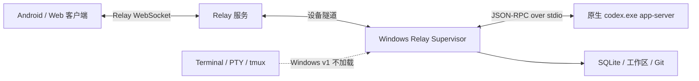

# Relay Supervisor 原生 Windows 兼容实施方案

> 状态：代码层实施完成，等待 Windows 11 实机与 Windows CI 首轮验证
> 文档日期：2026-08-04
> 最近实施审计：2026-08-04
> 目标仓库：`remoteCodex`
> 首版目标平台：Windows 11 x64、Node.js 22 LTS、Codex provider、Relay 模式

### 当前实施进度

截至 2026-08-04，在没有 Windows 实机的前提下，计划中的代码层工作已经落地：

- 已加入统一 Process Runner，并迁移 Codex、Claude/OpenCode 探测、runtime 安装/更新和 Git clone 等后端进程调用；覆盖 `.cmd`、`PATHEXT`、参数转义、超时、输出上限和失败分类。
- 已加入平台能力层；Windows 启动不创建 Terminal backend，PTY 为 optional dependency 且只在实际创建 POSIX PTY 时延迟加载。Terminal 插件在 API 和前端均显示稳定的 unavailable 原因，不能被重新启用。
- 已统一路径包含判断并覆盖 Windows 盘符大小写、不同盘符、兄弟前缀、反斜杠、空格和中文；Windows provider 默认只启用 Codex，Linux/macOS 默认行为不变。
- 已实现 Windows 命名管道生命周期控制、实例身份校验、原子状态文件、stale state 清理、优雅关闭和经二次身份校验后的 `taskkill` 兜底；同时提供当前用户 Task Scheduler 安装/卸载脚本和 ACL 收紧。
- 已加入生产 tarball 安装 smoke。它在含空格/中文的目录安装发布包，删除可选 PTY 模块后启动 Supervisor，并验证 authenticated lifecycle status/shutdown。
- 已加入 fake Relay + fake runtime E2E：注册用户和设备、建立设备隧道、创建含空格/中文路径的工作区、创建 thread、发送 prompt、验证流式结果和 transcript reload、发送 follow-up，并在 Relay 中断重启后验证自动重连和 transcript 保留，最后通过控制通道优雅关闭。
- 已加入 Ubuntu、macOS、Windows Server 2022 的 Node 22 CI matrix；Windows 11 x64 仍保留为发布前人工验收环境。

本机（macOS）已经通过全仓 typecheck、backend/platform tests、除已知外部 `thread-ui` 基线文件外的全部 supervisor-web tests、生产包 smoke 和 Relay E2E。尚不能勾选的门槛仅包括：Windows 11 实机安装、真实 `codex.exe`/`codex.cmd` E2E、Defender 默认开启验证、Task Scheduler 实机行为、连续 CI 稳定性及 required-check 仓库设置。它们必须在 Windows 环境中验证，不能由平台模拟测试替代。

## 1. 结论与推荐路线

Relay Supervisor 可以原生支持 Windows，而且不需要把 Linux/macOS 的全部能力一次性移植过去。推荐将 Windows 首版收敛为：

- 原生 Windows Node.js 进程运行 Supervisor；
- 原生 Windows `codex.exe app-server` 作为 agent runtime；
- 继续使用现有 Relay WebSocket 协议和 Supervisor HTTP/WebSocket API；
- Windows 不提供网页 Terminal/交互式 CLI 插件，不依赖 PTY、ConPTY 或 tmux；
- Windows 首版只承诺 Codex provider；Claude Code 和 OpenCode 后移；
- 第一里程碑只要求前台可靠运行，第二里程碑再提供“登录后自动启动”的后台模式；
- WSL 只作为用户自行选择的替代方案，不作为原生 Windows 兼容的实现基础或验收环境。

这里的“舍弃 CLI”专指用户可见的 Terminal/交互式命令行能力。Supervisor 调用 `codex app-server` 是后端协议依赖，不是面向用户的终端功能，不能删除。



## 2. 范围与非目标

### 2.1 P0：Windows MVP 必须完成

- Windows 11 x64 + Node.js 22 LTS 可以安装生产包及全部必需原生依赖。
- Supervisor 可在 PowerShell 中以前台模式启动，并可正常优雅退出。
- 可发现并启动原生 `codex.exe` 或 npm 安装产生的 `codex.cmd`。
- Supervisor 可连接 Relay、维持重连，并处理已有 Relay API/事件。
- 客户端可完成：添加工作区、创建 thread、发送 prompt、接收流式结果、重载 transcript、steer/follow-up。
- Windows 上 Terminal 插件明确显示为不可用，且不会在进程启动时加载 PTY 原生模块。
- 工作区路径支持盘符、反斜杠、空格、中文和大小写差异。
- CI 中存在真实 Windows runner 的安装、构建、单元测试和 Relay smoke test。

### 2.2 P1：可运维的 Windows 后台模式

- 提供当前用户登录后自动启动的 Task Scheduler 安装脚本。
- 提供可靠的 `start/status/stop/restart/logs` 管理能力，不能依赖 Unix signal、负 PID 或 tmux。
- 自动清理失效状态文件，并防止 PID 复用导致误杀其他进程。
- Relay token、session secret 等敏感配置至少受到当前用户 ACL 保护。

### 2.3 P2：明确后移

- Windows Server 2022 的正式支持。
- Windows ARM64 正式支持。
- Claude Code、OpenCode provider 的正式支持。
- Windows 网页 Terminal、ConPTY、PowerShell/cmd/Git Bash 会话。
- 以 `LocalSystem` 或其他系统账户运行的 Windows Service。
- UNC 网络路径、映射网络盘、WSL 路径互转、跨盘符工作区迁移。
- MSI/MSIX、代码签名、自动升级器。

这些后移项目不得阻塞 P0 发布，但代码设计不能让它们未来无法加入。

## 3. 当前实现的 Windows 阻塞点

### 3.1 外部命令启动方式不兼容 `.cmd`

当前多个位置直接使用 Node `spawn`/`execFile`，或拼接 shell 字符串：

- `packages/codex/src/appServerManager.ts`：直接 `spawn(command, args)`；
- `apps/supervisor-api/src/routes/agent-runtimes.ts`：执行 `npm root -g`、`npm bin -g`、`npm prefix -g`、`command -v`，并使用 `shell: true`；
- `packages/claude/src/runtimeAdapter.ts`、`packages/opencode/src/runtimeAdapter.ts`：通过 `execFile('npm', ...)` 查找全局 npm root；
- `apps/supervisor-api/src/workspace-file-service.ts`：直接启动 `git`，也应纳入统一测试范围。

Windows 的 npm 全局命令通常是 `npm.cmd`、`codex.cmd`。Node 官方文档明确说明 `.bat`/`.cmd` 不能像普通可执行文件一样由 `execFile` 直接启动。继续使用 shell 字符串还会引入空格、括号、引号和命令注入问题。

### 3.2 Terminal 原生依赖会在禁用功能前加载

- `apps/supervisor-api/src/shell/pty-shell-backend.ts` 顶层导入 `@homebridge/node-pty-prebuilt-multiarch`；
- `apps/supervisor-api/src/plugins/terminal-plugin-backend.ts` 静态引用 PTY 与 tmux backend；
- `apps/supervisor-api/src/app.ts` 默认始终构造 `ShellSessionService`；
- 根 `package.json` 把 PTY 包列为普通 dependency 和 `onlyBuiltDependencies`。

因此，仅把 Terminal 插件配置为 disabled 不够：Supervisor 可能在读取插件设置前已经解析并加载原生模块。Windows v1 必须在模块加载边界上隔离 Terminal，而不仅是隐藏前端入口。

### 3.3 后台进程管理依赖 Unix/tmux

- `bin/remote-codex.mjs` 的默认 `relay-supervisor start/status/stop` 由 tmux 实现；
- `scripts/service-manager.mjs` 使用 `process.kill(-pid, 'SIGTERM')` 和 `SIGKILL` 终止进程组；
- Windows 没有 tmux，也不支持该负 PID 进程组语义；
- Windows Service Control Manager 不能直接把普通 Node 脚本当作完整 Windows Service，因为进程没有实现 SCM service control handshake。

现有 `remote-codex relay-supervisor run` 前台路径基本可复用，应先让它成为 P0 官方入口。

### 3.4 路径包含判断存在大小写和前缀问题

`packages/workspace/src/index.ts`、`apps/supervisor-api/src/routes/threads.ts` 等位置使用 `resolvedCandidate.startsWith(resolvedRoot + path.sep)` 判断路径包含关系。Windows 默认文件系统通常不区分大小写，盘符也可能以 `C:`/`c:` 两种形式出现。字符串前缀判断还容易混淆 `C:\dev\app` 和 `C:\dev\application`。

### 3.5 测试和 npm script 含 POSIX 假设

- 根 `package.json` 使用 `NODE_ENV=test pnpm ...`，无法由 Windows 默认 shell 直接执行；
- 部分测试硬编码 `/tmp`、POSIX shell、POSIX 默认 shell 路径或 Unix signal；
- `.github/workflows` 当前没有 Windows runner；
- `default-shell.test.ts` 等测试直接依赖真实 `process.platform`，难以覆盖平台分支。

### 3.6 敏感配置权限语义不同

`bin/remote-codex.mjs` 以 mode `0600` 写入 Relay Supervisor 配置。Windows 上的 `chmod` 不等价于 Unix owner-only 权限，不能把它当作 token、admin password、session secret 的完整保护。

### 3.7 原生依赖需要固定运行时矩阵

根依赖包含 `better-sqlite3@12.10.x` 和 PTY 原生模块。即使包提供 Windows 预编译产物，也必须在真实 Windows runner 上验证 Node ABI、安装脚本和打包产物。首版应固定 Node.js 22 LTS，不能沿用过宽的“任意 `>=20` 都支持”承诺。

## 4. 目标设计原则

1. **Relay 核心不感知操作系统。** 平台差异应停留在进程、路径、Terminal 和生命周期适配层。
2. **所有外部命令使用 argv。** 业务代码不得拼接 shell 命令字符串，不以 `shell: true` 解决兼容性。
3. **不可用能力显式建模。** Windows Terminal 是 `unavailable`，不是“启动后随机报错”。
4. **前台模式是基础能力。** Task Scheduler、WinSW 等后台包装只能调用同一个前台核心入口。
5. **先验证生产安装包。** 只在源码 checkout 中通过测试，不等于用户安装后的包可运行。
6. **新增 Windows 分支不能破坏 POSIX。** Linux/macOS 原有 tmux/PTY 行为必须保留回归测试。

## 5. 分阶段实施计划

### 阶段 0：冻结支持合同与建立可复现基线

目标：在改代码前，把“支持什么”和“当前失败在哪里”变成可重复的记录。

#### 任务

- [ ] 在用户文档中增加平台矩阵：
  - Windows 11 x64；
  - Node.js 22 LTS；
  - Codex provider；
  - 本地 NTFS 工作区；
  - Terminal unavailable；
  - 前台运行是 P0，后台运行是 P1。
- [ ] 在 Windows 11 x64 干净 VM 上记录以下基线：
  - `node --version`；
  - `pnpm --version`；
  - `codex --version`；
  - `Get-Command node,pnpm,npm,codex,git | Format-List *`；
  - `pnpm install --frozen-lockfile` 的完整结果；
  - `pnpm build`、`pnpm typecheck`、目标测试的失败列表。
- [ ] 使用包含空格和中文的路径克隆一次，例如 `C:\Users\runner\source\Remote Codex 测试`。
- [ ] 把失败按以下标签归档：`spawn`、`native-addon`、`path`、`signal`、`shell-script`、`test-only`、`packaging`。
- [ ] 明确 P0 不接受 WSL/Git Bash 作为隐藏依赖；PowerShell 仅用于安装和运维脚本。

#### 交付物

- `docs/windows.md`：最终用户支持说明，实施阶段先建骨架；
- 一个 Windows 基线 issue 或测试报告；
- 本文的平台合同获得团队确认。

#### 验收门槛

- 同一 VM 上可重复得到相同类别的失败；
- 后续 PR 不得悄悄扩大 P0 范围。

---

### 阶段 1：建立跨平台 Process Runner

目标：一次性解决 `.exe`、`.cmd`、PATH、空格、超时和错误归一化问题。

#### 设计

新增 Node-only 模块，例如 `packages/process-runtime/src/index.ts`，向业务层提供两种 API：

```ts
export interface RunProcessOptions {
  command: string;
  args?: readonly string[];
  cwd?: string;
  env?: NodeJS.ProcessEnv;
  timeoutMs?: number;
  maxOutputBytes?: number;
  windowsHide?: boolean;
}

export interface ProcessResult {
  exitCode: number | null;
  signal: NodeJS.Signals | null;
  stdout: string;
  stderr: string;
  timedOut: boolean;
}

export function runProcess(options: RunProcessOptions): Promise<ProcessResult>;
export function spawnProcess(options: Omit<RunProcessOptions, 'timeoutMs'>): ChildProcess;
```

底层推荐使用 `cross-spawn`。它专门处理 Windows `PATHEXT`、npm command shim、shebang、带空格路径和 argv quoting。API 必须保持 `command + args[]`，禁止提供接收完整 shell 字符串的便捷方法。

#### 任务

- [ ] 增加 `cross-spawn` 及其类型依赖，更新 lockfile。
- [ ] 新增 Process Runner、结构化错误类型和输出大小限制。
- [ ] 默认设置 `windowsHide: true`，防止后台 Supervisor 每次启动子进程时闪出控制台窗口。
- [ ] 区分以下错误：
  - `COMMAND_NOT_FOUND`；
  - `SPAWN_FAILED`；
  - `NON_ZERO_EXIT`；
  - `TIMED_OUT`；
  - `OUTPUT_LIMIT_EXCEEDED`。
- [ ] 将 `packages/codex/src/appServerManager.ts` 的 app-server 启动迁移到 `spawnProcess`。
- [ ] 将 `apps/supervisor-api/src/routes/agent-runtimes.ts` 改为结构化调用：
  - `runProcess({ command: 'npm', args: ['view', packageName, 'version', '--json'] })`；
  - `runProcess({ command: 'npm', args: ['root', '-g'] })`；
  - 安装使用 `['install', '--global', packageSpec]`；
  - 删除 `command -v`、`shellQuote` 和 `shell: true`；
  - 命令发现由 Process Runner/实际 `--version` probe 完成。
- [ ] 将 Claude/OpenCode 的 `npm root -g` 查询迁移到同一实现，即使它们不是 P0 provider，也避免留下第二套 Windows bug。
- [ ] 检查 `git clone`、PDF 浏览器启动、重启脚本等其他 child process 调用；需要 shell 的位置必须写清原因并进行固定命令白名单处理。
- [ ] 日志只记录 executable、脱敏后的 argv、exit code 和耗时，不记录 token、password 或完整环境变量。

#### 单元测试

- [ ] 启动真实 `.exe`；
- [ ] 启动测试用 `.cmd` shim；
- [ ] 命令路径和参数包含空格、`(`、`)`、`&`、中文；
- [ ] `PATH` 中存在同名 `.cmd`/`.exe` 时结果可预测；
- [ ] 命令不存在；
- [ ] 非零退出并保留 stdout/stderr；
- [ ] 超时；
- [ ] 输出超限；
- [ ] app-server 的 stdin/stdout 流保持管道模式，没有插入 shell 文本或编码转换。

#### 验收门槛

- Windows 上 `codex.exe app-server` 和 npm 的 `codex.cmd app-server` 两种安装形态都可启动；
- `agent-runtimes` 的 detect/version/install 不再包含 POSIX 命令；
- Linux/macOS 现有 app-server 测试全部通过。

#### 回滚点

Process Runner 以独立模块和小范围 call-site 迁移提交。若某个调用迁移失败，可按调用点回滚，不回退已经验证的其他调用。

---

### 阶段 2：在 Windows 启动边界彻底隔离 Terminal

目标：即使 PTY 包没有 Windows 预编译产物，Supervisor 的非 Terminal 功能仍能安装和启动。

#### 设计

在插件元数据中加入运行时可用性，而不是仅使用 `enabled`：

```ts
type PluginAvailability =
  | { available: true }
  | { available: false; reasonCode: 'unsupported_platform'; reason: string };
```

Windows 返回 `unsupported_platform`。插件列表可以展示“Windows 暂不支持 Terminal”，但不能启用它。

#### 任务

- [ ] 增加统一 `PlatformCapabilities`：

  ```ts
  interface PlatformCapabilities {
    platform: NodeJS.Platform;
    terminal: boolean;
    tmux: boolean;
    managedSignals: boolean;
    windowsTaskScheduler: boolean;
  }
  ```

- [ ] 能力检测函数接收显式 `platform` 参数，测试中不得修改只读的 `process.platform`。
- [ ] `app.ts` 在 `terminal === false` 时不导入、不实例化 `PtyShellBackend` 或 `TmuxShellBackend`。
- [ ] 把 PTY 模块改成 POSIX 分支内的动态导入，确保 Windows bundle 启动时不会解析其 native binding。
- [ ] 增加 `UnsupportedShellBackend` 或使 `ShellSessionService` 可选：
  - list 返回空；
  - create/attach/write 返回稳定的 `TERMINAL_UNAVAILABLE`；
  - 不产生 500 或启动失败；
  - 已持久化的旧 terminal session 被标记为 unavailable/not found。
- [ ] Plugin Service 阻止 Windows 用户重新启用 Terminal；API 返回 reason code。
- [ ] 前端 Terminal 入口在 Windows 能力响应下隐藏，或以 disabled 状态展示原因；不要等待用户点击后才报错。
- [ ] 将 `@homebridge/node-pty-prebuilt-multiarch` 移至 optional dependency 或 POSIX 可选安装边界；确认生产 bundle 不再顶层引用它。
- [ ] 保留 Linux/macOS 默认 PTY 行为和 `REMOTE_CODEX_SHELL_BACKEND=tmux` 行为。

#### 测试

- [ ] 模拟 `win32` 构建 app，不 mock PTY 包，Supervisor 仍可启动；
- [ ] 扫描构建产物，Windows 启动路径没有 PTY 顶层 import；
- [ ] Windows 调用 Terminal API 返回稳定的 4xx/能力不可用响应；
- [ ] Windows 无法通过插件设置把 Terminal 强行设为 enabled；
- [ ] Linux/macOS PTY 和 tmux 现有测试回归通过；
- [ ] 前端插件列表/导航测试覆盖 unavailable reason。

#### 验收门槛

- 在未安装 C++ Build Tools、没有 tmux、没有 ConPTY Node binding 的干净 Windows VM 上，`pnpm install` 和 Supervisor 启动成功；
- Windows 客户端中没有可操作的 Terminal 入口；
- POSIX Terminal 无行为变化。

---

### 阶段 3：修复路径、文件系统和平台默认值

目标：让本地 Windows 工作区和状态目录具备正确语义。

#### 3.1 统一路径包含判断

新增共享 helper，例如：

```ts
function isPathInside(root: string, candidate: string, platform = process.platform): boolean {
  const relative = path.relative(path.resolve(root), path.resolve(candidate));
  return relative === '' ||
    (!relative.startsWith(`..${path.sep}`) && relative !== '..' && !path.isAbsolute(relative));
}
```

实现时仍需针对 Windows 做规范化比较，并明确处理不同盘符。不要用简单 `toLowerCase()` 代替完整路径规则；盘符、分隔符、尾部分隔符和 `path.relative` 结果要一起测试。

#### 任务

- [ ] 在 workspace 包中提供单一 `isPathInside`/`assertPathInside` 实现。
- [ ] 替换至少以下位置的手写前缀判断：
  - `packages/workspace/src/index.ts`；
  - `apps/supervisor-api/src/routes/threads.ts`；
  - `apps/supervisor-api/src/workspace-file-service.ts`；
  - provider 中处理图片/附件/工作区文件的相同逻辑。
- [ ] 不把 Windows 反斜杠路径错误转换成 URL 或 POSIX path。
- [ ] 所有临时目录测试改用 `os.tmpdir()` + `mkdtemp()`；测试 POSIX 专用逻辑时显式标注平台。
- [ ] Windows 默认状态目录继续放在 `%USERPROFILE%\.remote-codex`，Codex 配置继续遵循 `%USERPROFILE%\.codex`/`CODEX_HOME`。
- [ ] Windows P0 provider 默认设为 `codex`；不改变 Linux/macOS 现有 provider 默认值。
- [ ] Windows P0 遇到 UNC、WSL 路径或不同盘符的越界候选时返回清晰错误，不静默改写。
- [ ] 检查 SQLite 文件 URL/路径解析，保证 `C:\...` 不被误认为 URL scheme。

#### 路径测试矩阵

| 场景 | 预期 |
|---|---|
| `C:\dev\repo` → `C:\dev\repo\src\a.ts` | inside |
| `C:\dev\repo` → `c:\DEV\REPO\src\a.ts` | inside |
| `C:\dev\app` → `C:\dev\application\a.ts` | outside |
| `C:\dev\repo` → `D:\dev\repo\a.ts` | outside |
| 根路径或文件名包含空格、中文、emoji | 正常 |
| `..`、混合 `/` 与 `\` | 不可越界 |
| junction/symlink 指向 root 外 | 按现有真实路径安全策略拒绝或明确记录限制 |
| `\\server\share` | P0 返回 unsupported |

#### 验收门槛

- 在 `C:\Users\Test User\开发项目\remote codex` 中可以创建、浏览和使用工作区；
- 目录遍历保护在 Windows 大小写语义下仍然成立；
- 原有 POSIX 路径安全测试不回退。

---

### 阶段 4：使构建、测试和生产包可在 Windows 安装

目标：消除工具链层面的 POSIX 假设，并验证实际发布形态。

#### 任务

- [ ] 用 `cross-env NODE_ENV=test ...` 或测试 runner 内部配置替换 `NODE_ENV=test ...`。
- [ ] 搜索所有 workspace `package.json`，处理其他内联环境变量赋值。
- [ ] 搜索并分类 `/tmp`、`/bin/sh`、`bash`、`chmod`、`SIGKILL`、`process.kill(-`、`command -v`、`which`、`tmux`；只修改跨平台路径，保留有明确平台 guard 的 POSIX 功能。
- [ ] 固定并文档化 Node 22 LTS；根 `engines` 和 CI matrix 与支持合同一致。
- [ ] 在 Windows runner 验证 `better-sqlite3` 安装和最小读写；失败时先升级到有对应 Node 22 Windows prebuild 的补丁版本，避免把 Visual Studio Build Tools 变成普通用户前置条件。
- [ ] `npm pack` 后在全新临时目录安装 tarball，不从 monorepo 源码直接运行。
- [ ] 验证 package `files`、bundle external、动态 import 和可选依赖；确保缺少 Terminal native addon 不影响非 Terminal 启动。
- [ ] 确保发布包内包含 Windows 所需的 PowerShell 脚本和文档。

#### 建议新增脚本

- `scripts/verify-package-install.mjs`：跨平台打包/安装/启动 smoke；
- `scripts/windows/relay-smoke.ps1`：Windows VM 手工和 CI 共用；
- `scripts/windows/install-relay-supervisor-task.ps1`：P1 再加入，不与 P0 smoke 耦合。

#### 生产包 smoke test

1. `npm pack` 生成 tarball；
2. 在带空格的临时目录初始化空项目；
3. 安装 tarball；
4. 运行版本/帮助命令；
5. 以 fake Codex runtime 和 fake Relay 启动 Supervisor；
6. 轮询 health endpoint；
7. 完成一次 Relay request/stream/reload；
8. 请求优雅关闭；
9. 断言端口释放、SQLite 可重新打开、没有遗留子进程。

#### 验收门槛

- 普通 Windows runner 无需 Visual Studio Build Tools 即可安装生产包；
- tarball smoke test 通过，而不仅是 monorepo 测试通过；
- Linux/macOS 的打包结果没有新增强制 Windows 依赖。

---

### 阶段 5：完成 Windows 前台 Relay Supervisor MVP

目标：打通真实的 Windows 原生主链路。

#### 任务

- [ ] 把 `remote-codex relay-supervisor run` 定义为 Windows P0 官方启动路径。
- [ ] Windows 上裸 `relay-supervisor` 不再尝试 tmux：
  - 可直接等价于 `run`；或
  - 输出明确提示并以前台运行；
  - 不输出“安装 tmux”建议。
- [ ] 保留 SIGINT/SIGTERM handler，并增加适合 Windows 控制台关闭的验证；所有关闭路径最终调用 Fastify `app.close()`。
- [ ] 确认 `app.close()` 依次关闭 Relay tunnel、Codex app-server、SQLite、HTTP listener；Terminal service 在 Windows 为 no-op。
- [ ] Relay 重连使用现有实现，不增加平台分支；用测试证明网络层无需改造。
- [ ] Windows 首次设置只生成/启用 Codex provider。
- [ ] runtime diagnostics 输出：
  - 当前平台和架构；
  - Node 版本；
  - Codex command 解析结果；
  - Terminal unavailable；
  - Relay endpoint（不含 token）；
  - 数据库和 workspace root；
  - 支持范围警告。

#### E2E 场景 A：fake runtime，作为 CI 阻断门槛

- [x] 启动本地 fake Relay；
- [x] 以测试 device token 启动 Supervisor；Windows runner 由 CI workflow 执行；
- [x] 等待 Supervisor 注册和 tunnel ready；
- [x] 创建含空格/中文路径的工作区；
- [x] 创建 thread；
- [x] 发送 prompt；
- [x] 验证中间流式 delta、完成状态和 transcript reload；
- [x] 发送 follow-up 并验证第二轮完成；
- [x] 中断 Relay 后恢复，验证自动重连；
- [x] 通过 authenticated lifecycle control 关闭 Supervisor，验证进程退出。

#### E2E 场景 B：真实 Codex，作为发布前人工门槛

- [ ] 通过官方 PowerShell 安装器安装原生 Codex；
- [ ] 验证 `codex.exe --version`；
- [ ] 完成 Codex 登录/凭证准备，不把凭证写入 CI 日志；
- [ ] 启动真实 `codex.exe app-server`；
- [ ] 从 Android 或 Web 客户端完成 thread 创建、prompt、stream、reload、steer；
- [ ] 重启 Supervisor 后重新加载既有 thread；
- [ ] 在 Windows Defender 默认开启状态下重复一次关键流程。

#### P0 验收门槛

以下条件全部满足才可以称为“Windows MVP”：

- [ ] 干净 Windows 11 x64 上生产包安装成功；
- [ ] 不安装 tmux、WSL、Git Bash、C++ Build Tools 和 PTY 包也能启动；
- [ ] 真实 Codex 主链路通过；
- [ ] Relay 断线重连通过；
- [ ] 优雅退出后无锁死 SQLite、占用端口或遗留 app-server；
- [ ] Terminal 明确不可用；
- [ ] Windows CI 连续通过至少 10 次，排除明显时序 flaky test。

---

### 阶段 6：实现可靠的 Windows 后台生命周期（P1）

目标：让 Supervisor 可以长期驻留，同时使用当前登录用户的 Codex 凭证、工作区权限和 `%USERPROFILE%`。

#### 6.1 推荐方式：每用户 Task Scheduler

首选“用户登录时启动”的计划任务，而不是 `LocalSystem` Windows Service：

- 它天然使用安装 Codex 的同一用户；
- 能读取同一 `%USERPROFILE%\.codex` 登录状态；
- 工作区权限和网络盘可见性更接近用户手动启动；
- 不需要把用户 token 复制到系统账户；
- PowerShell 可以无额外二进制完成安装/卸载。

计划任务的 action 必须使用完整路径：

- executable：实际 `node.exe` 绝对路径；
- arguments：`remote-codex.mjs relay-supervisor run --managed`；
- working directory：安装包或稳定数据目录；
- secrets 不得出现在 task arguments；
- 开启失败重试和合理延迟；
- 限制同一任务只运行一个实例。

#### 6.2 本地控制通道

新增平台无关的 `SupervisorLifecycleController`。Windows 使用命名管道：

```text
\\.\pipe\remote-codex-relay-supervisor-<user-or-install-hash>
```

状态文件建议位于 `%USERPROFILE%\.remote-codex\relay-supervisor-state.json`：

```json
{
  "schemaVersion": 1,
  "pid": 1234,
  "instanceId": "random-uuid",
  "startedAt": "2026-08-04T00:00:00.000Z",
  "controlPipe": "\\\\.\\pipe\\remote-codex-relay-supervisor-example",
  "host": "127.0.0.1",
  "port": 8787,
  "logPath": "C:\\Users\\me\\.remote-codex\\logs\\relay-supervisor.log",
  "version": "x.y.z"
}
```

#### 任务

- [ ] 启动时生成不可预测 `instanceId`，原子写状态文件。
- [ ] health/control 响应返回相同 `instanceId`；`status` 必须验证它，不能只检查 PID 是否存在。
- [ ] `stop` 通过本地命名管道发送 authenticated shutdown 请求。
- [ ] Supervisor 收到请求后调用 `app.close()`，等待 Relay/app-server/SQLite 关闭。
- [ ] 超时后才使用 `taskkill /PID <pid> /T /F`，并在执行前再次验证 `instanceId`。
- [ ] 启动时检测 stale state：PID 不存在、pipe 不存在或 instance 不匹配时清理旧文件。
- [ ] 用 exclusive create/lock 避免两个 Supervisor 同时占用同一状态目录。
- [ ] 实现轮转日志，日志中禁止写入 relay token、admin password、session secret、完整 authorization header。
- [ ] 提供 PowerShell `install/status/stop/restart/uninstall` 脚本；卸载默认保留配置和数据库，删除数据需要单独显式参数。
- [ ] Linux/macOS 现有 tmux 管理保持不变，或后续也迁移到同一个 lifecycle abstraction。

#### 6.3 可选的无人值守 Service

只有在确实需要“用户未登录也运行”时再增加 WinSW：

- 使用 WinSW 包装前台 `run --managed` 入口；
- 服务必须配置成明确的专用用户，而不是默认 `LocalSystem`；
- 为该用户单独完成 Codex 登录和 workspace ACL；
- 使用 WinSW 的 graceful stop/日志轮转能力；
- 不直接使用 `sc.exe create ... node script.js` 冒充原生 service。

#### 后台模式验收

- [ ] 登录后自动启动；
- [ ] 重复 start 不产生双实例；
- [ ] status 能区分 running、stale、wrong instance、unhealthy；
- [ ] stop 优先优雅关闭，正常场景不执行 `/F`；
- [ ] Windows 重启后能恢复连接 Relay；
- [ ] 更新包后任务仍引用有效入口，或安装器能原子更新 action；
- [ ] 卸载任务不删除用户数据库和配置，除非明确指定 purge。

---

### 阶段 7：Windows 配置与凭证保护

目标：避免把 Unix `0600` 当作 Windows 安全边界。

#### P0/P1 最低要求

- [ ] 配置和状态目录只位于当前用户 profile 下，不写入仓库或公共目录。
- [ ] 创建目录后检查 ACL；使用 `icacls` 或 Windows API 收紧到当前用户和必要的系统主体。
- [ ] 写文件采用临时文件 + fsync/close + rename，避免断电后留下半个 JSON。
- [ ] 日志和 diagnostics 对所有秘密脱敏。
- [ ] Task Scheduler action 不携带秘密；进程从受保护配置文件读取。
- [ ] 文档明确备份/迁移 token 文件的风险。

#### 后续增强

- [ ] 用 Windows DPAPI current-user scope 加密 relay token 和 session secret；
- [ ] 不使用 `CRYPTPROTECT_LOCAL_MACHINE`，因为该模式允许同机其他用户解密；
- [ ] 或迁移到 Windows Credential Manager；
- [ ] 设计 schema version 和无损迁移，以兼容现有明文配置。

#### 验收门槛

- 另一普通本地用户无法读取配置；
- 日志、crash report、CLI/PowerShell 输出不包含秘密；
- 配置迁移失败时保留原文件并可回滚。

---

### 阶段 8：CI、发布门禁和回归策略

目标：Windows 不再依赖开发者偶尔手测。

#### 建议 workflow

新增 `.github/workflows/windows-compat.yml`：

```yaml
strategy:
  fail-fast: false
  matrix:
    os: [windows-2022, windows-latest]
    node: [22]
```

初期两个 runner 可以一个跑完整 smoke、一个跑 build/unit，以控制时长。稳定后再评估是否保留两个镜像。

#### CI 层次

1. **静态层**：install、build、typecheck、lint；
2. **单元层**：Process Runner、path、platform capabilities、unsupported Terminal；
3. **组件层**：fake app-server、SQLite、Supervisor health/shutdown；
4. **包层**：`npm pack` 后全新目录安装；
5. **Relay E2E**：fake Relay + fake Codex 完整事件流；
6. **人工发布层**：真实 Codex 登录和 Android/Web 客户端。

#### 任务

- [ ] Windows workflow 成为 required check，不长期使用 `continue-on-error`。
- [ ] flaky 重试只允许在最外层 E2E，并记录首次失败；单元测试不得靠 retry 掩盖竞态。
- [ ] 保存失败时的脱敏 Supervisor log、fake Relay log 和 test report。
- [ ] 每次升级 Node、`better-sqlite3`、Codex、PTY 包或打包器时自动触发 Windows package smoke。
- [ ] 加入 Linux/macOS 回归 workflow，保证平台抽象没有破坏现状。
- [ ] 发布 checklist 增加 Windows VM 人工验证和已知限制确认。

#### 发布门禁

- Windows required checks 全绿；
- 生产 tarball smoke 全绿；
- 真实 Codex E2E 通过；
- 安全文档和 Terminal unavailable 文案存在；
- changelog 不宣称 P2 功能已支持。

## 6. 建议 PR 拆分与依赖顺序

| PR | 内容 | 依赖 | 可独立回滚 | 预计工作量 |
|---|---|---|---|---|
| 1 | 平台合同、失败基线、测试脚本可移植化 | 无 | 是 | 1–2 人日 |
| 2 | Process Runner + Codex/npm/git 调用迁移 | PR 1 | 是 | 2–4 人日 |
| 3 | Terminal capability/unavailable + PTY 延迟加载 | PR 1 | 是 | 2–4 人日 |
| 4 | Windows 路径、状态目录、provider 默认值 | PR 2 | 是 | 2–3 人日 |
| 5 | Windows production package smoke + fake Relay E2E | PR 2–4 | 是 | 3–5 人日 |
| 6 | Windows 前台真实 Codex MVP、文档和发布门禁 | PR 5 | 是 | 2–4 人日 |
| 7 | Task Scheduler、命名管道 lifecycle、日志轮转 | PR 6 | 是 | 4–7 人日 |
| 8 | ACL/DPAPI 增强、可选 WinSW | PR 7 | 是 | 3–6 人日 |

估算不包含首次搭建 Windows 测试机、等待外部依赖修复或 Claude/OpenCode 适配。P0 为 PR 1–6，粗略为 12–22 人日；P1 为 PR 7 和 PR 8 的 ACL 最低要求，粗略再增加 5–9 人日。建议以测试门禁而非日期作为发布依据。

## 7. 文件级改动清单

以下清单用于实施时逐项核对，最终位置可随重构微调：

### 新增

- [x] `packages/process-runtime/src/index.ts`
- [x] `packages/process-runtime/src/index.test.ts`
- [x] `apps/supervisor-api/src/platform/capabilities.ts`
- [x] `apps/supervisor-api/src/platform/capabilities.test.ts`
- [x] `apps/supervisor-api/src/shell/unsupported-shell-backend.ts`
- [x] `scripts/verify-package-install.mjs`
- [x] `scripts/verify-relay-supervisor-smoke.mjs`
- [x] `scripts/windows/relay-smoke.ps1`
- [x] `.github/workflows/platform-compatibility.yml`
- [x] `docs/windows.md`
- [x] P1：`scripts/windows/install-relay-supervisor-task.ps1`
- [x] P1：`scripts/windows/uninstall-relay-supervisor-task.ps1`
- [x] P1：`apps/supervisor-api/src/platform/lifecycle-control.ts`

### 修改

- [ ] `package.json`、`pnpm-lock.yaml`
- [ ] `packages/codex/src/appServerManager.ts`
- [ ] `packages/claude/src/runtimeAdapter.ts`
- [ ] `packages/opencode/src/runtimeAdapter.ts`
- [ ] `apps/supervisor-api/src/routes/agent-runtimes.ts`
- [ ] `apps/supervisor-api/src/app.ts`
- [ ] `apps/supervisor-api/src/plugins/terminal-plugin-backend.ts`
- [ ] `apps/supervisor-api/src/plugins/plugin-service.ts`
- [ ] `apps/supervisor-api/src/shell/pty-shell-backend.ts`
- [ ] `packages/workspace/src/index.ts`
- [ ] `apps/supervisor-api/src/routes/threads.ts`
- [ ] `apps/supervisor-api/src/workspace-file-service.ts`
- [ ] `packages/config/src/index.ts`
- [ ] `bin/remote-codex.mjs`
- [ ] P1：`scripts/service-manager.mjs`
- [ ] 前端插件导航/设置相关组件和 shared DTO。

## 8. 风险与缓解措施

| 风险 | 影响 | 缓解 |
|---|---|---|
| npm shim/路径 quoting 只在某种安装形态可用 | 用户无法启动 Codex | `.exe`、`.cmd`、带空格绝对路径三类真实测试；统一 Process Runner |
| PTY native addon 在安装或 import 时失败 | Supervisor 完全无法启动 | Windows 不加载 Terminal；optional/lazy import；package smoke |
| Windows 强制终止导致 SQLite 或 transcript 损坏 | 数据损坏 | 命名管道优雅关闭；超时才 `taskkill /F`；原子状态文件 |
| Task Scheduler 使用错误账户 | 找不到 Codex 凭证/工作区 | 每用户 logon task；完整路径；安装时打印运行身份 |
| PID 被复用 | stop 误杀其他进程 | `instanceId` + control pipe + health 验证，不只检查 PID |
| 大小写/盘符差异绕过目录保护 | 目录遍历或误拒绝 | `path.relative` helper + Windows 路径矩阵 + junction 测试 |
| 原生依赖没有对应 Node ABI prebuild | 安装需要 C++ 工具链 | 首版固定 Node 22；Windows package CI；升级前预检 |
| 日志泄漏 relay token | 凭证泄漏 | 结构化脱敏；不记录 env/Authorization；失败 artifact 审查 |
| Windows 兼容代码破坏 POSIX | 现有用户回归 | 平台能力层；POSIX Terminal/tmux 回归；按 PR 可回滚 |
| WSL/UNC 范围蔓延 | 延误 MVP | 明确返回 unsupported，P2 再设计路径桥接 |

## 9. 最终 Definition of Done

Windows 兼容任务只有在以下全部完成后才算结束：

- [ ] 支持矩阵和非目标已发布；
- [ ] Windows 11 x64 + Node 22 生产包可安装；
- [ ] 原生 `codex.exe` 与 `codex.cmd` 都可驱动 app-server；
- [ ] Windows 启动不加载 PTY/tmux，Terminal 明确 unavailable；
- [ ] 工作区空格、中文、盘符大小写和越界测试通过；
- [ ] fake Relay 自动 E2E 通过；
- [ ] 真实 Codex + Android/Web 人工 E2E 通过；
- [ ] 前台关闭无残留；
- [ ] P1 后台模式可安装、查询、优雅停止、重启和卸载；
- [ ] 配置文件 ACL 达到当前用户隔离，日志无秘密；
- [ ] Windows CI 是 required check；
- [ ] Linux/macOS 构建、Relay 和 Terminal 回归全部通过；
- [ ] 发布说明准确列出 Windows v1 不支持 Terminal、Claude/OpenCode、UNC/WSL 路径和系统服务模式。

## 10. 研究依据

- OpenAI Codex README 已提供原生 Windows PowerShell 安装器和 Windows binary：<https://github.com/openai/codex/blob/main/README.md>
- Node.js `child_process` 文档说明 Windows `.bat`/`.cmd` 不能由 `execFile` 直接执行：<https://nodejs.org/api/child_process.html#spawning-bat-and-cmd-files-on-windows>
- `cross-spawn` 处理 Windows `PATHEXT`、shebang、command shim 和空格路径：<https://www.npmjs.com/package/cross-spawn>
- Node.js Windows named pipe 格式：<https://nodejs.org/api/net.html#identifying-paths-for-ipc-connections>
- Microsoft Task Scheduler logon trigger：<https://learn.microsoft.com/en-us/windows/win32/taskschd/logontrigger>
- Microsoft `taskkill`：<https://learn.microsoft.com/en-us/windows-server/administration/windows-commands/taskkill>
- Microsoft DPAPI `CryptProtectData` 及 current-user/local-machine 语义：<https://learn.microsoft.com/en-us/windows/win32/api/dpapi/nf-dpapi-cryptprotectdata>
- WinSW 是把普通进程包装成 Windows Service 的成熟方案：<https://github.com/winsw/winsw>
- `node-pty` 在 Windows 1809+ 可使用 ConPTY，但这属于后续 Terminal 能力，不应阻塞 MVP：<https://github.com/microsoft/node-pty>
- GitHub-hosted runner 支持的 Windows 镜像和标签：<https://docs.github.com/en/actions/how-tos/using-github-hosted-runners/using-github-hosted-runners/about-github-hosted-runners>

## 11. 实施时的第一组动作

为避免方案停留在文档层，建议按以下顺序立即开始：

1. 建立 Windows 11 x64 + Node 22 基线并保存失败日志；
2. 提交 PR 1，先让 test scripts 能在 Windows shell 执行；
3. 提交 PR 2，完成 Process Runner 和 Codex app-server 启动；
4. 与 PR 2 并行准备 PR 3，但合并时单独验证无 PTY 安装环境；
5. 完成路径修复后，立即建立 tarball smoke，避免只修源码开发模式；
6. fake Relay E2E 稳定后再做真实 Codex E2E；
7. P0 发布后再引入 Task Scheduler/命名管道，不让后台服务复杂度拖延核心兼容；
8. 最后再评估 Claude/OpenCode、ConPTY Terminal、Windows Service 和 ARM64。

这一路线的关键是把“原生 Windows Relay 后端可用”和“Windows 上拥有完整 Unix 式终端/守护进程体验”拆成两个问题。前者改动边界清晰、风险可控，可以先交付；后者按真实用户需求逐项补齐。
