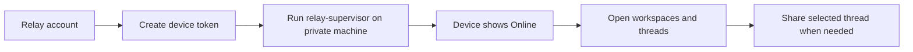

# Remote Codex Relay Usage Guide

## Choose A Connection Mode

Local mode is for the same machine, a LAN, an emulator, or Tailscale. It is the simplest option and does not need a relay account.

Server mode is for a directly reachable supervisor with its own login. Use it on a trusted private server or private network endpoint.

Relay mode is for public web or mobile access to a private supervisor machine that should not accept inbound connections. The private machine starts `remote-codex relay-supervisor`, connects out to the relay, and the browser or mobile app forwards authenticated requests through that selected device.

## Relay Setup



1. Open the relay home page.
2. Sign in or register a relay account.
3. Open Devices.
4. Create a device token for the private supervisor machine.
5. Copy the setup command.
6. Run the command on the private machine that owns the workspace.

```bash
REMOTE_CODEX_RELAY_SERVER_URL=wss://remote-codex.example.com \
REMOTE_CODEX_RELAY_AGENT_TOKEN=rcd_... \
REMOTE_CODEX_RELAY_SUPERVISOR_PORT=45679 \
remote-codex relay-supervisor
```

If `tmux` is installed, `remote-codex relay-supervisor` starts itself in a detached session by default. Use these commands to inspect or stop it:

```bash
remote-codex relay-supervisor status
remote-codex relay-supervisor stop
```

## Daily Use

After the device is online, choose Connect on the Devices page. Workspaces, threads, file actions, and WebSocket updates are scoped through that relay device.

Shared with me lists sessions another relay user granted to your account.

Shared by me lists sessions you granted to other users. Use it to open the thread, edit permissions, inspect access history, or revoke access.

## Mobile Layout

Android and iOS follow the same hierarchy:

1. Connection chooses Local, Server, or Relay.
2. Relay opens the relay portal for backend devices and shared sessions.
3. A selected backend device opens Workspaces.
4. A workspace opens Rooms and then the thread UI.
5. Shared with me and Shared by me live in the relay portal so shared sessions can be opened or managed before choosing a workspace.
